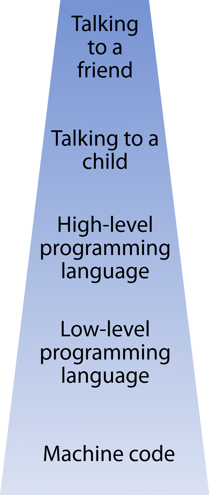

# Chapter 1: Introduction

## Aims of this book

Do you write code as part of your work?

Did you pick up coding while “on the job”, without formal training?

If you answer yes to these two questions, then this book is for you. This book is aimed at undergraduates, postgraduates, and doctoral students across the sciences, as well as postdoctoral researchers, and data scientists. It should be relevant to anyone who needs to write computer code in order to achieve a scientific goal, including data analysis, statistics, coding tasks and data collection code, tools for others to use, or web applications.

**Note: the book will not teach coding, and will assume that the reader is moderately fluent in at least one programming language.**

**Poor code is often the weakest link in science**. Many causes contribute to poor code:

-   Many scientists write scripts as part of their work, yet have had only brief 2-week courses in programming. Often much of their training is from colleagues, or immediate seniors, who also never received any formal training.
-   Experiments and analyses are often essentially one-man efforts
-   Many labs have large volumes of legacy code, where the original author may not even be in science anymore.
-   Publication pressure leads to short deadlines and limited local training in coding.

These factors lead to **many problems** such as:

-   single-use code that needs to be re-written to be useful again,
-   convoluted data pipelines which are hard to debug,
-   poorly documented scripts that are error-prone to use,
-   unpublishable code, and in the worst-case scenario,
-   scientific errors and retraction of publications.

Improving the quality of code facilitates open science, and fosters code re-use. This book will aim to improve coding practice in science and will promote code-sharing by encouraging readability, generalisability, and fool-proof coding styles. Ultimately, I hope that this will contribute to the increased reproducibility of scientific research. The book’s specific aims will be to:

-   foster critical self-appraisal through interactive learning and ongoing self-assessment
-   engender a passion for good code by aesthetic “training”
-   help readers understand *why* certain styles are better than others
-   engage readers with a visual-led and example-driven approach

I will not aim to teach coding: you should already have experience with at least one language.

This book will deal primarily with code **style**. This means that some of the book is opinion and taste, rather than fact. So how can we teach style? Appreciating style requires cultivation of the palate. My aim is to build in you a sense of taste for good code – an appreciation for elegant, tidy and readable code. To achieve this, you will need to know the tools and tricks, and also know when to use which trick. Many alternative ways of achieving good code will be explored, and the advantages and disadvantages of each approach will be highlighted. You might prefer one style over another, but I will try to make it clear that each situation may require a different approach.

I will lead you to investigate the factors that contribute to well-written programs, focusing on style, clarity, technique, and robustness. You will see through examples that naïve styles of programming are much more bug-prone. As a scientific programmer, you will discover how to move from writing a series of one-use scripts, to writing well-planned, transparent, re-usable code.

The book will cover some of the ideas and techniques used in professional software development, to the extent that they are relevant for the day-to-day scientific coder. Rather than delivering facts, the book aims to develop **intuitions**. As such, the book will be “dip in, dip out” and will not require a linear read from beginning to end. Although topics towards the end of the book will get increasingly complex, each sub-section will be a self-contained unit.

**Other books**: While there are a number of fantastic coding practice books addressed at programmers, most of these are for C/C++/Java programmers, and have a focus on database, web and business logic programming (though there are a couple of great Python resources out there). Many concepts took inspiration from classical texts by Uncle Bob (Robert Martin 2000, 2009, 2011) and others. This book focuses only on Matlab, Python and R, and is directed towards scientists collecting and analysing data. As such, I will assume little about your background knowledge of computer science.

**Chapters**:

Fig.1.1: Structure of this book.

To cover the essentials of computer science, an introductory chapter covers classifying programming languages, functional thinking, and process models of software development. There will also be basic information on practicalities of version control and publication. Chapter 2 gives some of the reasoning behind good coding practices, and how this has been driven by increased code publishing and open-sourcing. Chapter 3 will help you create a better coding environment. In Chapters 4 to 7, we cover four core components of good code: comments, variable names, conceptualisation and functions. Writing useful comments (chapter 4) and choosing sensible variable names (chapter 5) are the visible veneer of your code, and are more matters of housekeeping. However, conceptualisation (chapter 6) and functions (chapter 7) lie at the heart of any good program. In particular, chapter 6 lays out key principles of abstraction and externalisation, and chapter 7 showcases these principles using functions. Chapter 8 is devoted to planning the structure of your data, and Chapter 9 gives some methods to make code shorter and faster. Chapter 10 aims to help you spot and fix errors.

The book will aim to be *language agnostic* to the extent to which this is possible. Examples will be presented both in Matlab/Octave and Python, and where relevant, in R, but most of the techniques apply across all programming languages. My side-goal is to show parallels between languages, and make you a more versatile coder.

## What makes coding so powerful?

Computers are one of the greatest enabling innovations of our generation. They allow many repetitive tasks to be automated. Being able to codify a task requires you to understand that task intimately. The task needs to be conceptually broken down into its smallest, ‘abstract’ components. Take for example making a cup of tea. You can describe the task at many levels, depending on what primitive operations you are permitted to use.

| **Talking to a friend**             | “Make me a tea please, one sugar no milk”                                                                                                                                                                                                                                 |                                                                                           |
|-------------------------------------|---------------------------------------------------------------------------------------------------------------------------------------------------------------------------------------------------------------------------------------------------------------------------|-------------------------------------------------------------------------------------------|
| **Talking to a child**              | “Turn the kettle on, get a mug out, get a teabag from the third cupboard, put it in the mug, and when the water is boiled, pour it in carefully.”                                                                                                                         | Assumes good grasp of language, pragmatics, and small-scale sequences                     |
| **High-level programming language** | “Press button on side of kettle. Open third cupboard. Locate and open box labelled “teabags”. Take one bag. Close the box and then the cupboard. Put in mug. Wait until kettle light goes off. Pick up kettle. Pour water in mug until mug is 85% full. Put kettle down.  | Assumes physical-visual coordination, some action language semantics (like “pour x in y”) |
| **Low-level programming language**  | “Locate kettle visually. Locate red button on kettle. Move right hand towards it, with finger outstretched, until you feel the button. Increase pressure on button until you feel the button click. Remove finger from button – etc.… ”                                   | Assumes visual localisation ability, simple motor control and sensory feedback.           |
| **Machine code**                    | “Take data from eye. Scan each region of the image for a pattern that matches a kettle. When found, move eye towards kettle. Check if each pixel of new image is red etc…”                                                                                                | Few assumptions                                                                           |

\<caption\> Figure 1.1: Different ways to give instructions, with high-level instructions at the top, and low-level instructions at the bottom \</caption\>

Although your program specifies the instructions at a given level, the instructions are all eventually translated into machine code, the lowest level. These are the instructions that the microprocessor chip understands. Believe it or not, real machine code actually operates at an even *lower* level than the analogy here. It is truly hard to imagine what a complex series of computational steps is being executed when you do something trivial. For example, when you open a message on your phone, your phone executes around a billion machine-code instructions! It takes several thousand just to download a single **character** from the internet. But you might program the command at a high level, so all this might correspond to just one or two lines of code.

The power of programming is that you can create this structure – from the lowest level up to the highest – so that the computer can take care of all the intricate low-level steps, while you care only about the top level instructions. Good coding lets you build an efficient language to describe your common tasks.

## What language to choose

Choosing a language is tricky, controversial, and full of opinion. Consider the following factors when choosing:

**Will I find it easy?** If you know a language already, and it can do the job, then you should stick with that language. Learning curves are steepest at the start, and some languages have a different conceptual structure that can be hard to pick up. For example, moving from python to C is hard because of declaring and typing variables, and using pointers safely. In contrast, moving from C to python is much easier – since many Python concepts are found in C.

**Is it suited to the task?** Some languages have features that are suited for specific purposes. For example, if you are doing many linear operations, Matlab has built-in matrix shortcuts for this.

**Can I use existing code?** Many common scientific tasks have already been coded, and increasingly, this code is openly available. This might simply be in the form of downloadable scripts from other people; or, someone may have taken the trouble to put the code in a “**library**”: a self-contained module that you can slot into your own code. Search the internet to see if anything already exists for the job – for example, there are great Python libraries for machine learning, and there are a great many Matlab libraries for signal processing; some statistical methods only have R code available. So, your tasks may determine what language you need. Open source libraries are likely to have fewer bugs and run faster than anything you can write without substantial time and effort.

All languages have libraries to support data format conversion, visualisation, statistics, and machine learning, which you can search for online. Check out what libraries are currently popular – these are in constant flux.

**What are my colleagues using?** Science is a team job. If you use the same language as colleagues, you can get advice, give advice, and share code. Also consider people in your field outside your team: you may eventually want to share your code more widely.

If in doubt, talk to people in your field. They may have experience with libraries, and your nuanced needs, that influence choice of language.

There is a trade-off between **open-source** vs. closed-source languages. Python and R are open source, whereas Matlab is proprietary. Octave is an open-source language that aims to be interoperable with Matlab, i.e. much Matlab code runs in Octave with only minor changes.

| **Open Source**                                                                                                                                                                         | **Closed Source / Proprietary**                                                    |
|-----------------------------------------------------------------------------------------------------------------------------------------------------------------------------------------|------------------------------------------------------------------------------------|
| e.g. Python, R, Octave                                                                                                                                                                  | e.g. Matlab                                                                        |
| Free to run code, but users need to be familiar with installing the language and libraries.                                                                                             | Expensive license needed to edit code – often costing several hundred pounds       |
| Community **libraries** may have incompatibilities and rely on different versions of **dependencies**                                                                                   | Curated libraries guaranteed to be interoperable, and released for each version.   |
| Not all libraries are optimised for all platforms                                                                                                                                       | Libraries professionally optimised                                                 |
| Most languages share their underlying fast linear algebra libraries (called “BLAS” and ”LAPACK”) – so the execution speed for these most-critical operations is surprisingly all on par |                                                                                    |
| Large communities for programming support                                                                                                                                               | Technical support from company and community                                       |
| Downloadable code packages may contain bugs or not all uses cases covered                                                                                                               | Packages designed for general use, with options to tune to your specific use case. |
| Python and Matlab both allow you to package executable versions of code that don’t need installation / license to run                                                                   |                                                                                    |
| In theory, can be compiled to run on any operating system                                                                                                                               | Runs on Mac Windows and Linux (Debian/Ubuntu, RHEL, SUSE)                          |

\<caption\> Table 1.1: Comparison of open source and closed source code\</caption\>

Matlab has the benefit of being curated, so all provided libraries are interoperable, professionally optimised for the platforms, and support is available. However, you need an expensive license to run the code, often costing several hundred pounds. In contrast, code written in open source languages can be run by anyone.

Many scientists switch between languages depending on the need case. Language interoperability may also be a consideration in many scientific environments.

### Could I use a spreadsheet?

Spreadsheets have been the cause for many coding errors and famous paper retractions (AlTarawneh & Thorne 2017). But yes, you can use a spreadsheet like Excel for most things that require programming. But there are major differences.

\<exercise\> Make a list of the pros and cons of using Excel.

| Pros                                                                                                                                                     | Cons                                                                                                                    |
|----------------------------------------------------------------------------------------------------------------------------------------------------------|-------------------------------------------------------------------------------------------------------------------------|
| For 2D tables, spreadsheets display all the data in an easy-to-read form                                                                                 | 3D data is very tricky, and more dimensions are basically impossible                                                    |
| Data problems visible at a glance, such as zeros or NaNs, repeated values, empty columns, misaligned rows, or major scaling errors or negative numbers.  | It’s easy to miss a problem when scanning through a large table                                                         |
| Easy to move data around, combining and splitting arrays                                                                                                 | Manipulating the data is error prone, with no errors messages or warnings                                               |
| Cell highlights when using a formula, so you can see what value is being used, or even where a value is used (Trace dependents)                          | Formulas not shown by default, and when they are, they are hard to read                                                 |
| Auto-summation and pivot tables allow quick visual summaries of data                                                                                     | You can’t easily summarise complex data. It’s not always transparent what the auto-operations do e.g. with missing data |
| Conditional formatting to quickly scan data                                                                                                              | Easy to miss hidden columns, hidden formulas                                                                            |
| Possible to operate on arrays or matrices                                                                                                                | Loops and whole-array operations are tricky. You could use Visual Basic but that adds another layer of complexity       |
| Easy one-click charts                                                                                                                                    | Limited control over the output                                                                                         |
| All comments are data - so you can easily use them in chart labels etc.                                                                                  | Poor separation between data and code – for example it’s easy to paste numbers over a formula.                          |
| If you feel more comfortable with spreadsheets, it can be faster with fewer errors, for small datasets.                                                  | Slow and error-prone if you have large quantities of data                                                               |

\<caption\> Table 1.2: Pros and cons of spreadsheets \</caption\>

\</exercise\>

Using spreadsheets for data can be useful. You get an immediate view of the numbers. You can use scroll bars to look around. with a pleasant interface. Moreover, it is critical to inspect the raw values. However, you lose the power of programming

-   you can’t replicate your actions, or automate things;
-   you can’t audit your actions, to see what exactly you did.

Learn the alternatives to spreadsheets. They are useful for some things:

-   Spreadsheets are excellent for data entry. They can mix text and numeric data in a column, which is sometimes essential, although this isn’t that helpful for later quantitative analysis.
-   There are ways to do quite powerful things in a spreadsheet. For example Excel has multi-cell array formulae which can perform matrix-like operations. These are entered with Ctrl+Shift+Enter, and allow results to spill into neighbouring cells.
-   Excel Tables now allow structured referencing, e.g. my_table[@ [colA:colC]] which accesses a sub-matrix of a named table, a bit like slice indexing in your language.

But if your data has more than 2 dimensions (e.g. a 3-factor design), or has more than a thousand datapoints, you will likely benefit from abandoning spreadsheets. Statistical analyses done in spreadsheets tend to be shallow and miss many safety checks and diagnostics found in R / Matlab or dedicated statistics software. Moreover they usually indicate that the data has been looked at on a superficial level.

Good practices for spreadsheets are similar to good coding. Break down formulas into manageable chunks. Give names to each cell or range – either use text in another “label” cell, or better still, use named ranges. Take care when copying and pasting formulas -- which is necessary in spreadsheets. For every reference, add \$ signs wherever the value is not part of an array. For example, = \$A2 + \$C\$1.

\<ref\> https://retractionwatch.com/2021/02/08/why-good-phd-students-are-worth-gold-a-grad-student-finds-an-error/\</ref\>

## Classifying programming languages

There are hundreds of programming languages. Remarkably, every language can produce exactly the same set of algorithms (Turing 1936). In theory, this means that they are all equally powerful. What, then, makes them different?

Depending on what you want to do, the same program in different languages might have dramatically different lengths. For example, in a scripting language for a word processor (e.g. Visual Basic for Microsoft Word), you can check the spelling of this book in a single-line command. Doing this in Matlab would involve a lot of work. Conversely, you can multiply two matrices in a single instruction in Matlab, but this might take six lines of code in Basic.

In this book we will provide examples for Matlab, Python and R. These will be colour-coded:

% Matlab code

\# Python code

\# R code

and code where the language isn’t important

the code, bold font will refer to **keywords**, built-in or library functions. In the main text, italic refers to a **technical term**, and green indicates a term listed in the **glossary**. In Python I will assume we have imported the numpy library, with the convention import numpy as np.

### Functional vs Imperative:

Imperative languages focus on instructions to change things. They are usually **procedural** – focusing on blocks of instructions executed in sequence. Functional languages, in contrast, emphasise processing inputs to produce outputs.

| Imperative                                                                                                                                            | Functional                                                                                                                         |
|-------------------------------------------------------------------------------------------------------------------------------------------------------|------------------------------------------------------------------------------------------------------------------------------------|
| a = 2 **\# set a variable’s value** a_squared = a\*a **print**(a_squared)  **% load variable X from file** load datafile  plot X **% plot the data**  | **\#** **define a function** squared(x) = x\*x  **print**(squared(2)) **\#** **invoke it**  **plot**(   load( "datafile", 'X' )  ) |

Here, imperative languages focus on the instructions the computer will follow, whereas the functional language encourages us to think about the flow of information.

In Matlab, functions can be called in an imperative style. Many Python functions return nothing, encouraging imperative programming. At the other extreme are **functional programming** languages, such as ML, Lisp and Haskell. In those languages, everything is a function, and information “flows through” functions. In the example above, “print 2\*2” is treated as passing 2 into a squaring function, and then passing on the result of this to a printing function. The functions try to be as pure as possible: we will discuss why in chapter 7.

In shell scripts (e.g. bash on Linux), you can also adopt a functional programming style using pipes, where input from one command is sent to another using the symbol \|.

The syntax of R is conducive to a more functional style of programming. You can manipulate expressions, formulas and calls as though they were objects. You can even use a pipe operator from package dplyr: e.g. 0 %\>% cos 1.

**Object-oriented programming** is an alternative style to functional programming. Each piece of data has a defined set of functions that can operate on it, known as ‘methods’. Data can be ‘encapsulated’ in an object, that knows its own type or ‘class’, that determines which functions can be used. For example, a table object might have a function to sort its rows. This book doesn’t have enough space to cover this, but a brief overview is in \<link\> chapter 9.4.

### Strongly-typed vs. weakly-typed languages

Variables in a strongly-typed language aren’t automatically converted from one type to another. For example, text and numbers are considered as incompatible:

| Ⓜ️   |  🅿️   |  ®️  |
|---|---|---|
| `class(1) 'double'` | `type(1) \<type 'int'\>`     | `class(1) "numeric"`     |
| `class('1') 'char'` | `type('1') \<type 'str'\>`   | `class('1') "character"` |
|---|---|---|

class(1) 'double'

class('1') 'char'

type(1) \<type 'int'\>

type('1') \<type 'str'\>

class(1) "numeric"

class('1') "character"

This generally means that you cannot combine them with simple operators:

'1' + 1

50

'1' + 1

Unsupported operand type for +

'1' + 1

Non-numeric argument to binary operator

Python and R use strong typing here, and disallow conversion of the text into a number. However, Matlab allows text to be treated as numbers – in this case '1' has a value of 49 in **ASCII**, giving the strange answer 50. However most languages use weak typing for **booleans** (logical true or false values). Although they are represented as their own type,

class(true) 'logical'

type(True) \<type 'bool'\>

class(TRUE) 'logical'

booleans can be silently **promoted** to **integers**, so you can do this:

1 + true 1+True 1+TRUE

2 2 2

The Boolean true values have been converted to the integer 1. False values would be converted to 0. This is an example of weak typing. Sometimes this is called **implicit casting**: the boolean is cast to an integer type.

\<box\> Programming languages are case-sensitive, unlike filenames in Windows. This means that you have to capitalise keywords like True exactly right. Similarly, x and X always represent different variables. Consider this when naming variables! \</box\>

Weak typing allows you to write some things in short form – for example you can use a **boolean** as an index. Imagine you have a boolean variable isRight, indicating if an event was on the left or right side, and you want to translate this into a **string**. Instead of writing

if isRight

side = 'L'

else

side = 'R'

end

side = 'R' if isRight else 'L'

side = if(isRight) 'R' else 'L’

you could use an array and index into this by implicitly **cast**ing the boolean to an integer:

side = {‘L’,’R’}

side{ isRight + 1 }

side = [ ‘L’, ‘R’ ]

side[ isRight ]

side = c(‘L’, ‘R’)

side[[ isRight + 1 ]]

However, weak typing allows mistakes that are hard to debug – for example if you put the **character** '1' in a variable and try to do arithmetic.

**Static vs dynamic typing**: In interpreted languages like Python, Matlab and R, types are only inferred at the time a program is run (runtime or **dynamic typing**). Stricter languages like C and Java won’t allow you to run a program unless variables are of the right type (compile-time or **static typing**). Scientists often deal with dynamically-typed languages, which make it easier to prototype working code, but at a cost. There are many families of code error which the computer cannot warn you about. As we discuss in chapter 10, this can be dangerous.

### Interpreted vs Compiled languages

Traditionally, when you type in a program, you type in words and symbols as text. This has to be converted into a machine code, where your text is turned into a sequence of simple low-level instructions, and each instruction is mapped to a number. If this conversion is done before running anything, the code is said to be ‘compiled’ to machine code. If, on the other hand, this conversion is done ‘on the fly’, line-by-line, during execution, the code is said to be ‘interpreted’.

Historically, compiled code ran much faster. These days, a number of techniques exist which make interpreted code run pretty fast. Compilation might occur just before parts of a program are executed – known as “just-in-time” compilation. Both Matlab and Python are interpreted, but both can compile code to a ‘native executable’ file, sometimes called a **binary file**.

Why do scientists often use interpreted languages?

-   You can interrupt analysis to examine data, and change code to fix problems;
-   You can program interactively at a console. This is termed a **read-eval-print loop** (REPL) as the interpreter reads what you type, evaluates it, then prints the result;

***

-   Quickly changing and running the program is simpler, as you don’t need to compile, which can be slow;
-   Debugging can be easier.

Consequently code development time is an order of magnitude faster. But:

-   Interpreted code runs slower. For some tasks, this may be negligible, but for others it could mean a tenfold slowdown. Speed-critical tasks may require you to use a compiled language like C/C++. It might also be necessary when controlling certain peripheral devices.
-   Errors may not be detected until you get to the line with the problem. While simple problems like “syntax errors” can be spotted before running the program, many critical issues cannot. Compiling before running allows a much wider range of problems to be flagged up before running.

\<key point\> For you as a scientist, your code is your lab, and running programs is like doing experiments. Scientific code cannot be designed in advance: it evolves. \</key point\>

### High-level vs Low-level languages

\<caption\> Figure 1.2: The level of a language confers benefits and drawbacks \</caption\>

As mentioned in the previous section, some languages allow you to achieve many things in one step. One command might translate into a vast sequence of lower-level instructions. For scientific code, it is usually better to communicate using the highest-level language possible: a language that abstracts away from the internal representation, so that you can focus on the logic. High-level languages tend to be more domain-specific, and can deal with more complex data structures.

### General-purpose vs Domain-specific languages (DSLs)

Python is a true general-purpose language. It can be used for commercial software development, for graphics, or just for quick short scripts within a word processor. It can run on servers, in a lab, or at home. Matlab and R, in contrast, are specifically designed for scientific use. Matlab is optimised for matrix manipulation, and rapid computation with large arrays. R is designed with statistical modelling in mind.

Some applications have languages that are specifically designed for them. For example, there are business languages. Hypertext markup language (HTML) was created specifically for designing web pages, and is domain-specific, whereas its parent XML (Extensible markup language) is general-purpose. XML has ‘schemas’ that enable more specific languages to be defined, such as Scalable vector graphics (SVG) which defines instructions for drawing line art.

### Array formats

One other way that languages differ, is in how they treat arrays of numbers. Subscripts, the integers that specify which item in an array, may begin with zero (**zero-based indexing**, Python) or one (Matlab, R). Arrays of numbers are passed to functions as a copy (**pass-by-value**), or as a link. And multidimensional subscripts like [row, column] map differently onto the “flat” one-dimensional sequence of memory locations.

## Chapter summary

Programming allows you to get things done quickly and reliably. It’s pretty unlikely that your computer will make a mistake. Most errors come from translating your thoughts into a computer programming language. There are many types of programming language, suited to different problems. For science, a high-level language with native parallel array operations is ideal (Matlab, Python + numpy, or R).

Discussion Questions: Ask around people in your department or group. How many use programming? And of them, what proportion are using each language?