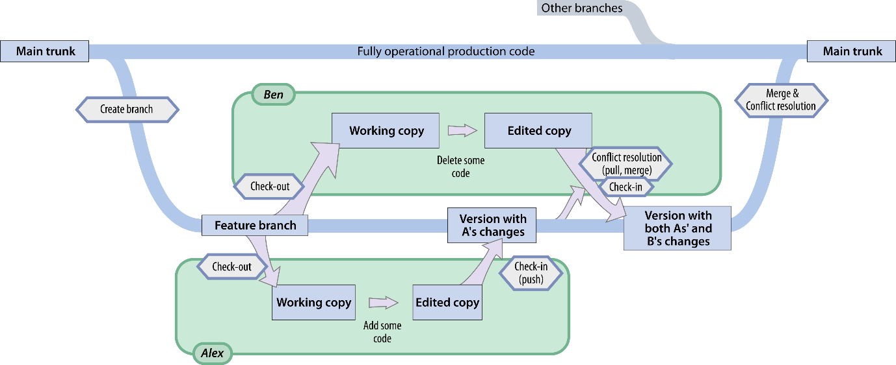

# Chapter 2: Best Practices

For one simple task, there are a hundred ways to write a piece of code that accomplishes it. All these pieces of code may work. They may even behave identically in all situations, i.e. represent exactly the same algorithm. But they may look and read completely differently. Best practice is about how to choose the best version.

In this chapter I will demonstrate

-   why I care so much about good practice
-   that there are plenty of resources around to help
-   that open code is vital for science
-   why you should learn to use a version control system
-   that there is a workflow for developing code

## 2.1. What is Good Coding Practice?

Professional programmers are coached to program well. The principles of good coding were established in the 1970s (Kernighan et al. 1974), and were aimed at programmers writing in lower level languages, whose code needed to be read by other programmers. The overarching aims include:

-   **Error-free code**: In practice this means ensuring that a program’s behaviour is specified accurately for every possible situation
-   **Team coding**: Often dozens of developers will be coding one software product. Coders may come and go from a particular project.
-   **Maintainability**: If a new version of the language or libraries is released, or as new scientific knowledge emerges, you may need to update your code to keep it functional.
-   **Maintaining security**: Commercial code needs to ensure data privacy, and resist hacker attacks
-   **Making code run faster**: If a program runs continuously with high throughput, efficiency can make a big difference to consumers.
-   **Economising on memory**: When multiple tasks occur simultaneously, it becomes important to manage which information to hold on to, and kept in memory (**RAM**), rather than being kept on disk.
-   **Robustness to different computer systems**: Commercial software must often be usable on many different computer setups, and is often platform-independent
-   **Flexibility and future-proofing**: The consumer may want additional functions, or to handle new situations.

Some but not all of these considerations may apply to scientific code.

The first point, error-free code, is worth a little expansion: Code can be wrong in two ways.

1.  If the computer detects there is something wrong, an **error** might occur. Your code might generate a message, or blank output, or the computer might crash. This might occur only in very specific circumstances. But in these cases, you know about the problem when it occurs, and you can do something about it.
2.  The computer may run the code just fine, but the program does not do what it was supposed to. This is a silent **bug**. Your code might output incorrect numbers, mix up an analysis, or delete something it was not meant to. Again, this might happen only in very specific circumstances. And when it does happen, you may never find out about it.

If you don’t specify what behaviour you desire from your program beforehand, then it’s hard to classify the bad behaviour as a feature or a bug! For example, you might simulate a biological or physical process, and find the variables diverge to infinity. This is usually because the problem was poorly specified (bad assumptions or parameters), rather than a coding error. In this case, the divergence is a useful feature, as it informs us that our model assumptions are invalid.

## 2.2. Why should I bother to write good code?

For scientists, the main benefits of good code are

-   **Fewer errors**: which means fewer retractions and failures to replicate
-   **Quicker debugging**: scientists waste a lot of valuable time poring over red error text
-   **Easier to modify and reuse**: there is no point re-inventing the wheel
-   **Readable by others**: allows code to be verified and publishable
-   **Easy to return to**: scientists often need to revisit old experiments and data, in light of new findings

Small investments early on can make later life easier! (Wilson et al 1996)

### Software carpentry

You cannot write good code without knowing how to program. This book does not teach coding. There are many ways to learn.

-   Local coding courses may be available through your institution – introductions to coding, training in specific languages, or domain-specific courses
-   Software carpentry courses, that teach general practical techniques, and how to capitalise on available tools \<see ref 1\>
-   Free online resources on the internet, e.g. web pages and videos \<see ref 2\>
-   Online courses
-   Books specific to your programming language

\<ref 1\> <https://software-carpentry.org/> \</ref\>

***

\<ref 2\>https://www.software.ac.uk/programmes-events/carpentries/software-carpentry\</ref\>

***

Books and courses are great, but you cannot learn to program without experience – just like you can’t learn to play the piano simply by reading textbooks and listening to music. There are two kinds of experience:

1.  trying to **code from scratch** your own ideas – for example,

***

-   you might have read an interesting algorithm in a paper, and you want to implement it on your own data, or in a different language, or repurpose it.

***

-   Or perhaps you are a statistics whizz who conceives a statistical model: you might want to simulate or fit it.

***

-   Or perhaps you found the equations for a scientific model, and want to apply it to actual numbers.

***

Here, you learn to break down concepts into instructions, think logically in terms of steps and variables, and build a mapping from your scientific language to a computer language.

Adapting other people’s code – for example you may have inherited code from other people, and you want to add a new function. Or perhaps you downloaded a toolbox from the internet, and need to modify it. Reading code and working out its meaning (**reverse engineering**) is a skill, and lets you acquire new snippets of language, and recognise new **design patterns**.

\<case study\>

What is your worst nightmare? For me, retraction of a high-impact paper is one. Retractions are increasingly common results of code errors (Casadevall et al. 2014). In the above case, a small error in a script crept in. The code was inherited from another lab, and in their excitement about the results, the code wasn’t checked. Two columns of data were flipped, leading to a protein’s structure being mirrored.

Consequently, five papers, including three published in *Science* between 2003 and 2005, had to be retracted in 2006 (Miller 2006). The papers were highly cited and controversial, so if the code had been **open source**, the error would doubtless have been picked up much sooner. The authors were candid about the mistake, and continue their highly successful work.

Admitting errors is painful, stressful and depressing.

\<key point\> Science is built on community trust. For this, we need a fair, open, blame-free culture. Top scientists admire people who admit their errors. \</key point\>

\</case study\>

## 2.3. Version control

What happens when you want to change some code? Most people will change the code, then save it. But this carries a high risk of “breaking” old functionality. That is, after you have made the change, you might not be able to run the same code on old data. When possible, you should try to make your code backwards compatible. How can you get around this?

**Exercise**: You have written an analysis script, “Analysis.py”. You get a new dataset, and you need to change the script because the new data includes an additional variable. You edit the code to work with the new script. What do you do now?

-   Save over the old version.
-   Save it as “Analysis_for_new_data.py”
-   Rename the first one “Analysis01.py”, and save the new one as “Analysis02.py”
-   Add the date to the end of the file, “Analysis_2020_05”
-   Create a new folder, called “Second_dataset”, and save the file there with identical name
-   Add a line to your code “DATASET = 2”, and where you make your modifications, wrap them with “if DATASET==2:”

Each method has problems. Can you identify them?

|                                   | Pro                                                                                                                                                                                                                                                                                                                        | Con                                                                                                                                                                                                                                                             |
|-----------------------------------|----------------------------------------------------------------------------------------------------------------------------------------------------------------------------------------------------------------------------------------------------------------------------------------------------------------------------|-----------------------------------------------------------------------------------------------------------------------------------------------------------------------------------------------------------------------------------------------------------------|
| Save over old version             | You don’t need to change any scripts that call this script: they will automatically find the new version.                                                                                                                                                                                                                  | You may no longer be able to analyse the old dataset.                                                                                                                                                                                                           |
| Analysis_for_new \_data.py        | Semantic name: you can understand from the filename what it’s for                                                                                                                                                                                                                                                          | Duplicates code. If you needed to change both the new and old analysis simultaneously, you need to remember to duplicate the changes too.                                                                                                                       |
| Analysis02.py Analysis_2020_05.py | Creates a sequential order, so that changes can be seen.                                                                                                                                                                                                                                                                   | Can lead to messy, cluttered folders, and difficult to keep track of which version to use. Old scripts that call on Analysis.py need to be changed                                                                                                              |
| Second_dataset/ Analysis.py       | Moving between directories automatically selects which version of the script you want. Creates organisation in file structure.                                                                                                                                                                                             | Can be very confusing if you are relying on the PATH to find the code (in Matlab). When debugging, it is not clear which of the two files has the error, because error message may just say “Analysis.py”.                                                      |
| If DATASET==2:                    | You can switch between the datasets by changing a variable. Does not duplicate code, so subsequent changes can be applied to both datasets. You get a single script at the end, for distribution. Encourages generalisation of the code, and thinking about what aspects of your analysis are common to the two datasets.  | Not suitable for all changes. Some changes are too large and would lead to a lot of “if” statements. Runs the risk of breaking your analysis for the first dataset Code can get complicated quickly, and you may need to split the analysis in different ways.  |

There is a ready-made solution for this problem: Version Control software. There are a range of tools you can use: find out what your colleagues are using. The common ones are: Git, Subversion (SVN), and Mercurial. They have similarities and differences, and they all have a learning curve. Many online learning resources are available for beginners.

### A simple workflow

Version control programs are integrated into several coding environments, but are also available as standalone command line tools, which may have their own standalone graphical interfaces (independent of any IDE).

Most tools allow “branches”, containing different versions of your code. However, a minimal workflow might use just a single “master” branch, where you commit daily changes. As an individual scientist, you might want to

-   maintain multiple versions of your code
-   keep backup copies on disk or on cloud

***

-   synchronise edits from multiple computers

***

-   back-track at any point
-   audit progress.

For the community of scientists, they permit

-   code sharing
-   future adaptation of your code by other people for new purposes
-   code maintenance by the user community.

***

-   concurrent collaboration, synchronising edits from multiple users

### A more involved workflow

Common features are

-   Forks and branches: you can create a parallel copy of the code. This means different people can work on different parts of the code, and you can have copies with different functionality.
-   Merge: Somebody responsible can bring together changes made in different branches.
-   Cloning and Committing: These features give you the ability to edit and tweak code on a local computer, then send your edits to a central location.

\<image\>

\<caption\> Figure 2.1 **A more complex use of a version control system**. Version control systems allow operational and development versions to co-exist. Code can be changed by different people, and the edits merged. In this example, the main trunk contains fully operational code. A branch is created in the repository, for developing the new feature. Alex and Ben "check out" this branch, meaning that their computers’ files reflect the new branch. After they make changes, they can "check in" their edits back to the branch. If the edits conflict, they have to be resolved manually. Edits within this branch don't affect the trunk. Once the tests have been passed, the changes from the branch can be merged into the trunk. \</ caption\>

One major problem is that multiple versions of commonly-used code inevitably means conflicts. Some authors recommend that code should be open for extension, but closed to modification (the **open-closed principle** (Martin 2000)). This would avoid version conflicts altogether. But it’s not possible to predict use cases in advance, so branching versions remain the norm, and guidance is available (Perez-Riverol et al. 2016).

***

### Diff

You will need to get familiar with a file comparison utility, sometimes called a **diff** tool. Diff software allows two files to be compared line-for-line. This can be used with or without version control. There are graphical diff tools, which contrast two files side-by-side. These programs will try to line up matching parts of the files, and highlight the changes, with sophisticated algorithms that can spot moved sections. Some programs will also allow you to **merge** selected changes across the files.

It may be useful to know that the original console diff command (available on UNIX/Mac) can produce a text file that summarises the differences between two files, and these changes can then be applied to a file using the patch command.

## 2.4. Publishing Code

Many Universities have their own archives for code and data, and there are national archives. Additionally, some journals have begun to host resources to accompany papers. These have the advantage that

-   they are guaranteed to be operational for a long time e.g. 10 years
-   once deposited, no maintenance or subscription is needed on your part

However, this kind of deposited version is usually a **final** version. So this kind of archiving is useful for data and scripts that accompany published manuscripts, which will not be further modified as they reflect a finished product.

One alternative is to publish code (and data) in a repository that implements version control. These environments include GitHub, GitLab or Open Science Framework. You may have institutional guidelines on where and how to publish different kinds of code and data, and how to deal with versioning, linking to preprints, and the institution’s open science policies. Consider a service that provide a citable digital object identifier (DOI) for publishing research code.

What counts as a good format for publishing code? Some people prefer a downloadable unit – e.g. an archive (e.g. a zip file).

-   Archive files preserve the folder structure on your disk, which might be important for your code. It has the full directory structure all laid out. You can unpack the archive and directly run.
-   Zip archives are compressed, which means for code they can take up less than 40% as much space. But since code is small, it’s usually compressing the data that makes a big difference. If your data has a high resolution, e.g. very fast sampling rates or a large number of bits per sample, then you could achieve up to 90% compression. Some files are already compressed, such as Matlab mat / HDF5 files, TIFF or PNG files, so may not benefit further.
-   Archives also contain a **checksum**, which means that if a **byte** in the file gets changed (e.g. by a disk or network error), this is detected and you will be notified. If not for the checksum, a small change that doesn’t break your code might go unnoticed.

The flipside of this is that a single byte error in an archive file means that the whole file is corrupted, and sometimes none of the information inside is retrievable.

\<example image - zip folders TODO\>

-   Provide a **Readme file**, in the root directory. This should provide instructions on how to get it working. Explain where to unzip the files, how to install required **dependencies** (extra components required to run the program), and configure the search path if needed.
-   A **Manifest file** is a structured file (i.e. it is machine readable) that indexes your archive. It might give the type of each file, its size, and a list of dependencies for each one.

***

-   Provide a clear **entry point**: a script that can be simply loaded and run, without any extra setup
-   Provide **metadata** for any data – that is, information about how the data is structured. This should include a hierarchy of variables, naming conventions, array dimensions, column headings and units. Include the same kinds of information you would use when commenting variables in code\*. You can provide metadata simply through your code, or use a separate file e.g. XML, a table, markdown or markup, or just plain text.
-   Give a reference to a paper, where the methods are fully described. You want to be cited, don’t you? And nobody can use data or code if the methods are not explained in full detail.
-   Provide your contact details – perhaps a permanent email address as well as an institutional one.
-   Minimise namespace intrusions, which may cause **collision** problems for some users.
-   Be prepared to offer support. Depending on the popularity of the resource you publish, you might need forum or group mailing list.
-   Update your code. If bugs are found, correct them using version control, and advertise the changes to minimise people affected.

An alternative way to publish code is an **interactive notebook** or ‘live script’. Code is presented as a webpage, including interactive commands and their outputs. Notebooks contain a list of cells, each with a few lines of code, that can be stepped through. Each cell might produce some intermediate output. Cells can also contain text and equations. This allows a reader to follow through the steps of an analysis.

### Code security

This book is not intended to be a guide to information security: plenty of other guides are available for that \<ref CNIL\>. But, as part of research ethics, institutional policies and national regulation (e.g. General Data Protection Regulations (GDPR)), we all have a duty to keep data secure. I will summarise some measures here, but they should be obvious.

**Data security** should be in proportion to how sensitive the data is, so use common sense:

-   Password/passcode protected logins for all devices, including mobile phones – follow guidelines on password strength and reuse. As a programmer, you will begin to realise how easy it is for a hacker to fool a computer.
-   Always use an encrypted drive when transferring files
-   For human data
    -   anonymise data at the point of collection
    -   keep linkage key on paper in locked room, so that identifying information is not stored electronically
-   Avoid use of uncertified cloud platforms, according to your local policy
-   If you store confidential data, consider

***

-   operating-system level hard disc encryption

***

-   saving documents with password-based encryption.

***

Part of this is also keeping your computers safe

-   Avoid uncertified remote desktop software, desktop sharing, or remote login servers
-   Use appropriate firewall and antivirus
-   Caution when opening email attachments or clicking on email links
-   Never provide your password to anyone or re-use passwords. Many institutions now recommend password managers or “digital wallet”.
-   Set appropriate permissions on data directories

\<case\> The Adult Friend Finder data breach

According to CSO online and BBC reports, in 2016 hackers stole between 3.5 and 400 million usernames and passwords from the adult swingers site FriendFinder, compromising IP addresses, names, billing details, and explicit photos and messages for several casual hookup and adult content sites like stripshow.com. The files were published with a \$100,000 ransom demand.

The hack exploited a trick to get files from a server that are not directly accessible. Some web pages use **local file inclusion**, which is a way to include dependencies, like include or library. Inclusions sometimes allow a the web page URL to include a query, which specifies a filename to include in the web page. For example, you might have a URL like <http://oup.com/?module=products.php>, which includes the code for ‘products’ on the page. The vulnerability meant you could replace this with a file in the server’s root directory – like /etc/passwd for example!

For safety, the server should have **validated** the module query by removing slashes or dots, permitting only a particular set of module names, and also checking user access.

Worse still, the passwords were only encrypted with **Secure Hash Algorithm 1 (SHA-1)**, which generates a 20 byte **hash** code. When you enter a password, only its hash code is stored, and authentication then involves comparing the hashed passwords. While this was thought to be secure, by 2005 it was shown to be crackable, taking 233 tries to find a password that will generate a given hash. Although it would cost thousands of pounds in electricity, this is easily done on modern GPUs. SHA-1 is no longer accepted for web certificates. It was estimated that 99% of the leaked FriendFinder passwords were cracked within a month, and included 5000 military and government addresses. This kind of attack is common, with victims including Yahoo, Adobe, MySpace, LinkedIn, and eBay.

\<ref\> <https://www.csoonline.com/article/3132533/researcher-says-adult-friend-finder-vulnerable-to-file-inclusion-vulnerabilities.html>; <https://www.bbc.co.uk/news/technology-37974266> \</ref\>

\</case\>

Some aspects of GDPR regulations \<ref CNIL\> legally require you to:

-   Recognise personal data, and sensitive data. Importantly, if information can be used to identify people by coupling it with other data, it is personal. In fact, **pseudonymised data are considered personal data**.
-   Minimise data collection
-   Inform users in a concise, transparent, comprehensible and easily accessible communication
-   Define a data retention period
-   Follow the “legal basis” i.e. processing the data only for the appropriate purpose
-   Manage access rights to the data according to need-to-know

**Secure coding** is part of this, and if you are writing server code, you should read specific books on security especially **cybersecurity** (Graff & Wyk 2003; Howard & Leblanc 2004 ). Key topics include:

-   Checking the input to your code, at every stage. Input validation means check that numbers and text sent to your function contain only expected values. Use **assertion** to ensure your code fails when it needs to.
-   Use encapsulation with object-oriented code
-   Keep code simple and readable with commenting, naming, and functions
-   Start implementing security measures when you first plan your code
-   Set aside time for security testing at the end, and ask an expert to find security holes

\<ref CNIL\>

Commission Nationale de l’Informatique et des Libertés CNIL GDPR guide <https://github.com/LINCnil/GDPR-Developer-Guide>

\</ref\>

## 2.5. Open Code, Licenses and Publishing Code

The main open source software licenses are:

-   **Copyleft** eg GPL (Gnu General public license) which allows the code to be re-used by others in new projects, as long as the project carries the same license. Used for the Linux operating system.
-   **MIT license** – the code can be re-used for any purpose, under any license. Used for much web coding and javascript. Also requires the copyright notices to be included with any copy of the software.
-   **BSD** (named after Berkeley Software Distribution, a Linux distribution that first used the license) – the code can be re-used for any purpose, under any license, provided the copyright notices of each contribution, and disclaimers of warrantee are preserved.
-   **Creative Commons licenses**: often used for the text of academic papers, but not recommended for software. CC BY is an ‘attribution’ license, which allows re-use in any form, including commercial, as long as the author is credited. CC BY-SA is a copyleft version (ShareAlike), and CC BY-NC allows only non-commercial use.

License conventions vary by field, and change over time. So, do your own research\<ref\> and ask what your colleagues are using. If your institution or funders claim intellectual property rights, please seek legal advice locally before committing to a license.

**Ethics** of code sharing: each time you use 3rd party code, check the license, and acknowledge the code appropriately, both in comments and in accompanying publications.

\<ref\> https://choosalicense.com/\</ref\>

## 2.6. The Software Development Process

Commercial programmers work with clients who specify what their code should do. As you might imagine, this can go disastrously wrong, since:

1.  clients often have no idea how to specify an algorithm – often they have trouble even deciding exactly what the program should do in each possible case;
2.  the programmer often has no idea about the nuances of the data and logic that the client needs;
3.  the client usually has constantly changing demands which may be modified before the software is even finished.

Software development has invented many styles of project management to approach these problems. Not all of these are relevant to scientific lab-based coding, but it pays to know that they exist.

Software development is an iterative process. You start with the scientific idea, plan what steps are needed, write code, and test it. It will probably fail, which means you have to debug the code. This will often unearth problems in the code's organisation, which will require refactoring. Conceptual problems in the algorithm may require you to plan new computational steps, restarting the cycle. Development therefore proceeds in **cycles**.

\<caption\> Figure 2.2: Starting with a very simple specification, code can be planned. The plans can then be implemented by writing code. The code can then be tested, and if it fails the test, it can be debugged and refactored. Once it passes the tests, it can be used and maintained. But usually, additional specifications are added, and the process starts again.

\</caption\>

**Agile**: Programmers aim to get working software out quickly, and then rapidly evolve the product by getting feedback and implementing small changes. This addresses the problem of constantly changing demands by only working toward one short-term goal at a time, with customer involvement and feedback after each goal. They use strategies like a daily **scrum** where team members summarise the day’s work, and work in **sprints** – a timeframe of a couple of weeks to achieve specific goals.

**Test-driven development (TDD)**: Software is built in units, each of which is self-contained and has well-defined behaviour. Even before you begin writing code for a unit, you write the **unit tests**. The suite of tests is a complementary body of code that runs and tests each little piece of the unit. It makes **assertions** about what results are expected, in each possible situation. Writing the tests first means that they will initially fail, since there is no working code! Your job is then just to make the tests pass, so progress towards a goal is easily measured by the number of failed tests remaining. **Code coverage** measures how much of your code is actually tested by the test suite, and there are tools to analyse this.

**Extreme programming (XP)**: a form of agile development in which new code is released extremely quickly – perhaps combining edits from many programmers at the end of every day. Unit tests must be written before writing any production code. **Pair programming** is common, where two coders work at a single computer – one person typing, the other reviewing. If you are interested, look these up on <http://software.ac.uk/resources/guides>.

Numerous courses exist on these techniques for software industry, which may be less useful for scientific coding.

\<further reading\> Extreme Programming Pocket Guide, O’Reilly 2003 ISBN-13: 978-0596004859

In scientific programming, a highly effective strategy to check your code is **simulation**. This means creating artificial data, which you have full control over. You will need to come up with a **forward model** of your data.

Once you have coded up a data analysis script, run it with example data that you have created. Can you obtain a null result? Can you detect a true positive?

In some domains, the motto is simulate, simulate, simulate:

\<caption\> Figure 2.3: Simulation is a central component of science \</caption\>

-   Generate data before you design an experiment. Add in measurement noise and process uncertainty, to see if your experimental design is appropriate to test your hypothesis.
-   Simulate once you have pilot data, to check your power, and to validate the forward model which you use to simulate your data.
-   Simulate again when you perform your final analysis, to see if you can actually recover the parameters you estimated.

## Chapter summary

Good code is important for you: it will reduce errors, and make your life easier. It’s also important for other people: your code will be re-usable by your team and the scientific community. Imagine coming back to your code in two years’ time, having forgotten all the details. How would you like the code to look? Imagine emailing the code to your boss. Would they be happy reading it?

As you work on and modify your code, you want your code to be accessible, re-usable and adaptable. To achieve this, you should know a range of techniques, and when to use them – and this knowhow amounts to both a skill and an aesthetic – if you like, **phronesis** (a practical virtue).

Discussion Questions: What are your favourite features of your version control system? Can you these in other aspects of your work, e.g. collaborating, writing papers, or synchronising files across computers?

Further reading: Riquelme & Gjorgjieva, 2021
