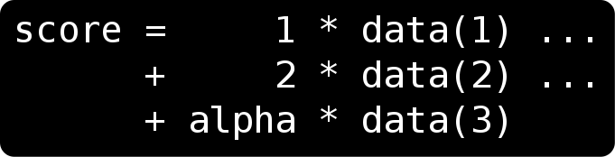
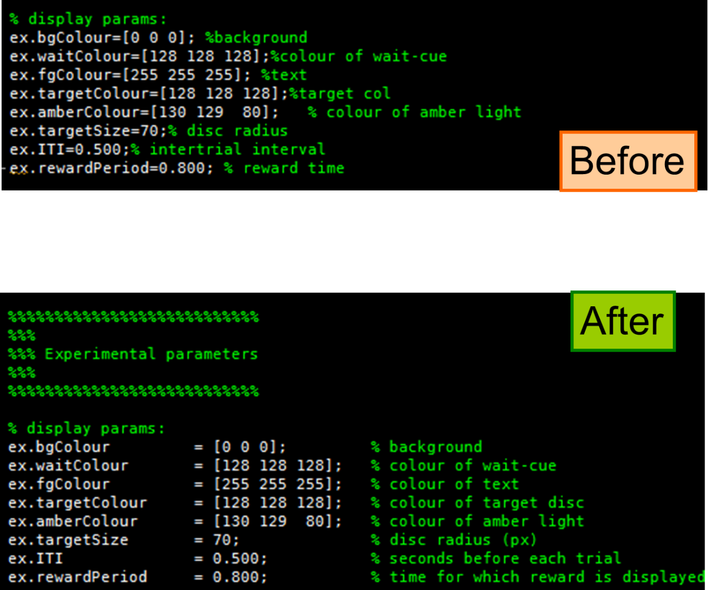

# Chapter 3: Preparing to code

Writing code takes a lot of concentration. You need to maximise your vision, memory capacity, and typing speed. Coding is frustrating, and can be stressful, so let’s make your environment as comfortable as possible. Take some time to adjust things, and on its own, this will improve your coding.

In this chapter you will understand

-   how to stay comfortable while coding
-   why you should spend time setting up your coding environment
-   how to use empty space to make code more readable

There are many coding environments, but they are in constant flux, so I will discuss only the common aspects.

## 3.1. Are you sitting comfortably?

These guidelines are taken from the UK Unison Display Screen Equipment regulations.

### Adjust your seat

-   Raise the backrest to a position where supports your lumbar spine.
-   A slight forward tilt to the seat is recommended.
-   The height of the seat should be such that your arms comfortably rest on the desk, ideally forearms horizontal or with a slight downwards slope when your shoulders are relaxed.
-   If the height is not comfortable, you can raise the desk with bricks or books.
-   If your feet do not rest flat on the floor, consider a footrest.

    

***

Figure 3.1: How to sit comfortably

***

### Keyboard and mouse

-   The keyboard should be sufficiently far from the edge of the desk, so that there is room to rest your wrists, but sufficiently close that when typing, your upper arms hang vertically.
-   Avoid resting your wrists on the edge of the desk – raise the height of your seat to avoid this.
-   Ensure your mouse speed is set high enough, so that you don’t need to move your hands wildly, but low enough that you can still click precisely between letters.

### Screen position and visibility

-   Your screen(s) should be directly in front of you.
-   If the screen is horizontal the top edge should be approximately level with your eyes; for vertical screens, eyes should be about three-quarters of the way up.
-   The screen should be approximately at arm’s length when you are sitting comfortably back in your chair.
-   Take an eye test, get the right glasses, and keep them clean!
-   If possible, use a matte screen. If your screen is reflective, try an anti-glare filter.
-   Close blinds and point the screen away from light sources and windows.
-   Make sure the screen is clean.
-   Adjust the display contrast and brightness on the monitor itself to maximise the visibility of your code.

### Posture

-   No posture is ideal if maintained for long periods. Take frequent breaks away from the screen – break up your day with meetings, calls or actual breaks.
-   Adjust your chair during the day.
-   Avoid slouching forwards, keep shoulders above hips, and don’t stretch when using the keyboard.
-   **Seek help from your department / employer** if you experience any problems with your equipment.

\<ref\> Adapted from Unison UK’s Display Screen Equipment Guide

## 3.2. Your coding environment

Code is written in text editors. For most scientific computing, you will want to write your code in a specialised editor that is designed for your language. At the simplest, you might use a command-line text editor with programming plugins (like vim or emacs). But for interpreted languages, you may improve your productivity with something more sophisticated.

The most sophisticated code editors are known as **Integrated Development Environments** (IDE). Matlab has an IDE built in, but for Python and R, you may need to download a separate program. As of writing, Spyder is common for scientific Python, and Rstudio for R. I won’t touch on specific IDEs, as they are in constant flux.

### Using an IDE

A typical scientific IDE contains four components:

1.  A console, to type commands directly into an interpreter, which are executed immediately
2.  An editor, to view source code files
3.  A file panel, to browse your computer’s directories and load files
4.  A workspace or variables view, which variables in the current **stack frame**.

\<caption\> Fig.3.2: Auto-completion using the \<tab\> key displays a list of known names of fields, variables or functions within the relevant namespace. \</caption\>

How will an IDE help you?

| Auto-completion         | After you type a few letters, the IDE will show you options to complete the word. It is usually context-sensitive.                         |
|-------------------------|--------------------------------------------------------------------------------------------------------------------------------------------|
| Parameter help          | When you type “(“ to call a function, e.g. “sin(“, then information is shown about what you can put in the brackets.                       |
| Syntax highlighting     | Recognised keywords in the language are highlighted. Comments, definitions and loops appear in colour.                                     |
| Selected word highlight | When you click or select a variable name, all the occurrences of that variable are immediately highlighted. This is incredibly useful.     |
| Working variables       | A table showing the variables currently in the workspace                                                                                   |
| Bracket matching        | Click on an open-bracket to see the matching close-bracket (or vice versa)                                                                 |
| Code folding            | In the margin, you can collapse chunks of code, like functions or blocks                                                                   |
| Debugging               | Visually add breakpoints, step through code and into functions, hover over code to see variable values, window showing current variables.  |
| Smart indenting         | When you press return after typing “for …”, the spaces are added before the next line, to indicate the next lines are inside the loop.     |
| Auto-format             | You can select a chunk of code, press a key to automatically fix indentation. e.g. \<TAB\> in Matlab if emacs-style indents are enabled.   |
| Command History         | Keep track of all the commands you have typed, auditing your progress and errors.                                                          |

Look through your IDE’s options to see how to enable and invoke these features.

\<caption\> Figure 3.3: IDEs have an option to “highlight current word”- making it easy to see where a variable is created and changed. \</caption\>

Good coders don’t need a mouse: moving your hand between the mouse and keyboard costs valuable thinking time, and distracts you from what you are coding. Some say it also contributes to wrist strain. You must know your shortcut keys. The most important ones are:

-   Move cursor to console, Move cursor to file editor (matlab \<ctrl\>+0, \<shift\>+\<ctrl\>+0; spyder \<shift\>+\<ctrl\>+I, \<shift\>+\<ctrl\>+E; Rstudio \<ctrl\>+2, \<ctrl\>+1)
-   Cut, copy, paste
-   Go to beginning of line \<home\>, End of line \<end\>, start/end of document (e.g. \<ctrl\>+\<home\>)
-   Move forward by one word, backward by one word (e.g. \<ctrl\>+\<right\>)
-   Select while moving (usually hold \<shift\>, e.g. \<shift\>+\<ctrl\>+\<right\>)
-   Quick-run a line of code (variously F9, \<shift\>+F7, \<ctrl\>+R)
-   Quick-run a block of code (\<ctrl\>+\<enter\>)
-   Auto-complete (e.g. \<ctrl\>+\<space\>)
-   Jump to function definition (e.g. \<ctrl\>+D, F2)

***

If you do not know the specific keys for your system, look them up and practice them. You should be able to **configure these keys** in the options or preferences menu. If you are using a laptop, practise hitting \<home\> and \<end\>, which might require you to hold down a ‘function’ key; alternatively assign them to another combination, such as \<ctrl\>+ something. Learn to **touch type**: you can find other guides to this, but in brief, keep your index fingers over ‘F’ and ‘J’ keys (marked with bumps), and use your right little finger for \<shift\>.

A useful technique is to learn one new shortcut every few days (once all the other ones you’ve already learnt have become automatic).

One useful feature of IDEs is the ability to ‘drill down’ into variables by clicking in a ‘workspace’ window. You can display elements within your variables – like fields of a structure, or elements of arrays. However, do get used to doing this in the console, by typing the variable names, and using auto-complete. You will soon cherish the speed gained from **avoiding the mouse** (and touchpad).

You can save all the loaded data in your session using save / shelve / dill / save.image / save.session.

### Fonts

Exercise: Can you read these characters? Which font do you prefer, and why?

\<Caption\>Fig.3.4: Which font do you prefer? \</caption\>

### Monospaced fonts

There are two types of font: proportionally spaced and monospaced. Proportional spacing means that the letter “i” takes up very little width on the line, whereas the letter “m” takes up much more. This is great for reading, because the vertical lines in the text are all similar distances apart. However, it is never used for code. Alignment is crucial in visualising code, and to get good alignment, all characters must take up the same space. Interestingly, the digits 0 to 9 are monospaced in all fonts, because alignment is crucial for numbers too.

\<caption\>Figure 3.5 Proportional font (left) and monospaced font used for programming (middle). Numbers are monospaced in most fonts (right).\</caption\>

### Font size

Some people like to see lots of code on screen at once, and use small point sizes. The critical test is, how easy is it to distinguish a comma from a full stop? A colon from a semicolon? These are the commonest errors.

### Hazards of IDEs

Most IDEs have a data viewer like a spreadsheet. Using this graphical interface can be useful but comes with hazards, as discussed above. IDEs encourage mouse-click-based data analysis, which ultimately takes away your control.

Instead, learn to use the command line and scripts to manipulate the data. To view the data, type the name of the variable containing the array or table – rather than clicking on the variable with the mouse. To check its size, just use size / shape / dim. To get a statistic, use mean, min or max, or summary. To visualise the distribution of values, use histograms, cumulative densities ecdf / plot.ecdf, and scatter plots. To get a list of possible values, use unique. Consider showing a table as a heat map, using imagesc / imshow / heatmap. Overlay several plots, using different colours to compare them, and consider a plotting library like gramm / seaborn / ggplot. For multi-dimensional data look at the correlations with corrplot / seaborn.pairplot / pairs. When flicking through data, these are the commonest things you’ll want to do.

\<key point\> Digging into the data is one of the great joys of science. This is how you discover new things. Have the tools under your fingers. \</key point\>

Crucially, you can instantly automate or vectorise these operations, so that you can plot overlaid distributions of several conditions at once, visualise all possible pairwise correlations with an array of plots, or in a single command request summary statistics per session and condition.

\<key point\>

Get used to quickly checking through data with **console** commands. Typing commands lets you track edits in the command history – you can spot errors in retrospect, and you can repeat commands easily using the cursor keys.

\</key point\>

### Know where to find help

For all languages, help is close at hand.

1.  From the interactive console, the help() command gives you most of what you need.
2.  Most IDEs also provide built-in documentation viewers: e.g. Matlab doc command, Spyder help window (check out ctrl+I and the ‘automatic help’ that opens the docs when you type a function) and the R Studio help tab, using the “?” prefix.
3.  To see what information is hiding “inside” a variable, you could try methods(x), dir(x), attributes(x). In most IDEs you can type x. (x\$) and press tab to see the list of completions.

***

3.  Many functions are written in the language itself. This means you can peek into them, by displaying their **source code,** which might contain helpful comments. You can call edit in Matlab, or just type the function name in R. In Python, your IDE will have shortcuts for finding the source .py file, or you can use inspect.getsource().
4.  Search online to find the documentation for the packages you are using. The maintainer’s website may have example code. Ask a clear question an coding forum.
5.  Ask someone! Try **pair programming**, or speak to a colleague. General coding forums can be invaluable for solving problems, but to get the right answers, you must ask your question well.

## 3.3. The Neuroscience of Legibility

### Screen orientation

Do you ever find that when you read to the end of a line, you have to concentrate to find the beginning of the next line? Do you ever begin the same line twice, or skip a line? Line breaks are much harder to navigate when lines are longer. This is because the rapid eye movements you make to scan back, called **saccades**, obey a version of Fitts’ law (Harris & Wolpert 2006). Larger eye movements are less precise, and may not land exactly on target.

Newspapers have solved this problem with multiple columns. Each column might only be a few words wide. Common guidelines are less than 50 characters, or 8 words. You will never find an A4/letter-size book printed margin to margin – the column will be about 15 words wide. In these days of widescreen monitors, this is even more of a problem.

\<caption\> Fig.3.6: Example of newspaper columns. This well-tested style of print is optimised for the human eye and brain. Note the narrow columns with 3 to 7 words. Indentation helps pick out paragraphs. \</caption\>

To optimise code legibility, it is usually preferable to keep lines short. An 80-character limit is traditional because old terminals had such low resolution. However it remains a useful guide, for the reasons above. Many modern editors can put a vertical line here as a marker, or offer to automatically wrap comments at 80 characters. Some people prefer a longer limit, e.g. 120 characters.

One solution is to rotate your monitor to vertical orientation. This is extremely useful if your scripts are long: you can see more of the script without scrolling.

\<exercise\> Are there any disadvantages to the 80-character width limit?

I can’t think of any. \</exercise\>

 

\<caption\> Fig 3.7: splitting the editor, or using vertical monitor orientation, to maximise your screen space. Seeing a lot of code at a glance is vital.

Another useful option is to split the editor, so that you are viewing two columns of code at once. This makes it easier to switch between different functions, or even between two locations in one long file. This is great when you have multiple files that call upon each other.

When might long lines be better? When it makes parallels in your code clearer. For example, look at this code and see if you can figure out what it does:

output_horz( sample, sensor ) = input_horz( sample, sensor ) / sensor_gain( time, sensor )\^2

\+ horz_offset( time )

output_vert( sample, sensor ) = input_vert( sample, sensor ) / sensor_gain( time, sensor )\^2

\+ vert_offset( time )

It is performing two calculations, for a pair of horizontal and vertical inputs. The two statements look similar, but in what way? Perhaps it would be clearer written like this:

output_horz( sample, sensor ) = input_horz( sample, sensor ) / sensor_gain( time, sensor )\^2 + horz_offset( time )

output_vert( sample, sensor ) = input_vert( sample, sensor ) / sensor_gain( time, sensor )\^2 + vert_offset( time )

because it is easier to see the similarities and differences between the lines.

\<key point\> The rule is: know when to break a rule! \</key point\>

All the rules in this book are guidelines: use your judgement to work out whether they apply.

**Two screens** are always better than one. You could use one to keep the console and variables, another to put the editor. If you are working with data, you could have one screen for plotting. If you are referring to documentation, you might open a web browser or doc pages on a separate screen. Some people use three screens.

### Spacing

Many computer languages ignore spaces, so you can usually add space liberally in your code. Leaving a little space around something is a great way to make it stand out. Code should be like a picture: try and portray the structure of your code graphically, by adding space and aligning things.

As you may be able to see, this code adds up some data. But can you improve it? Here is one suggestion:

Points to note:

-   The uses of the variable “data” are aligned, so they can immediately be compared. Any spelling error in the variable name can be immediately spotted. The variable looks visually more like a vector.
-   The coefficients have been spelled out, introducing the ‘invisible’ 1 that multiplies the first term. This makes it very clear that the various data elements are being scaled in different ways. It also makes the code easier to modify if needed. The code could potentially be vectorised.

The three characters space, tab and newline (“carriage returns” and “line feeds”) are all considered **white space**. In most code, whitespace is ignored. Python is fussy about newlines and spaces at the start of lines. Newlines can be inserted liberally if you are inside an expression enclosed by brackets. Matlab requires you to specify the magic “...” if you want to break a line.

To include tabs in your output, code them as "\\t". To output newlines, use "\\n", which generates **carriage return** and/or **line feed** characters, depending on whether you are on Windows or not.

Where should I place spaces within a line of code? There are no strict rules. But here are some guidelines that are commonly followed:

-   Placing spaces around an assignment operator (=, \<-) makes it easy to spot what variable is being changed on each line. Compare:   
    x=x+(vel+dv)\*(t0+t)   
    vs   
    x = x+(vel+dv)\*(t0+t)  
    This is because people often scan through code to find where x was last changed – for example when debugging.
-   Placing spaces around things that count as additive terms helps when you have multiple terms on a line. Compare  
    x = x + (vel+dv)\*(t0+t)  
    Here it becomes clear that x is being adjusted or incremented by one product.
-   Spaces can help separate factors within a term, when each term is itself a compound:  
    x = x + (vel+dv) \* (t0+t)  
    Here the spaces help to clarify the **operator precedence** (i.e. that first the velocities are added, and the times are added, and finally these two are multiplied.
-   Don’t use spaces before a bracket that represents a function call:  
    x = x + sin(t0 + t)
-   As with natural English, avoid spaces before colons and commas:  
    def my_function(x, y):

In general, add space until it becomes easy for someone to guess what your code does, with their eyes half closed.

\<exercise\> What are the arguments against spacing?

Some coders argue that it wastes time, and code gets out of alignment quickly, which can be confusing. It means the spacing doesn’t follow uniform rules, and the invaluable auto-format commands will disrupt it. \</exercise\>

### Crowding

Focus your eyes on each circle on the left. Can you read the T on the right?

\<caption\>Fig.3.8: visual crowding: look at the circle on the left of each row, and try to see the letter ‘T’ on the right. Adjust the page so you can see the first one clearly. Now look down at the second one. The T should disappear into a jumble of lines. Now look at the bottom one: you should now be able to identify the T, because of the spacing.

This phenomenon is known as crowding (Whitney & Levi 2011). The closer letters are together, the harder they are to individuate, when in peripheral vision. There is no problem when you focus your eyes on them. And there is no problem if there are no flankers (“L”s). If you have several text elements, adding spacing can really improve legibility when scanning a document.

**Styles guides** provide rules on how to space out code. For example **PEP 8** (van Rossum, Warsaw & Coghlan 2001) is a style guide for Python written by the creator of Python. This guide stipulates that consistency within your code is the most important thing. The rules in it are well worth reading. But it goes on to say, “know when to be inconsistent -- sometimes style guide recommendations just aren't applicable. When in doubt, use your best judgment. Look at other examples and decide what looks best.”

Some style guides recommend adding spaces inside brackets. Spaces are not recommended between closely associated items, for example between a function name and its open-bracket.

returnValue = processingFunction( inputData, parameters )

Spaces are commonly added after commas, and between terms in formulae, both before and after binary operators (like “+” and “\*”). In particular, you can use space to accentuate the natural grouping of operations, emphasising the operator precedence:

currentValue=currentValue+count\*increment;

currentValue = currentValue + count \* increment;

\<box\> A ‘term’ means a group of items that are multiplied together, but two things that are added together are different terms. Logically, it makes sense to separate the terms in a formula with spaces.

### Tidy code = Tidy mind

Some people advocate neat, aligned code. It often allows mistakes to be spotted quickly. For example, it is much easier to spot differences between two similarly-structured lines that are aligned. It also demonstrates that you have spotted that the two lines are similarly-structured, and could thus potentially be **refactored** into a function.

\<caption\> Fig.3.9: The judicious use of alignment and lines can make some code much easier to read.

Benefits: it becomes immediately obvious that the colours are all triplets of integers from 0 to 255. You can even see which colour channels have the same values. It is easier to read the comments. The ‘banners’ and lines drawn are readable from a distance, and make it easy to scroll to important sections in a longer script.

Problems: The code becomes longer, so more scrolling is needed. Beware of ‘gaudy’ or garish code – banners and lines are only useful markers if they are used sparingly. Otherwise they run the danger of cluttering (Martin 2011).

### Black on white, or white on black?

Should you use a dark or light colour scheme for programming? The debate is long and complex (Buchner & Baumgartner 2007), but here are a few points.

-   If you have **refractive error** (i.e. you wear glasses or have astigmatism), you can see better when your pupil is small. That is, a bright background will give better legibility in a dark room. In daylight, it probably makes little difference.
-   However, if you suffer from **glare** (i.e. if you see haze around lights, for example if you have a cataract, corneal scars or vitreous floaters), bright light will scatter in the eye, and so a dark background will give better legibility.
-   Some people believe that a dim background may reduce eye strain.
-   If you are looking away and back from the computer screen, the pupil has to adapt to the change in brightness. It is possible this may contribute to eye strain. So, some people prefer to **match** the brightness of the screen background to their surroundings. That means dark background in a dark room, and bright in a bright room.

Everybody’s eyes are different – we each see colours differently because we have different pigments, with varying time constants, and we each have unique optical imperfections. So try out some different colour schemes and find what works.

### Syntax highlighting

Colours are critical to noticing problems in code.

\<exercise\> Can you spot the errors?

begin = 1

end = 5

length = end – begin

abc = 1

def = 5

len = abc – def

In Matlab, then end is a reserved keyword, so this will give an immediate error; length is a built-in function and it will be **shadowed**. Similarly in Python, def is a reserved keyword and len is a built-in function. Syntax highlighting will show you the keywords in colour, but overwriting built-in functions is something you just have to be always alert to.

It is safety-critical to have syntax highlighting turned on. But do spend some time adjusting the colours to your liking. Make comments stand out! You may find your IDE puts comments in low-contrast colours. Depending on your coding style, comments might be more important than the code, so colour them appropriately.

Standard: Comments emphasised:

\<caption\> Fig.3.10:If comments are important, make them more visible. \</caption\>

Remember, though, that the only thing at actually matters is the code – the comments might be all wrong!

### Organise your files

Think carefully about your folder / directory structure in advance.

-   Will the data be easy to find?
-   Where will the analysis scripts go? Data-specific code should be stored near the data, whereas more generic or abstract code can be further away.
-   Will the files be easy to loop over? Keep similar files in a single folder, or in an identical folder structure, so that you can simply insert a number into a pattern. Think about writing the loop before you create the data folders.

e.g. By first writing the loop below, the best format for the data folders becomes clear

subjects = [1,2,3,4, 6,7];

pattern = ‘data/expt1/sub%02g/data.mat’

**for** s = 1:**length**(subjects)

file = **sprintf**(pattern, subject(s));

data{s} = **load**(file,’data’);

**end**

data = [ **load_csv**(“data/expt1/sub%02g/data.csv” % s) **for** s **in** subjects ]

### Keeping files in a sensible order

-   Most file systems can show a “lexicographic” ordering of the files – that’s basically alphabetic, but where 0 comes before 1 etc. So files named with numbers in them will be sorted in a strange way. The solution is zero padding:

\<caption\> Fig.3.11: Left: files created by just placing the number after a prefix are vulnerable to mis-sorting (middle). Right: Zero-padding requires foresight but makes a big difference.\</caption\>

You can use format strings (like the example) to automatically insert zeros. Look at the format string help to understand how the '%02g' placeholder works.

If you use dates in a file name, you may encounter a similar problem: If you want dates to sort sensibly, they have to be written correctly. Year must come first, then month, then date, then time – e.g. YYYY-MM-DD-TTTT format. This may sound backwards, but in general, names should carry the ‘**most-significant bits**’ of a quantity first. Tens before units; Years before months.

### Theory of mind

As a programmer, you need to think about how others will read your code. How do you do this? Around the age of 6 we develop the ability to understand what other people might think. It seems that the brain forms an **internal model** of how minds work, allowing us to represent and simulate how our actions might influence someone else’s beliefs. This faculty is termed theory of mind. It is what allows us to imagine someone else reading our code.

Theory of mind lets us put ourselves in other people’s shoes. It is the skill that makes us tactful, good politicians, and likeable communicators: skills which, perhaps unjustly, are not associated with the stereotypical computer programmer! However, good coders can anticipate what a reader will think, and will write code accordingly.

Theory of mind is not the same as being considerate. For example, I occasionally read comments like “you may not understand this bit”, or “not clear why this works, but it does”. These clearly show the author has thought about what people will think, but has opted not to help them.

Know your audience – this is the first rule of communication. Who is going to read your code? If you are publishing your code, and/or making it open source, you need to think about who will use it. Will a fellow scientist need to adapt it? Might a professional programmer want to integrate it into a library or interface? Will a critical reviewer decide to check it? Or perhaps your student has to run it blindly following simple instructions. Your coding style might be different in each of these cases.

## Chapter Summary

Ensure your environment is optimised. Adjust your screen and keyboard. Maximise your windows and choose the right font and font size. Know your keyboard shortcuts and avoid the mouse. Spend some time to configure your IDE and optimise your directory structure.

When you code, think about the code’s visual appeal – spacing, layout and organisation. Can you make the meaning of the code visible from a distance?

Above all, stay relaxed when coding. You will get stuck. But work on different things, or come back after a cup of tea. Enjoy the power of looping through millions of numbers in seconds.

Discussion Questions: What are the differences in your setup, when you prepare to write a document, vs write code? Or when you read papers? Can you apply any ideas from this chapter to other aspects of your daily work?