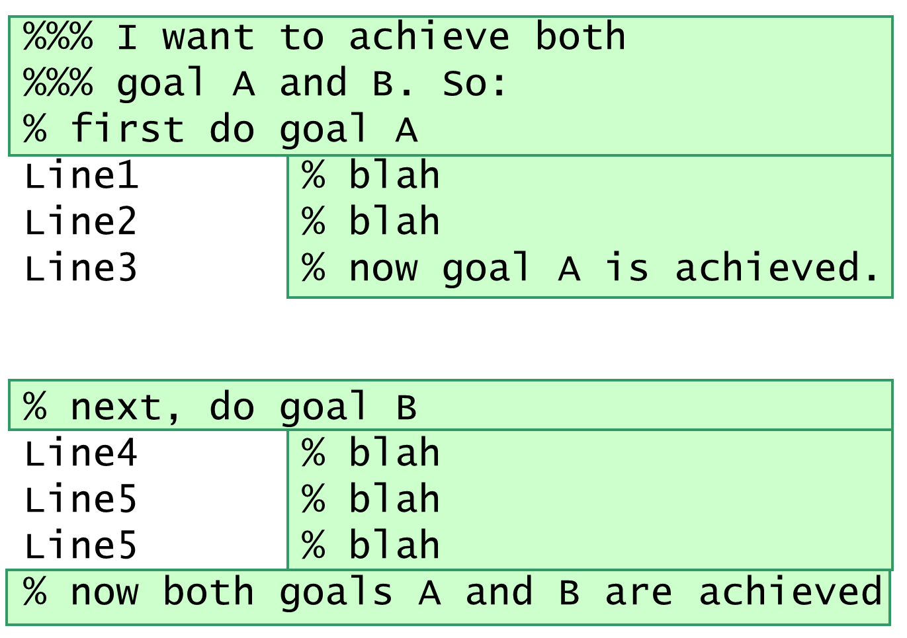
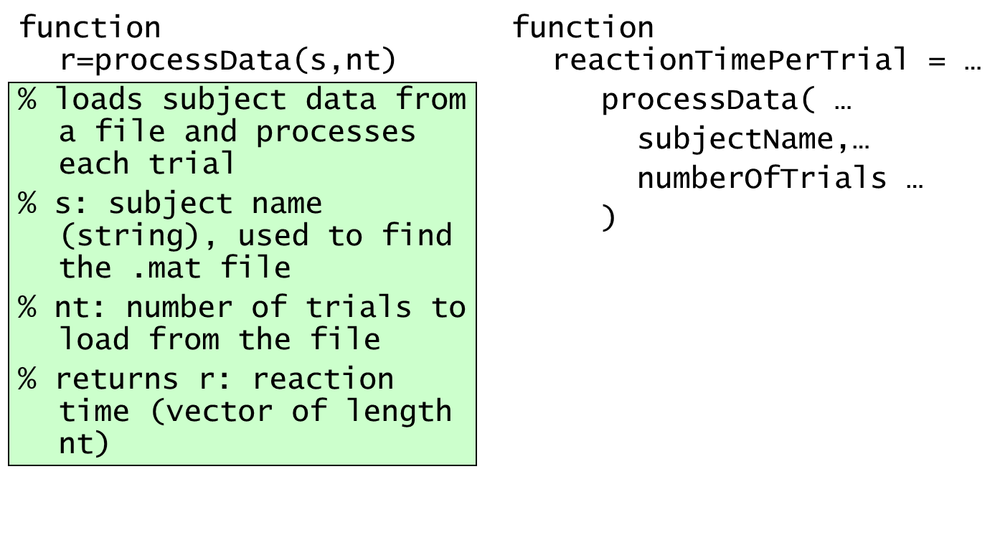
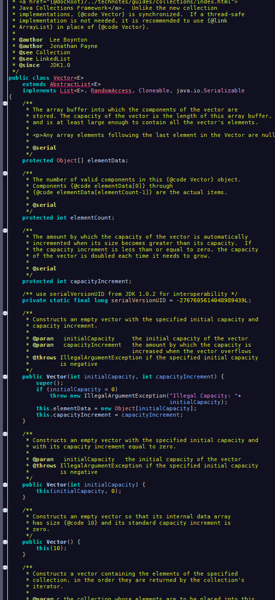
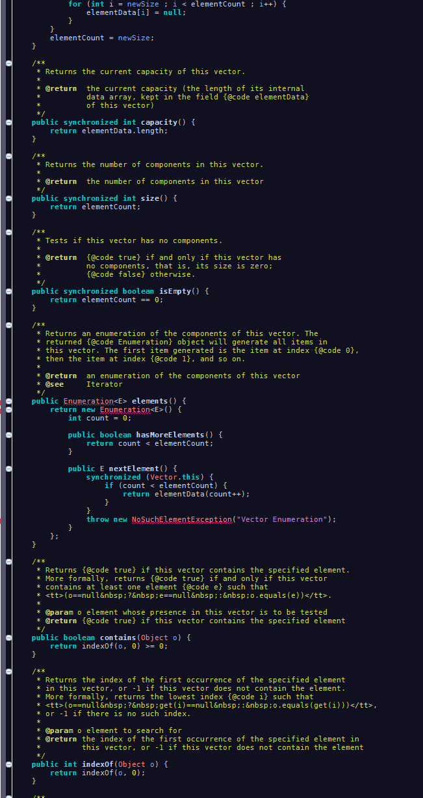
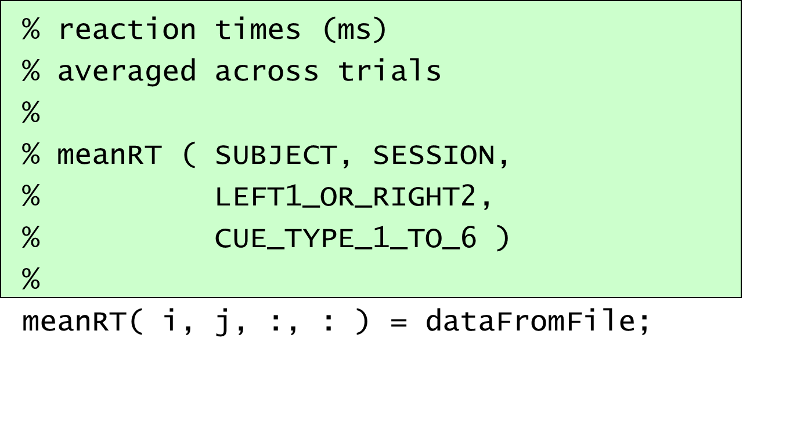
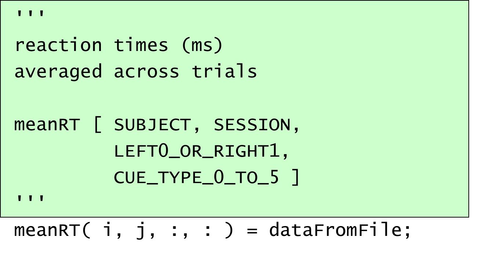
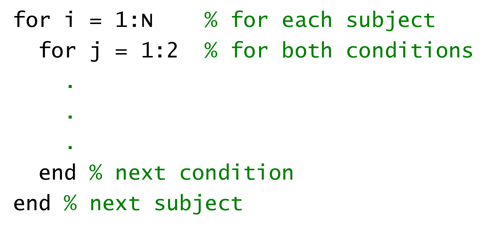
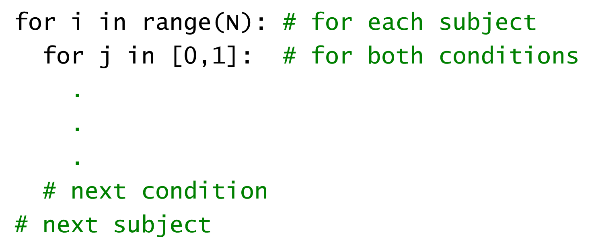
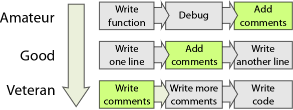

# Chapter 4: Comments and documentation

Some people think of comments as a way to stop a line of code from running. But comments are also the only part of the code where you can add informal and contextual information. Comments are usually the first thing people look at – if only because they are humanly readable. Use comments to maximise the **signal-to-noise ratio** in your code (Martin 2011). Make them useful!

You will learn

-   What to put in a comment
-   How to document code

## 4.1. Anatomy of a comment

\<exercise\> What information should you include in the comments for a function? Make a list.

\<caption\> This style of commenting code gives a prose-like commentary on the structure, purpose, and individual steps. \</caption\>

Comment styles are a matter of taste, convention, discipline – and depend on how you name your variables and functions. Which of these two styles do you prefer? List the pros and cons of each style.

\<caption\> Two very different ways of commenting a function declaration. In both cases, there seems to be enough information to use the function. Which do you prefer, and why? \</caption\>

As a rule, the less obvious something is, the more comment it needs. However, too much commenting poses its own problems\*.

**Disadvantages of commenting**: Comments can draw the reader’s attention away from what *really* matters: the code! Imagine trying to find a bug. You read the comments, which seem to make perfect sense. They encourage you to read the code in the same way it was written – making the same assumptions, and potentially failing to spot the error.

-   Comments often simply repeat what the code says – they are redundant
-   When you **refactor**, you need to change both the code and the comment. Not only does this double the workload, but also runs the risk of having the comment being out of date for the code (e.g. a comment explaining the parameters might be incorrect for the new parameters in a function).
-   To make each function’s comments self-contained, some comment text may need to be duplicated across multiple functions that call each other. Repetition is generally bad.
-   Some coders suggest that having the same header comment at the top of every file (e.g. package name, license etc) is bad news. What if you needed to change the license? While find and replace is

\<caption\> Fig.4.1: Some styles of coding require more comments than others. Just look at the colour distribution in this example of commercially produced code in Java. Yellow indicates comments. Sometimes there are 5 lines of comments for three words of code! The comments are used to create the documentation web pages for the library. \</caption\>

## 4.2. Commenting a variable declaration

\<exercise\>

The first time you encounter a variable, what information would you like to have about it? Make a list of what you would include when commenting a variable declaration.

…

Sometimes things are clear enough from the variable’s declaration itself:

number_of_sessions_per_experiment = 3;

But for many other variables, you may want to specify

-   Its type – and if it’s an array, the expected dimensions (shape, size). If multidimensional, what does each dimension represent?
-   Units; is it a physical quantity? Seconds or milliseconds?
-   Expected range: what is the minimum and maximum permissible value? Can it go out of range?

Remember that you can use block / multiline comments (%{ and %}, or """ which also creates documentation).

## 4.3. Commenting a function

Functions are the tools that other people will use. Commenting them clearly is of utmost importance.

At a minimum, you should document the inputs, outputs, and error conditions.

### Function inputs

You should write something brief about each parameter to the function. Mention

-   Its type, units and range, just like a variable declaration. This time, it has to be very clear what is an acceptable range of values.
-   For an array, additionally: how many dimensions, what do each of the dimensions mean, and how large should each of the dimensions be.
-   Special cases – what would it signify if the value supplied was negative? Or if it was NaN? Note that it is bad practice to use numeric values as indicators. It might not be clear what a value of 1 or 2 means. Consider using a **flag** or **enum** instead.
-   If it’s a structure, what fields should it contain?
-   If a filename is provided as a parameter, what type of file should it be, and what does it need to contain?
-   Are any parameters optional? If so, what are their default values if the parameter is omitted?

### Function Outputs

Specify what each return value from the function means. Mention

-   Type, dimensions, units, range as above.
-   Is anything written to the screen, to a file, or are any graphs plotted? Mention this in the comments.

### Error conditions

Mention when the function will fail, and how it will signify failure. For example, will it return a particular value such as NaN? Or will the function throw an error (this is usually better than ignoring abnormal inputs)?

Within code itself, you may want to comment individual lines.

for(i in 1:N){ **\# for each subject**

for(j in 1:2){ **\# for both conditions**

**...**

} **\# next condition**

} **\# next subject**

Note here that the units of i are specified, and the end of the block is commented. Sometimes, the end of a block may be far from the start of the block, and there might be many blocks being closed – some loops, some ifs, and so on. In that situation, these end-of-block comments are useful. But: it might also be a sign that you need to split your code into smaller functions.

### Header

People often include the author, a copyright message, and sometimes a revision history.

Revision or version information might include date and initials of people who have made major changes to the function.

You might highlight disclaimers, situations where the code should not be used. Some people also keep a “ToDo” list at the top of their script, e.g. to keep track of missing functionality.

If you anticipate that your function may be slow, for example a parameter search, or lengthy pre-processing, document this. Say approximately how long it takes to run:

**% function b_hat = find_optimal \_bias( samples )**

**% this function can take about 30 minutes to return**

**% eg with 200 samples on a 4GHz CPU.**

Consider adding a **verbose** option that displays information at each step, showing progress. Similarly, if your function creates very large variables, e.g. calculating kronecker tensor or outer products, or performs dimensionality expansion, then explain this:

**% note that this function creates a large array in memory**

**% with length(samples)\^2 elements. You can expect 1GB RAM**

**% usage with 1e4 samples.**

These are especially important if either execution time or memory requirements are of the order of O(*n*2) or higher. Somebody might test their code by calling your function with a small test dataset, and feel pleased, but then be disappointed when the full dataset causes problems.

In other words, try to avoid nasty surprises for people with small computers.

\<caption\>Fig. 4.2: An amateur coder writes, debugs, then finally adds comments. In contrast, a veteran programmer begins by writing some comments, elaborates them, before diving into coding. \</caption\>

### Functions that take functions

Some functions require another function as a parameter. Usually, these are notoriously badly documented.

Common examples include optimisation routines, which take a ‘cost’ or ‘objective’ function as a parameter. fminsearch( @sin, 0 ), minimize( sin, 0 ), optim( 0, sin ).

Other examples include **callbacks**, (see Event-driven programming) where a routine might take some time to finish, but needs to provide some output: you might provide your own function to be called once the routine finishes.

In all these situations, you must **document the parameter just like you would document another function**! In other words, include a full specification of its input values, and output values. Include error conditions, and any things that it must or must not do (its contract). Additionally, specify how its input values will be calculated, how many times the function is likely to be called, and how its return value (if any) will be used.

### Documentation comments

The first comment before or after a function definition is special. It can be automatically extracted to provide documentation about the function.

| In Matlab, the first line of comment in the function generally echoes the declaration, followed by detail.   | In Python, “doc strings” at the start of a function are enclosed in triple-quotes e.g. """. The string follows conventions that allow them to be rendered into HTML pages. These documentation comments are actually stored as properties of the function object (__doc__).  Conventions include PyDoc or Google Docstrings, which can be rendered by the package Sphinx.  | In R, comments beginning \#' before a function definition can be compiled into a LaTeX-like Rdoc file (using the package roxygen) or used directly (with package docstring). The comments use tags like @param, @examples and @return.   |
|--------------------------------------------------------------------------------------------------------------|----------------------------------------------------------------------------------------------------------------------------------------------------------------------------------------------------------------------------------------------------------------------------------------------------------------------------------------------------------------------------|------------------------------------------------------------------------------------------------------------------------------------------------------------------------------------------------------------------------------------------|

In all cases, the documentation can be displayed by calling the help() function, or through the **IDE**’s help browser. Some languages allow a degree of **markdown** where you can control the formatting of the documentation, such as bullets, emphasis and hyperlinks.

**""" Reads data from experiment files into a data frame**

**:param filenames: a list of strings. Files should contain...**

**:returns: a pandas object with columns from \`\`filenames\`\`... """**

**\#\#' @title  Reads data from experiment files into a data frame**

**\#\#' @param  filenames a list of strings. Files should contain ...**

**\#\#' @return a data frame with columns from \\code{filenames}, and ...**

\<key point\> Some comments constitute documentation, giving easy access to a function’s usage.

With a well-documented function, there is no need to look at the code. \</key point\>

### Vignettes

Aim to give a short concise example of how to use a function, in the documentation. It may be as simple as fleshing out the declaration with explanation and context. You may need more than one vignette, if there are different modes of use.

## 4.4. Iffing out

Historically comments were used to ‘comment out’ code – that is, to temporarily stop a line of code from executing. However this is not great practice:

-   Over time, many lines may become commented out, each at different phases, and for different reasons. This threatens to become a chaotic minefield. It won’t be clear if any of the commented lines are supposed to ever be reinstated. Accumulation of redundant code is dangerous.
-   Previously commented lines don’t get tested as the code changes, and so may not work when they are next uncommented
-   Syntax highlighting isn’t shown for commented code, and your editor won’t be able to mark warnings, run **lint**, or perform semantic analysis on that code
-   The reason for commenting out code is often not specified. This leaves the reader wondering what the code originally did, why it was left, and whether it might be needed again.
-   If the commented section contains a block comment (e.g. %{ / %} or """) then you will run into grave problems if you try to block-comment this. You cannot nest comments!

Instead, consider switching the code off by an if statement. This is sometimes called ‘iffing out’. If code is unlikely to be needed again, **delete it**. On the other hand, if it might be needed again, put an option flag in the if, so you can switch it back in when needed:

verbose = False

if verbose:

print(x)

\<exercise\> Iffing out is not always the right solution. What are the disadvantages?

-   If you temporarily need to disable a single line of code, for example in debugging, you can just comment the line out.
-   Because iffed-out lines are syntax-highlighted as normal, it is not obvious that the code is out-of-action. Code that is currently broken and needs fixing could be commented as a way of highlighting that it is non-functional.
-   A valid time to comment out code might be if it serves as a “how to use” instruction – e.g. as a usage example at the top of a function.

\<case study\>

NYSE

Knight Capital Group was one of the world’s leading financial services and stock traders. In 2012, a software bug brought the firm down \<refs\>. They had a function which bought high and sold low – this sounds an odd thing to do! But this code was only used to create a simulated environment to test their other code. It was kept switched off by iffing out, with a flag something like this

if TEST_MODE:

buy_high_sell_low()

An update was released in which this old testing code was deleted, and the name of this test flag was re-used for another variable. Unfortunately, the file containing the deleted function was not deployed on one of their eight servers. So, this testing code re-activated on one server.

The result was that when the new code was deployed, the buy_high_sell_low code was triggered every time a transaction was made. Worse still, this code was executed hundreds of times because it did not count correctly how many transactions were required.

It was noticed by the New York Stock Exchange within 4 minutes, but Knight had not implemented a kill switch, so the crazy purchasing continued for 20 minutes more. High Frequency Trading algorithms from other trading firms immediately exploited this. Knight’s computers made 4 million transactions in that time, sending stock prices into chaos. The transactions were worth \$6bn, and may have cost the firm about \$460m.

\<key points\> Delete defunct code, avoid re-using global variables

This kind of error may be prevented by **DevOps** – as set of practices spanning software development and operations. DevOps aims to keep software reliable while it is changed, by specified pipelines for coding, review, testing, releasing, configuration and monitoring. \</key points\>

\<ref\><https://www.henricodolfing.com/2019/06/project-failure-case-study-knight-capital.html>

https://www.bugsnag.com/blog/bug-day-460m-loss \</ref\>

\</case study\>

## Chapter Summary

Think carefully about your comments. For the top of the code: can a user pick up your code and immediately know exactly how to use it? Consider using “doc strings”. For the interior: can someone else coming to edit your code fully understand how it works? Imagine yourself in these two situations, and put anything you would like to know in a comment. Alternatives to commenting include more meaningful variable names (see next chapter) or splitting code into meaningful functions (see chapter 7).

Discussion Questions: There are many places you could comment – at a function declaration, and at each time the function is used; where a variable is declared, initialised, used, and reported. How do you decide what to write at each of these places? Does a need for comments always reflect poor variable naming?
