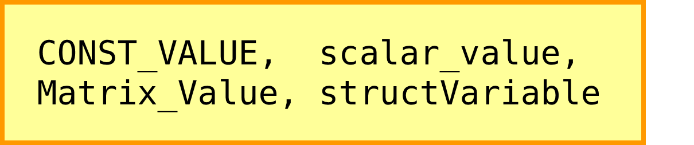
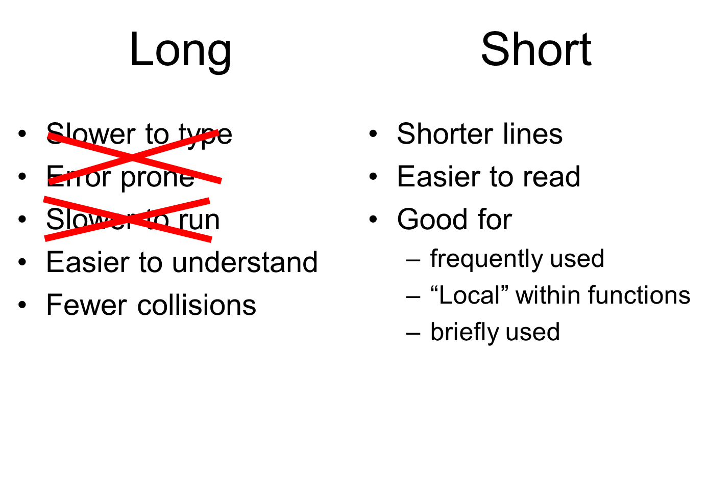
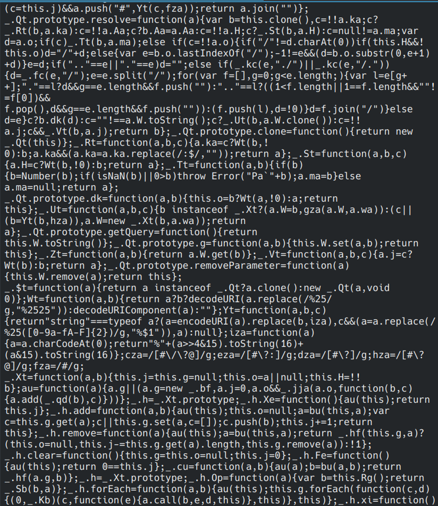

# Chapter 5: Choosing names

The great luxury we have with computer languages – which we don’t have in human natural languages – is the ability to rapidly define new words. A lot of your code will use words that you come up with yourself. It will pay to choose them well. After this chapter, you should know

-   What makes a good name for a function or variable
-   What factors might affect your choice of name

## 5.1. Naming conventions

Everybody has their own naming conventions. But knowing the variety of possibilities will let you make an informed choice. In every computer language, variables cannot include spaces; but often you will want to use more than one word as the label. So how will you separate words in the variable name? Also, given that humans have relatively poor memory, how will we remind ourselves of what a variable does?

\<caption\> Some common naming conventions \</caption\>

Capitalisation is often used for things that are less likely to change. For example, types or classes might have an initial capital, and **constant**s (values with long scope) may be fully capitalised. You might choose one format for functions, another for variables, and yet another for structures.

\<caption\> A common naming scheme. Try to distinguish constant values from variable values.

Delimiters and capitalisation within a variable name can vastly improve legibility of code.

In “Hungarian notation”, programmers prefix each variable with a decoration indicating its type. For example, ‘i’ for integers, ‘d’ for **double**-precision numbers ‘ai’ for arrays of integers, ‘s’ for structures, ‘m’ for matrices. It helps prevent using a variable inappropriately, and also avoids **collisions** (where two variables inadvertently have the same name at the same time). But when writing, sometimes you don’t remember the type, so in this case locating the variable is slower.

In R, you can use dot ‘.’ within a name, whereas in Python and Matlab the dot means look for a “member” of a **structure** or object; so instead use underscore \_. R also permits you to use any character in a variable name -- even operators and spaces -- if you refer to it using back-quote. E.g.  
 \` \`\<-1 ; \` \`+\` \` gives the answer 2, by assigning 1 to a variable whose name is a space!

**Consistency is paramount**: Choose your names consistently. Look at other peoples’ code in your field. Read any style guides available to you. For example, if you code in Python, read **PEP 8** (van Rossum et al. 2001) which aims to give highly consistent naming and code style conventions – snake_case is recommended. For R, there is excellent material in Wickham’s Advanced R \<Wickham 2019\> and tidyverse style guide, as well as Google’s style guide. There is less material for Matlab though see Richard Johnson’s excellent book (Johnson 2011); internal functions tend to camelCase.

These styles might not be substantially better than your own personally-developed style. However, they can tremendously facilitate understanding collaborative code, as you don’t have to take time to figure out each developer’s own personal style, and you don’t end up with the awful situation of a mixture of styles in a single codebase.

\<box\>

### Avoid spaces and minus signs in file names

Many operating systems permit filenames that contain spaces: these are not good filenames for scientific computing, and I would recommend avoiding them. Similarly, although you can use hyphens in filenames, avoid this when you are naming files to correspond to functions, classes or modules in your code. Files map to functions in Matlab, and to modules in Python -- and in both situations, spaces and hyphens won’t work. Hyphens are interpreted as the minus operator in code! R is immune to these issues since filenames have no special role when running code.

\</box\>

### Naming functions

Often functions can be thought of as verbs. Scientific code often adopts the “verb-object” convention for naming. Functions that don’t take parameters are often named like commands, with the verb and any objects, like readInput(), performConversions(), resetCounters(). In contrast, functions that take parameters are named like operations, with a transitive verb and any preposition. Which do you prefer: readInputFromFile(filename), readInputFrom(filename). or readInput(filename)?

Alternatively, functions can be named by their outputs, if that is their defining feature:

function y=meanAge(X)

**def** meanAge(X):

mean.age \<- **function**(X){

### Avoid confusable names

Sometimes you may want to use short names, for example i,j,k for loops. But:

-   Many programmers avoid using l. If the person reading your code is using a poor font, they might read i=i+l as i=i+1.
-   If you use complex numbers, you might want to avoid using variables i and j.
-   You might also want to be careful about having two variables called X and x, or S and s etc.
-   Programmers tend to avoid using the letter O as a variable name, for obvious reasons.

Avoid overwriting **built-in functions** in your language. Unfortunately, most languages provide a few functions with short names, but still let you re-define those names. You may unwittingly use those names for your own variables. This effectively overwrites (**shadows**) them, so later on when somebody tries to use that function, something unexpected will happen.

\<exercise\> Can you make a list of which words you can’t use as variables?

-   In Python be careful of all, any, bin, cmp, dir, file, filter, float, hash, id, input, int, iter, len, list, long, map, max, min, next, object, ord, range, set, str, sum, type, vars, zip.
-   In Matlab be careful of overwriting ans, any, all, cell, char, diff, eig, eps, fix, flag, flip, inf, home, length, lower, upper, max, min, mean, more, pause, pi, plot, prod, rand, rem, reverse, round, set, size, string, sum, years, days, hours, minutes, seconds, duration, date, now, struct, table, var.
-   R has a clever little rule that ignores non-function variable definitions if it’s clear that you intend to call a function. For example, after c\<-1; t\<-1, you will still be able to create lists with or transpose them: t( c(1,2,3) ) works fine. Still, use caution when overwriting functions, because if you then assign the function to a variable, or pass the function as a parameter, this mechanism will not know, and the function gets shadowed. The builtins include all, args, c, col, cut, diff, dim, dir, F, file, kappa, I , list, Map, max, mean, min, mode, names, next, norm, order, q, range, rank, rep, sample, scale, seq, sequence, sign, single, stop, sub, sum, t, T, table, try, units, url, var, vector. If you try and Avoid using **T** and **F**, which are initially defined as synonyms for **TRUE** and **FALSE**, but can easily get overwritten. Avoid assigning to pi.

In general, you might just check by typing the variable name in the console, and making sure you get Undefined function or variable, NameError: name is not defined, or Object not found.

R is one of few languages that allows you to actually meddle with all its keywords and built-in operators. You can simply assign to reserved words by quoting them with back-ticks: \`**if**\` \<- **function**(){}, or even "+" \<- **function**(a,b){} to destroy addition. This is of course very dangerous, so be alert.

\</exercise\>

\<case study\>

Mariner 1, launched in 1962, was designed to fly by Venus. Unfortunately the Atlas-Agena rocket carrying it veered off course just 93 seconds after lift off. The most likely cause was that the guidance code was supposed to use a variable containing the rate of change of the radius, denoted . The overbar denoted the time-smoothed rate, but this overbar was omitted. Perhaps this mean that normal variation in the velocity were treated as serious, and leading to the rocket veering off course.

Mathematical variables are often easily confusable – especially if they differ by only a suffix or vinculum. The error has been dubbed the “most expensive hyphen in history” (Arthur C Clarke, 1968) \<ref\>.

## 5.2. Names are greedy (Huffman coding)

An important principle of information theory is that you can compress information. We have all used zip files. How do they do their magic? One aspect is that our natural languages and natural data formats are highly redundant. For example, a screenshot of this page may contain a lot of white pixels, represented by long streams of ‘1’s in the datafile. Intuitively, you could take the stream ‘1,1,1,1,1,1,1,1,1,1,1,1,1,1,1,1,1,1,1,1’ and replace it by ‘(repeat '1' 20 times)’. This could shorten the file a lot.

A simple and assumption-free way of doing this is to replace commonly-occurring patterns by a single symbol. You would need a look-up table to know what symbol corresponds to what pattern. You could carry on replacing sequences with more and more symbols, but then the symbols would have to grow longer too. At some point you will reach a trade-off between sequence-length and symbol-length. Huffman coding optimises the symbols so that the **commonest sequences are replaced by the shortest symbol** (Huffman, 1952). In general, if you want to use a label a lot, make it short. If you use a label rarely, make it longer.

\<key point\> A general principle from information theory is that we can choose short names for frequent use, and longer names for rarely-used things. \</key point\>

This idea can be applied to variable names: if you use a variable several times in each line of code, use a short name! If you use it just twice in a long script, use a long name.

## 5.3. Long and short names

\<exercise\> Should variable names be long or short? List your reasons why. Are there arguments for the opposite view?\</exercise\>

Don’t be afraid of typing! Your **IDE** should have auto-completion. To type a long variable name, simply type the first few letters and press \<TAB\>. There’s no reason why long names should slow you down here.

Your code will be **compiled** – usually just after you hit Run – into simple fast code that resembles machine code (technically: **just-in-time** compilation to **bytecode**). In this process, all the names are converted to a numerical index or address, so they can be referenced quickly. So nowadays, long names will run just as quickly as short ones.

Pay careful attention to naming ambiguity. Might you need another variable with a similar name? Have you used similar names elsewhere? Longer names are less likely to collide.

-   Similar names often give you a clue to spotting algorithmic similarity – and should prompt you to rename groups of variables as structures or arrays, or move the code into a function so that a single variable name can be used for many different data fields.

**Short names:** When variables have a short, limited scope, give them shorter names. For example, in a very short function, you can get away with single-letter variables.

-   They are less likely to collide, in a small scope
-   Your brain’s working memory capacity is less strained: you have seen the declaration recently, and there aren’t too many other variables in scope.
-   The more often a variable is used, the shorter you should make it. However, if you find yourself using a variable many times over, think: have you spotted the algorithmic similarities? For example, if you find yourself calculating a unit conversion more than twice, consider using different units to start with; if you use a similar line twice, should you use a loop?

**Long names:** In contrast, use longer names for variables with a larger scope: In other words, for variables that need to be present for a lot of code, and are used in many places. These variables are more persistent: they hang around for longer.

-   Consider putting the variable inside a structure, so its name is effectively hierarchical (e.g. analysisParameters.TOLERANCE). This is especially true in the rare situations where you need global variables.
-   Longer variable names allow you to convey more about the semantics. Use them if you might not remember exactly what the variable does.
-   In nested loops, you could avoid single-letter indices in favour of meaningful names.

***

-   Long names allow “**Self-documenting code**”

### The Readability-Writeability trade-off

When we see a variable when **reading** code, we have to remember what it does. What is its type? For an array, what are its dimensions? What does each dimension signify? What is the range of its values? What do its values signify? Long names can help with this.

-   However, when we are **writing** code, we need to recall the variable’s name. Did I call it “num_samples” or “sample_nums”? Was it “mean_length_conditions” or “condition_length_means”? Longer multi-word names take more chunks of mental space, have confusable order, and are thus harder to recall.
-   Put the bit that will come to mind first at the start the variable name. Then you can use the auto-complete to effectively search for the right variable.
-   If you have your own conventions, you can use your conventions to reconstruct how you named things. For example, you might always use the prefix ‘n’ for number, e.g. nSamples.

### The opposite of legible code (advanced topic)

There are rare cases when programmers provide runnable code, but want to prevent users from being able to read or change it. Perhaps they have a secret algorithm, or want to conceal the fact that their code is awful.

In general there is no bulletproof way to prevent people from editing your code. If you provide code that people can run, they can also change it. But one reasonably strong method is to create an executable file (sometimes colloquially termed a “binary” file). This **compiles** your text code into a dense, condensed sequence of numbers called machine code, that can be read by the **CPU**. Tragically, all variable names and function names are replaced by numeric **addresses**. For humans to read the code would require **disassembling** (sometimes termed decompiling) the numbers back to a text form, called **assembly language**. As you can imagine, this is not much easier to read or edit than the machine code, but it can be done. Some executable binaries are further protected by a **checksum** – so directly changing the file would break the seal and prevent execution. Matlab’s compiler, Cython or pyinstaller and the R package compiler can generate encoded versions of program. If you distributed only these encoded versions, your program would be no longer be **open source**.

A simpler that prevents people editing code is to replace the variable and function names with meaningless letters. This is called **obfuscation**, and is commonly used to compress and speed up interpreted JavaScript code used in browsers.

-   In general, it is tricky to change obfuscated code.
-   Obfuscated code is slightly smaller, in terms of storage space. However, source code files take up negligible amounts of space, compared to data. The space needed to store 1 second of video (about half a megabyte at 1080x768 pixels) can hold at least 10,000 lines of dense code!
-   Obfuscation undoes all your hard work of making scientifically useful code!

\<caption\> Fig.5.1: Can you work out what this code does? This is an example of deliberately obfuscated code. Real, legible code is passed through a tool that replaces all the variable names with single-letter tokens. \</caption\>

## 5.4. Variable types

All variables have a type. To find out the type of a variable, use

class(1) : ‘double’

type(0.) : \<type ‘float’\>

typeof(0) : “double”

### Naming Booleans

\<exercise\> Consider the following code:

% indicates whether the light is on

% 1 = ON, 2 = OFF

light = [1,2,2,1,1];

How might you improve this variable? \<exercise\>

Notice light is really a **boolean** variables: it has only two states. Consider using a prefix ‘is’:

This can be written using an **enumeration**. But using the ‘is’ prefix, you could write

isLightOn = [1,0,0,1,1];

This has the benefit that you can write more legible code, like if isLightOn[3]:, which is much less bug-prone! Similarly, you might also replace variables like “leftRight” by “isLeft”; that way, there is no ambiguity about which value means what.

### Naming arrays

Let’s say you have a list of data files, and you store the names in an array:

session = {‘session1’,’session2’,’session3’}

or

sessions = {‘session1’,’session2’,’session3’}

Do you prefer to call the array session or sessions?

Now let’s say you are using the session names in a loop

filename = [ session{i} ‘.mat’ ]

or

filename = [ sessions{i} ‘.mat’ ]

This time, do you prefer to call the array session or sessions?

Nobody really knows whether array names should be singular or plural. In general,

-   plural names read better when you use the array as a unit
-   Singular names read better when you use the individual elements of the array (Conway 2005).
-   Plural names also leave you in no doubt that a variable is an array, when you use it: the plural acts as a variable type tag.

Try to avoid looping over arrays where the list is plural and the index or iterator is single:

***

**for** session = 1:**length**(sessions)

***

**for** session **in** sessions:

***

**for** (session **in** sessions){

***

You then have two variables which only differ by an “s” at the end, which can lead to hard-to-spot bugs and tricky-to-follow code.

***

## 5.5. Enumerations

Many data formats use **integers** to indicate categories. For example, there might be four types of response, which have been labelled arbitrarily 1, 2, 3 and 4. This is called an enumeration. Most commonly, the codes are labelled in comments:

% response codes:

% 1: valid leftward response

% 2: valid rightward response

% 3: invalid response

% 4: no response recorded

But it is much clearer if this information is stored in variables, e.g.

Response_types = { ‘VALID_RIGHT’, ‘VALID_LEFT’,INVALID’,’NONE’ };

This allows you to go from the index to the label, using Response_types{i}. Note that traditionally, constant values are capitalised. What if you want to go the other way, i.e. from the label to the index? You could use a structure:

Response_type.VALID_RIGHT = 1

Response_type.VALID_LEFT = 2 etc.

Then you could check response codes by name, rather than needing to know the number:

**if** response == Response_type.VALID_RIGHT:

In Matlab and R, you could use both methods. However, in Python the optimal structure is called an enum, which allows you to go both ways.

**from** enum **import** Enum

**class** ResponseType(Enum):

VALID_LEFT = 1

VALID_RIGHT = 2

…

which allows you to write ResponseType.VALID_LEFT, or ResponseType(1), or ResponseType['VALID_LEFT'], which are all equal to the same item.

And a trick to do something similar in R is:

Response_type \<- **function**() { **list**(

VALID_RIGHT = "VALID_RIGHT",

VALID_LEFT = ”VALID_LEFT”,

… ) }

Response_type()\$VALID_RIGHT \# to get the number

Response_type()[[ I ]] \# to get the name

In Matlab there are tricks for achieving something similar, such as the downloadable enum() function.

\<exercise\> What are the benefits and disadvantages of enumerations?

| Pro                                                                 | Con                                     |
|---------------------------------------------------------------------|-----------------------------------------|
| Allows number to be converted to readable names in graphs or tables | More lines of code to set up the enum   |
| Saved along with data – acts as **metadata**                        | Might not be worth it if only used once |
| Allows name-based indexing, so code is more readable                |                                         |

## Chapter summary

Weigh up the pros and cons when choosing names for variables and functions. What counts as a good name depends on how often you’ll use it, how much you break up your lines of code, and who’s reading. Once your code is working, consider **refactoring** to change the variable names.

Discussion Questions: What do you think are the biggest factors that leads to people unintentionally overwriting variables? How could they be minimised?