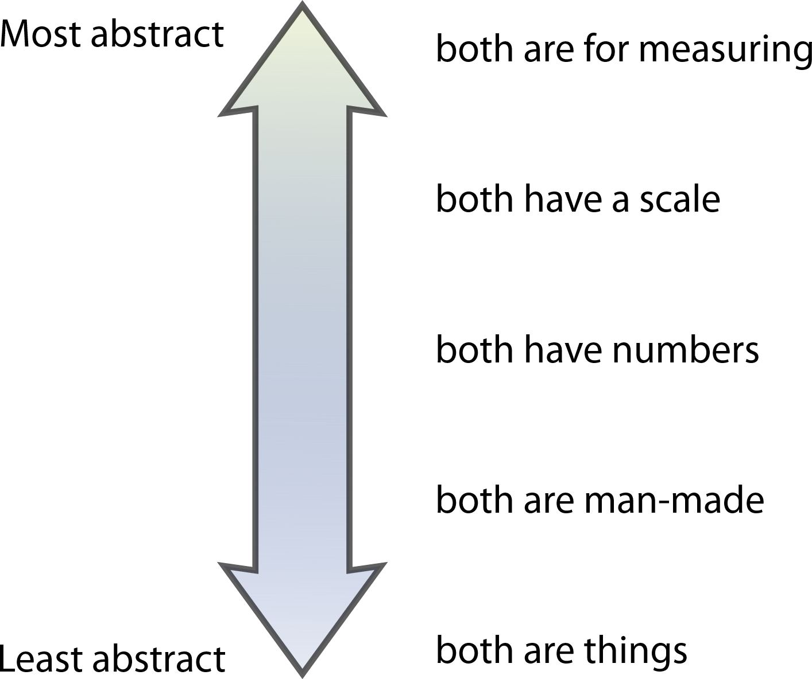
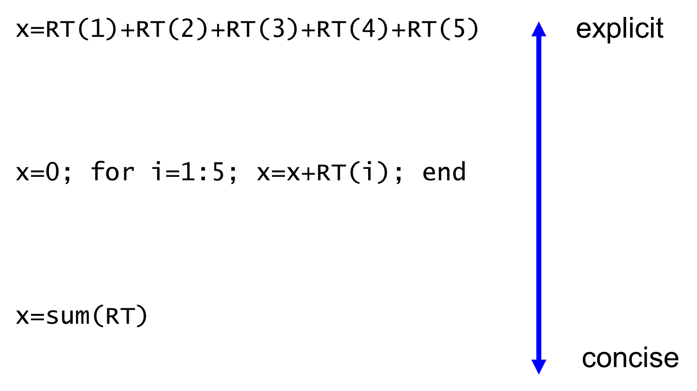

# Chapter 6: Conceptualisation

For beginners, one of the hardest things is formulating your problem in the right way. You may be able to describe in English how to solve a problem, but to describe it in precise instructions is quite another matter. It is hard to translate a complex idea into code. To translate it into clear, simple and elegant code is even harder.

In this chapter we will set the scene for **functions**, covered in the next chapter, by exploring

-   the signs of poorly thought-out code
-   how the structure of your code should map onto its function
-   the relative benefits of making code more abstract, or general-purpose

This chapter sets up some puzzles: how can I write clean code? The question won’t be answered until chapter 7, but it is important to recognise the problem before spying the solution.

## 6.1. Abstract *vs*. Explicit code

A sign of well-conceptualised code is that the code “reads at the right level” to understand the process. If you look at the structure of the code, it should mirror all the hidden structure of the algorithm. It should also mirror the language you would use to describe the method.

### Spotting similarities

Abstraction is the human capacity to spot similarities, and harness them.

\<example\>

What is the similarity between a clock and a ruler?

Fig.5.2: “What is the similarity between a clock and a ruler?” – an example of abstract thinking.

\</example\>

Abstraction means selecting the highest-level commonality, that is maximally restrictive. In coding, you need to apply something like this to express your algorithm at the right level. It needs to be sufficiently general to accommodate your particular use cases, but specific enough that it doesn’t need a long list of constraints or parameters to do what you want.

For example, Let’s say you notice there are several ways to plot 2D arrays: imagesc/imshow, contour, contourf, surf/plotsurface. Why not combine these into a single command, plot2darray, and specify which kind of plot you need as a parameter? This would be an example of code that is “too general as it needs too much specification”. Code should not be so abstract that it needs lots of switches inside. But look no further than ggplot to find that some people actually prefer this style!

In function-based programming languages, abstraction means combining a few pieces of code – which may contain some repetitive element – into a single block of code that can be called upon multiple times. In object-oriented languages, abstraction applies this idea to data structures themselves – what do two data types have in common?

\<exercise\>

Here are several ways to write a common operation. What are the advantages of the ‘higher’ levels? And the lower levels?

\</exercise\>

As a programmer, you have a lot of freedom. There are **many ways** to write the same thing.

-   Clearly, if the number of RTs is variable, the explicit options are not viable.
-   But equally, unless the reader already knows the type and shape of RT, and that the function sum adds numbers up, by default on dimension 1, the concise options might be more opaque. (There are a lot of functions whose meaning isn’t as obvious!)
-   It’s also not clear the options will do the same thing, for example when there are **NaN**s.
-   In some situations, the middle option has the advantage that when an error occurs, you can see which item was at fault – and if the data is not what you expected, you can step through the computation.

Often you can spot hidden structure in the algorithm. For example, you might have two long scripts, one for each experiment, which share a couple of lines at the start. They might both begin with “load the datasets, and then loop over each one”. How could the common elements be made clearer?

**function** result = analyse_expt1

all = **load**(‘expt1_data’)

num_datasets = **length**(all.datasets)

results = {}

**for** i=1:num_datasets

% lots of experiment-specific code

**if** successful

results{i} = (...)

**end**

**end**

**def** analyse_expt1():

all = **load**('expt1_data')

num_datasets = **len**(all.datasets)

results = [**None**]\*num_datasets

**for** i **in** **range**(num_datasets):

\# lots of experiment-specific code

**if** successful:

results[i] = ( ... )

Notice that the experiment-specific code has a specific job: it takes in a dataset, and results generates a result. At this level of description, it is the same job for both experiments. So, as an exercise, let’s try abstracting out the code common to both experiments:

**function** analyse_expt(expt_num)

all = **load**( [ 'expt' **str2num**(expt_num) '_data'] )

num_datasets = **length**(all.datasets)

analysis_functions = {

@analyse_dataset_exp1

@analyse_dataset_exp2

}

**for** i=1:num_datasets

results(i) = analysis_functions{expt_num}( all.datasets(i) )

**end**

**def** analyse_expt(expt_num):

all = **load**( 'expt' + expt_num + '_data' )

analysis_functions = [

analyse_dataset_exp1,

analyse_dataset_exp2

]

results = [ analysis_functions[expt_num]( dataset )

**for** dataset **in** all.datasets ]

Here the “lots of experiment specific code” lines, which operate on a single dataset, are extracted into their own function.

This is an example where the effort of abstraction doesn’t really pay off! Also note that in the original, if one dataset needs to be skipped, the result is left blank. In the refactored code, the analysis must always return a result even if there is a problem, for example None, or an empty structure with the same fields as a ‘real’ result.

In general, you will always strike a trade-off between explicit and concise code. You cannot spell everything out, even in the comments, but don’t forget that short function names can mislead, and terse expressions can be misinterpreted.

One role of abstraction is to try to make parts of your code **less dependent** on other parts of your code.

-   Rely less on variables assigned previously, for example instead of using a size variable, directly check the size of your data length, .shape, dim.
-   Write ‘local code’ – code that accesses only a small portion of your data
-   Arrange for your code to be **agnostic** to which subject or session the data came from.

**Dependency inversion**: Typically, high-level code relies on low-level code that **implements** or “fleshes out” the abstract idea. For example, you might have a function to train a neural network, that **import**s low-level functions like convolutions, loss functions, gradient estimation etc. However, a better design may be to make the low-level functions depend on the abstractions (Martin 2000): define how you want to use them, to create an **interface**, and import that interface when writing the low-level functions.

### Pseudocode: transcending language

Another role of abstraction is to write things using new **elementary operations**. If you described to a colleague what your code does, what kind of language would you use? What words would form the building blocks that describe your algorithm? Those words are the elementary operations.

Try starting with a natural language description of your solution. If the terms you used are not existing variables or functions in your programming language, then you probably need to define a set of intermediate-level functions. Your top-level code will then read like natural language. Your intermediate functions could form the basis for an **API** or a domain-specific language.

**Pseudocode** is a language used to describe an algorithm before you implement it. It has no rules, no syntax, and no vocabulary. In pseudocode, you just describe the steps as clearly as you can, in an unambiguous way. Pseudocode is usually based on a computer language that the writer and reader are both familiar with. But it might incorporate elements of English where needed. Here is an example:

**function** analyse_Expt {

( **integer**: experiment_number )

**array**: datasets = **call** load_data **with string** (

"expt" + experiment_number + "_data"

)

**for** **integer** i **from** 1 **to** **length** **of** datasets {

**call** analysis_function **with** **input** dataset

(**returns** **structure**: result)

all_results[ i ] = result

}

}

This code resembles lots of computer languages, but complies with none. By departing from the rigid rules of actual languages, observe that the meaning is clearer, and more is explicit.

Importantly, pseudocode tells you what kinds of building blocks you need. Clearly, here you need to be able to store a single dataset in a variable. Furthermore, you need a structure that holds the results of one dataset. **Natural language**, too, can give you clues about the elementary operations you need. Take this example:

“I took the average of each subject’s squared error, and compared groups using a t-test”

Here, we have an instruction for taking the average, an instruction for calculating the squared error, an instruction for doing a t-test. Those are the names of your new elementary operations, and in the next chapter we will see how to baptise them using functions.

## 6.2. Spotting conceptual errors

Glancing at code often reveals there’s an underlying problem. This is sometimes called a “**code smell**” (Fowler 1999). You can tell there is a conceptual error by the way things are written. Here we will look at some signatures of bad code.

### Your code contains “clear”

If you use clear or clear all, del or %reset, rm(list=ls()), this is a sure sign that you are doing something wrong.

Clearing variables is not necessary. In fact, **good code never clears variables**. Why? Because good code never pollutes the workspace. And good code never assumes what variables already exist. After reading Chapter 7, you will know how to achieve this, using **scope**: the scope of a variable is the region of code where that name can be used.

In some languages, like Java, scope is strictly enforced. All variables only exist within the block where they are created, and so there are no global variables. In practice, this means that variables disappear as soon as they become irrelevant.

When you write a single-use script, you might think that it would be nice to clear all the variables first. But:

-   What if someone had important data held in a variable?
-   What if someone wants to keep hold of something while running the script, for example the result of a previous run of the script? Or if they want to compare results from several datasets?
-   What if your script needs to be called as part of a larger, automated sequence of scripts? Or needs to be run several times, each time with a couple of different parameters?

How can you avoid clearing variables?

Use functions (Covered extensively in the next chapter \<link\>). Variables created in functions are automatically deleted when the function finishes. This removes the need to clear, because:

-   Internal variables are discarded after use. Users of a function do not want to know about the variable i that was used in an internal for loop. This minimises the amount of information that ends up in the workspace.
-   Users of a function can choose their own variable names for the outputs. Imagine you write a function that takes two sets of numbers, does some preprocessing, and calculates a t-statistic. In your code, you might call the result something generic like t_stat:  
    function t_stat = process(X,Y)  
     ...  
    The user who calls this function probably knows more information about where the data comes from, and so might want to call it something more specific, like group_mean_t:  
    group_mean_t = process( grp_mean{1}, grp_mean{2} )  
    The user could also call the function more than once, and store the results in an array:  
    all_t_stats(i) = process(x_means{i}, y_means{i})  
    This automatic translation between “internal” (**local**) names and “external” names grants the function sovereignty over its internal affairs.
-   Intermediate results are efficiently discarded, which saves memory. Occasionally intermediate results are useful – you can make an option to return those from the function. You might need to view intermediate results when debugging. For this, use the debug stack (\<see “Debugging with a stack”\>).

### You use global variables

Similar to the problem with clear, it is rarely necessary to use global variables – variables that are created at the top level of your script, and are used within functions without being sent as a parameter. If you find you are using global variables, you may not have organised the variables well. Consider

-   Using a structure to group variables that are needed together e.g.   
    time.start, time.end  
    time['start'], time['end']  
    time\$start, time\$end  
    the start and end times are then combined into one variable, time.
-   Checking whether each function really needs to know about global details
-   Sending all required values to the function explicitly as input and output parameters

Why are global variables bad? There are similar concerns as for “clear”. What if, later, the global values need to take different values for different conditions within your data? What if your script becomes part of a larger collection of scripts, which also need global variables, potentially with similar names?

### You use an “eval” statement (Python/Matlab)

If you have not heard of eval – that’s great! Keep it that way, and skip to the next section. Most programmers will tell you that you should never ever use eval.

-   It is a sign of poor code
-   It is a security risk
-   It can slow down code considerably

Poor coders often use eval when they don’t know the name of something, or the name itself can change. For example if you don’t know the filename, avoid this:

**eval**( [ 'load results_s' **num2str**(sub) ] )

**eval**( “np.load( results_s“ + **str**(sub) )

This is correctly done by passing a string to the load function:

**load**( [ 'results_s' **num2str**(sub) ] )

**load**( **sprintf**( ‘results_s%g’,sub ) )

**np.load**( ‘results_s%s’ % sub )

Or if a variable name is not known:

curr_result = **eval**( [ ‘result_’ sum2str(i) ] )

This is correctly done by replacing numbered variables by an array:

curr_result = result{i}

curr_result = result[i]

Or if the name of a field is specified in a variable:

v = calc_var(i)

**eval**( [ 'results.' var{i} ' = v' ] )

This is correctly done by using dynamic field names, or an associative array:

results.(var{i}) = v

results[var[i]] = v

However there are occasions where eval is permissible. For example:

-   if the user needs to input a formula, for example in a graphical interface. You can execute the formula in eval, to turn the text into a number.
-   very sophisticated programmers may use eval to manipulate the workspace

eval in R is a different beast, and can be useful for delayed evaluation of formulae.

### Your variable names contain numbers

If you use numbers in your variable names, this almost always means that you need some kind of array or list. The only reason for calling variables data1 and data2, is if there is some similarity between them. The similarity might be superficial, but still you probably have some code *somewhere* that can operate on either of these variables. Thus

data_all = {data1, data2}

data_all = [data0, data1]

data_all = **list**( data1,data2 )

allows you to notice similarities and parallels, and thus write re-usable code.

I have never seen an example where numbers in variables is the ‘right thing’ to do. Sometimes it means you are writing code at the ‘wrong level’ of abstraction: for example, if you load data1 and data2 from different files, you should immediately dispatch the data to lower-level functions that are agnostic of the ‘number’.

If the data are really qualitatively different, then consider using something more descriptive than a number.

\<key point\> Numbers in variable names is almost always a sign of bad conceptualisation: use arrays \</key point\>

**Exception**: Zero could be acceptable in a variable name. For example, you might use x0 to denote the initial value of x.

**Exception**: A 2 could be acceptable if you want to read it as “squared”, e.g. chi2stat. Two is sometimes also used for ‘conversion to’, e.g. deg2rad for a conversion of degrees to radians.

Perhaps numbers are acceptable when the number describes the size of something? E.g. you might name a neural network layer as hidden_8x8. But what happens if you later decide to expand this layer? You’d feel obliged to rename the variable everywhere. It would be better to name the variable according to its role, eg hidden_narrow_layer.

\<key point\> Name variables according to their semantic roles. \</key point\>

Consider this similar example of bad variable name choice:

RT = **load**(‘subjectA.mat’)

MeanA = **mean**(RT)

RT = **load**(‘subjectB.mat’)

MeanB = **mean**(RT)

RT = **load**(‘subjectC.mat’)

MeanC = **mean**(RT)

RT = **np**.**load**(‘subjectA.npy’)

MeanA = **np**.**mean**(RT)

RT = **np**.**load**(‘subjectB.npy’)

MeanB = **np**.**mean**(RT)

RT = **np**.**load**(‘subjectC.npy’)

MeanC = **np**.**mean**(RT)

Using letters (meanA, meanB etc.) is also a sign of conceptual error. Clearly an array is needed. I have even once encountered roman numerals session_i, session_ii, session_iii – which unsurprisingly, is also a sign of poor conceptualisation, as well as ruining the visual alignment.

Exercise: Let’s say you had to do some operations with data from both the left and right side. What would you do if there was a lot of code that had to be duplicated like this, for left and right?

( left_angle, left_radius ) = to_polar( left_x, left_y )

(right_angle, right_radius) = to_polar( right_x, right_y)

In some ways, right and left are behaving here like numbers – or at least, like the indices of an array. You may want to iterate or parallelise over them. This would become obvious if you had a long chunk of code operating on the left\_ variables, and another on right\_ variables. You might use an array or list:

LEFT = 1

RIGHT = 2

for s=1:2

[angle(s), radius(s)] = to_polar( x(s), y(s) )

end

Side = enum(‘LEFT’,’RIGHT’)

for s in Side:

angle[s], radius[s] = to_polar(x[s], y[s])

or

angle,radius = zip(\*( to_polar(xi,yi) for (xi,yi) in zip(x,y) ))

This also opens up the option of matrix or n-dimensional arrays for packaging values more neatly.

In general, ‘compound’ variable names (e.g. A_X, A_Y, B_X, B_Y) are a hint that you might benefit from arrays or matrices. On the other hand, if there is not much duplication, the original version might be clearer to read – use your judgement!

### You needed to copy and paste code

Cut and paste is acceptable. Copy is not. If two pieces of code are doing roughly the same thing, they should be written once, and called up when needed. You might want a for loop, a vectorised array operation (see Vectorisation), or to wrap the code in a function (see Functions).

\<key point\>“Every time code is repeated, there is a fairy somewhere that falls down dead", *attr.* Peter Pan.\</key point\>

The ban on copying applies even to the smallest sections of code. Are short phrases of a couple of terms repeated? Again you are probably missing the structural parallel. If you write

x = x + vx\*dt

y = y + vy\*dt

then the slight copy-like nature of these lines should put you on edge. Should you treat [x,y] as a vector, or a complex number? Or consider these two layers of a neural network:

self.fc1 = nn.Linear(in_features=12\*4\*4, out_features=120)

self.fc2 = nn.Linear(in_features=120, out_features=60)

Again this should make you feel uneasy. Should you keep the sizes in an array, [12\*4\*4, 120, 60 ], and create the layers in a loop? And replace the numbered fields fc1, fc2 with an array fc[i]? Probably not, but this is how you should be thinking.

\<key point\> Symmetries in your problem should be reflected in symmetries in your code. \<key point\>

\<bigger picture\> Don’t repeat yourself!

A common tenet in software engineering is “don’t repeat yourself” (DRY). Most commonly this applies to lines of code that share the same structure, with a few bits changed. One solution is to replace the differences between the copies with a variable, and run the code with different values of the variable.

DRY can also apply to data, where the same information is duplicated in several records. Examples would be if:

-   Every subject has fields for both date of birth, and age. What if they mismatch?
-   Data channels are always in a fixed order, and you include channel number with each sample. This could double your data size.

DRY even applies to documentation (see 4.1 commenting).

\</bigger picture\>

The main reason for this, is so that your code reflects the concepts of the problem you are solving. But other reasons (covered throughout the book) include the ability to change things just in one place, ability to vectorise, ease of debugging because errors in copies are hard to notice, and to reduce code length and improve legibility.

### Your functions have a lot of parameters

As your code grows, you may find your functions need more and more inputs. Perhaps you need three data arrays, the sampling rate, the number of conditions, plus a threshold parameter, a **flag** indicating whether to perform statistics, a flag whether to plot graphs, and a scaling parameter.

Think carefully whether you need to

-   split the code into smaller functions – e.g. for plotting, for statistics
-   put the data arrays and their **metadata** (like sampling rate) together in one structure – the structure can then be passed to the function as a unit. (see avoiding globals, above)

How big should a function be? People say that a function “does one thing”. What it does should be self-explanatory from the name. Chapter 7 will expand on this.

### You don’t cover all the cases

\<exercise\> This code discards data samples before time 50. What are the problems with this code?

discard = 50; **% discard samples before time = 50 seconds**

start_index = find( data.sampleTime == discard ); **% get t=50 index**

y = data.samples( start_index:end );

discard = 50

start_index = np.where( data.sampleTime == discard )

y = data.samples[ start_index: ] **\# slice off the beginning**

discard \<- 50

start_index \<- which( data\$sampleTime == discard )

y \<- data\$samples[ -(1:start_index) ] **\# exclude up to t=50**

\</exercise\>

What if the sample numbers stop before 50? Or if sample time 50 is missing? last_discard will be empty, and the last line will fail.

Similarly if the data lists are empty.

What if there are multiple trials with number 50? Is it clear what will happen?

Also, searching for an index is slow, so consider logical indexing:

y = data.samples( data.sampleTime \>= discard )

y = data.samples[ data.sampleTime \>= discard ]

y\<- data\$samples[ data\$sampleTime \>= discard ]

In this version, we will still have problems in a situation where data.sampleTime and data.samples are the same length. Unfortunately, if there are fewer times than samples, MATLAB and R silently do unexpected things without an error. R duplicates the times to fill the gap, whereas MATLAB uses only the first samples.

\<key point\>

-   Think through every possible situation.
-   Look for conceptual parallels, and minimise duplication.
-   Actively think: Which bits of code need to know about which variables?
-   EVAL is **EVIL**

\</key point\>

\<case study\>

Heathrow Terminal 5

The opening of Heathrow Terminal 5 in 2008 needed one of the world’s largest baggage tracking systems. The software was immensely complicated, and had to handle any combination of possibilities. However, it was not prepared for every scenario \<ref\>.

Some staff couldn’t log into the computer, and had to load some of the bags manually. Check in stands used wireless LAN with poor connections, so some information could not be entered. So, the servers had incomplete information about some of the bags. It seems the software might not have coped with these unexpected situations.

But worse still, there was a filter to block test messages -- used during software testing -- from being actioned. Unfortunately, this also blocked messages from other airlines, and so baggage transfers to British Airways were rejected.

Finally, some of the information from baggage handling was not transferred to the baggage reconciliation system. This meant that the system flagged bags as not being security screened, and the bags missed their connections.

It took months for software engineers to figure out what factors led to each problem, because these kinds of error only arise when dealing with real-life data. Together, these issues overwhelmed airlines, who were unable to accept checked baggage for 3 days. More embarrassingly, 23,000 bags were misplaced and 500 flights being cancelled. Together this may have cost £16m, not to mention the humiliation!

\<ref\>https://www.computerweekly.com/news/2240086013/British-Airways-reveals-what-went-wrong-with-Terminal-5\</ref\>

## 6.3. Externalisation

Is anything in your code not really code – is it a parameter, or even data?

### Numeric constants

Some numbers that you use frequently might not change during the course of an analysis. For example, the resolution of a camera or screen, the number of subjects in an experiment, or your significance threshold (like α = 0.05). These are **constants**, and are often typed directly into the code.

Have you typed a number more than once in your code? This usually means you should be using a variable instead of the raw number. Numbers typed directly in your code are called **literals**, and by definition remain constant. However:

-   They might not remain constant in every situation
-   If they need changing, they might need changing in more than one place. This is time-consuming and error prone – it’s easy to miss one instance.
-   Usually the number has a meaning. Writing a literal instead of a variable obscures the meaning. But note that this makes the maths more explicit, so the reader doesn’t need to look up the value.

Consequently, you may want to externalise the constants. In the first instance, use a descriptive variable instead, and move the variable’s definition up to the start of your function or block (but not outside the function). The variable could even be given as an argument to your function (see section 7).

\<exercise\>

A student has put the width in pixels, 600, all over the place in his code.

…

x[0] = 600/2

…

if x[0] \< 600 \| x[1] \> 600

You tell him to replace it with a constant variable. When you came back the next day, you see:

global SIX_HUNDRED

SIX_HUNDRED = 600

…

x[0] = SIX_HUNDRED/2

…

What might you say to help the student?

\</exercise\>

Consider how you will store your constants. How will you name them? Will you keep them all in a separate structure, or together with the data? This depends on how you will pass them to functions, and whether you might need to change them.

Although we often store a constant in a variable, scientific languages don’t support declaring variables to be fixed as constants. You can always change a variable’s value. Only **literals** are constant.

\<exercise\> Spot what’s wrong with this code:

**% for each subject**

**for** i=1:10

x = readData(i)

**% calculate subject mean**

meanSubj(i,:) = **mean**(x)

**end**

**% calculate standard error**

stdError = **std**(meanSubj)/**sqrt**(10)

**\# for each subject**

**for** i **in** **range**(10):

x = readData(i)

**\# calculate subject mean**

meanSubj[:,i] = x.**mean**(**axis**=-1)

**\# calculate standard error**

stdError = **np.std**(meanSubj)/**sqrt**(10)

\</exercise\>

The number 10 has been used twice. It should be replaced by a “constant variable” defined or calculated at the top of the code. Also you will notice it is good practice to initialise meanSubj, even if only because in a script, you don’t want it to overwrite another array, and also you would like to be warned if mean(x) produces a different size than expected on the first iteration.

### String constants

Strings in quotes are called string literals, and are also constants. They include file names, keys for matching to data (See enumerations ch5.5), or even output messages. Think about whether these strings should be kept separately from the code, e.g. at the top of the code in an array.

\<bigger picture\> Professional coders internationalise their software by externalising all text that the end-user will see. The strings are stored in a separate file – for example as a **map** (dictionary) of key-value pairs. When you want to show a message to the user, you specify the key, which is then looked up in the file.

print(MESSAGES.WELCOME) MESSAGES={

WELCOME: “Bienvenido”

... }

This file can be replaced for different countries’ languages.

\</bigger picture\>

For keywords, a straightforward solution is to define an **enumeration**. One option is to define these strings in a separate, shared file, sometimes called a **header file** or an **include**. This keeps them easily visible, easily changeable, and in a place where they can be shared with other programs. Often, headers become part of the contract you make with people who use your code: they can include them in their code too, and use constants you define.

**Filing system paths** should in general be avoided in your code:

load(‘C:\\Users\\manohar\\Documents\\Matlab\\Experiment1\\data.mat’) % BAD

np.load(‘\~/experiment1/data.npy’) \# bad

Relative paths (i.e. paths starting with the current directory, eg './data') are not as bad as absolute paths, so are acceptable if your code relies on a complex directory tree.

As an absolute minimum, the path strings should be specified in the first couple of lines of code. Better practice is to take paths:

-   as arguments to your function. The paths are then explicitly provided by the user of the code.
-   from command-line arguments if appropriate (Python sys.argv[])
-   from an external configuration file – i.e. treat paths as data.

I personally avoid asking the user for information at the console (input(), input(), readline()), because it prevents automation.

**Internationalisation** (sometimes abbreviated to i18n) includes methods of extracting strings from code, and placing them in an external text file. This means that if you want the code to run in another language, rather than changing each string in the code, you just link to a different text file.

### Replacing multiple ifs

Externalising options as strings can lead to serial if statements. Imagine that some of your data (e.g. probabilities between 0 and 1) need an arcsine transform, whereas other data (e.g. durations, being strictly positive) require log-transformation. Do you ever write code like this:

if strcmp( options.transform, 'arcsine')

y=asin(sqrt(y))

else if strcmp( options.transform, 'log')

y = log(y)

end

If so, there are many ways to make this less cumbersome. You could use “switch” selectors:

switch options.transform

case 'arcsine': asin(sqrt(y))

case 'log': log(y)

end

y = {

'arcsine': np.asin(np.sqrt(y))

'log': np.log(y)

}[ options.transform ]

switch( options.transform, "arcsine"=asin(sqrt(y)), "log"=log(y) )

Here, the python code actually computes both transforms. The R version does not because parameters are passed as a **promise**, and evaluated when needed. A better Python version uses lambda functions:

y = {

'arcsine': lambda x: np.asin(sqrt(x)),

'log': np.log

}[ options.transform ] (y)

Here, the elements of a dictionary, e.g. {…}['log'], are actually functions, and they can be called with parentheses e.g. {…}['log'](y), to apply the transform.

Object-oriented programming offers two other options. Using **function overriding,** different classes of object each have a function with the same name, like transform(), but the code executed is different for objects of each class. Alternatively, **function overloading** allows the same function name to call different code, depending on the type of data provided.

### Benefits of externalisation

-   **Legibility** – what does that number **mean**? Code becomes self-documenting and **literate**.
-   **Modifiability** – change once, affects all places; no need to find all the places where the value is used.
-   **Easier customisability** – tuneable parameters are kept in a separate region of the code, which is easy to find
-   **Saved with data** – keeping constants as variables means they can be saved along with the data (for parameters of an experiment) or with the analysis results (for parameters of an analysis). This means the data is more understandable and self-documenting. It also improves accountability / auditability because saved data and results keep track of the parameters that generated them.

## 6.4. Spotting algorithmic similarity

Spotting where lines of code have parallels is an acquired skill. You might start by asking some questions to yourself:

Have you used the same pattern of code more than once?

Look for similarities in every computation!

Spot loops early – how big can you make them?

\<example\> Here are two ways of writing the same code. Which way is better?

In general the right-hand side is better:

-   More visual
-   Simpler / Shorter
-   Constant used only once
-   Comments map onto the code better

What cases do you need to cover? Unforseen potentialities may help you restructure code neatly.

Can you avoid if / then? If-then inside a for loop can often be replaced by selecting subsets of the data – for example logical indexing, or reshaping data into higher dimensions.

You might also ask, is my data optimally structured for my analysis? Know your alternatives.

Have you copied and pasted any code?

t0 = **length**(trace) / analysisParameters.SAMPLE_RATE

t_p = **sum**(samples\>0) / analysisParameters.SAMPLE_RATE

t_ok = **sum**(\~**isnan**(samples)) / analysisParameters.SAMPLE_RATE

becomes

times = [ **length**(trace) % t0

**sum**(samples\>0) % t_p

**sum**(\~**isnan**(samples)) % t_ok

] / analysisParameters.SAMPLE_RATE

Proper conceptualisation is sometimes an organic process, and it can take multiple re-arrangements of code over time before it clicks into place.

\<key point\> If you ever have to change something in two places, you should restructure your code.

Whenever code elements are repeated, ask whether you can condense them into one element.

\</key point\>

### Design patterns

Design patterns are standard ways of coding up a common abstract task. Patterns are often specific to a language, and depend on whether your language is object-oriented, event-driven, multi-threaded etc.(Fowler & Beck 1999; Wilson 2007; Bladenhorst 2017; Gamma et al. 1994)

Patterns are useful because they:

-   involve using a clear protocol, with conventional ways to name variables and functions
-   are extensively-tested, with well-known conditions for when they might fail
-   involve quite general principles – so you can adapt them to specific cases
-   are instantly recognisable by your readers, making it easier to understand your code’s logic.

For example, perhaps you need inform the user how much of a calculation is complete. Some common patterns for this might be

-   have messages printed to the screen every iteration
-   call a **hook** function on every iteration, provided by the user
-   the user provides you with a file handle, to which you write an output
-   the user provides you with a **handle** or pointer to a value, which you change on every iteration. The user can then **poll** (check in parallel / in the background) this value, periodically.

These different patterns each have advantages and disadvantages. There are coding patterns for quite concrete things like reading large files, running stochastic simulations, applying functions over all elements of an array in parallel, or just persisting (saving) data to disk. There are also patterns for very abstract things, like how an analysis subfunction should know about the current context in which it is called, how to check for unexpected problems at runtime, and how to allow for radical future changes.

You probably have some of your own patterns for common situations: do you have a standard way of passing data through a series of preprocessing functions? Or a standard way of splitting up experimental runs according to the condition?

As you can see, design patterns are something in between conventions, protocols, algorithms and small snippets of code! You can find many ideas online about good patterns for your language and for your specific problem. Knowing lots of patterns give you a set of tools you can call upon.

## Chapter Summary

Structuring your code optimally can take considerable thought. But when the structure is right, everything will click into place, and you will see the algorithm visually pop out from your code. When the structure is wrong, you may find yourself using numbers in variable names, clearing variables, or copying and pasting code. Think about what is similar between two regions of code. Abstraction is one way to achieve elegant code, but do not sacrifice explicitness. Good abstraction, externalisation, and tapping into algorithmic similarity are all crucial for the topic of the next chapter: turning scripts into functions.

Discussion Questions: Some people distinguish writing scripts (single-use, unstructured code that runs from top to bottom) and writing code. They suggest that organising a script needs lower standards than code. What would you say to them? Is data preprocessing a scripting job or coding?

Further reading: Martin 2000; Henney 2010