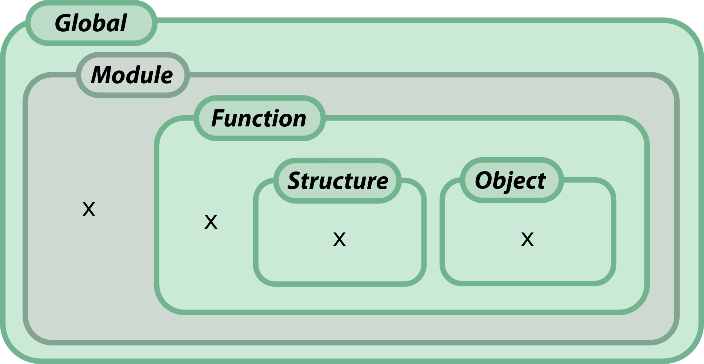
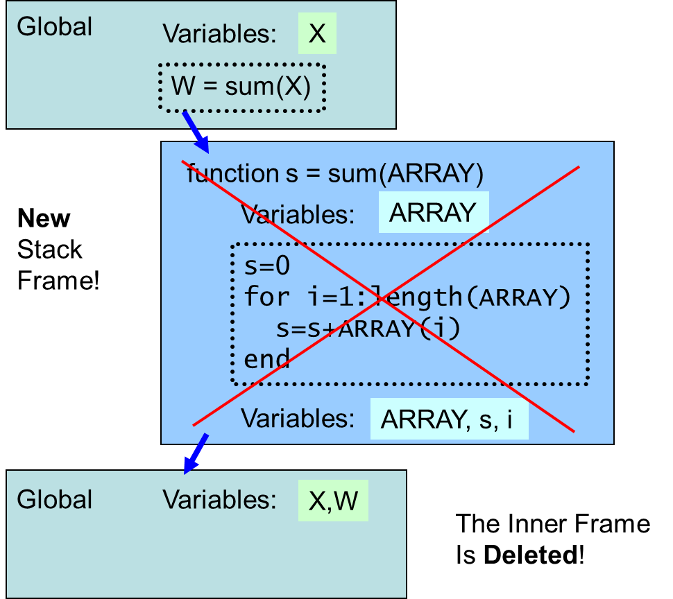

# Chapter 7: Functions

Functions are a way of dividing up your code. But they are immeasurably more than that.

Once you have fully assimilated the concept of functions, you will want to re-write all your scripts. This chapter will discuss what makes a function pure, what happens inside the computer when a function is called, and how you can banish a range of problems by using functions. This chapter helps

-   Understand functions as contracts
-   Visualise what happens to variables when a function is called
-   Motivate you to move code into functions, for your common tasks

\<bigger picture\> You may hear many terms with approximately similar meanings, used in different languages: procedures, routines, subroutines, functions, methods, handlers. All these refer to the idea of a self-contained block of code that is agnostic about the context it runs in. They can be **called**, which means it is *as though* that block of code were substituted in, at the call point. You can run the code many times, in different contexts. The details of how they work differ between languages, but this fundamental idea is the same: They encapsulate the idea that the concept behind your code is modular, separable, and factorisable.

\</bigger picture\>

## 7.1. Why bother using functions?

\<exercise\>

Why use functions? When would you use them? Make a list of reasons why they help.

\</exercise\>

Functions can:

-   Facilitate **semantic, self-documenting code**, so that you can replace equations by a descriptive function call, making code far more readable. It is a way of *labelling* a group of lines.
-   **Insulate / isolate code**, so that it is immune to changes elsewhere in the program. Functions inherit no variables except the ones supplied as arguments. The function can choose itself what names to call those variables. There is no possibility of name **collision** with things outside the function – internal function variables are kept separate. Ultimately this makes debugging easier, and errors less likely.
-   **Specify** clearly the inputs, outputs and contract of each chunk of code. You know for certain what depends on what.
-   **Decrease repetition**, and thus **increase code re-use** by allowing the same code to be called multiple times.
-   Let you **make alterations** in a single place, rather than searching for several places where the same algorithm needs to be changed.
-   **Create APIs**, interfaces where other people (or yourself) can call upon your code to do useful things. Often this follows on directly after making your code more general-purpose or abstract.

There are also cognitive factors that make functions easier to understand:

-   Human working memory is our ability to hold small amounts of information online while we are using it. **Working memory is severely limited**. When you write a function, your working memory keeps track of what input is coming in, the step you are on, and what you need to do next. Remarkably, our working memory capacity is only about 4 items. So, when you have to keep track of more than 4 items, you will need to look back at the code.
-   If you are looking at short functions, only a small number of variables will be visible at a time. This makes it much easier to understand the code in front of you. However, it may make it **harder to find** the right bit of code, because you might have to look through many different functions.

### When to functionise?

Functionising code involves breaking up a long, linear script into smaller chunks. It can be time-consuming and can introduce new errors in your code.

\<Exercise\> In what situations would you do this?

-   when code forms a “**meaningful unit of computation**” – that is, it serves a single purpose, or performs a unitary task
-   when code is **self-contained** – i.e. when it does not depend on many other aspects of your code
-   when a region of codes has **defined inputs and outputs** – so you can specify what the code needs to know, and what it actually creates
-   when code has **internal temporary variables**, that are not needed by other parts of the code
-   when you feel an urge to ‘**copy-paste**’ coming on
-   when you are **sharing** code – so that when people need bits of your code, they don’t need to cut it up. Instead, your functions will be self-contained, with defined inputs and outputs, and will therefore be easy to incorporate.
-   when you **work in a team** of people using similar techniques – for the same reasons as above.

In these situations, the solution is often **refactoring** (see 7.8) existing code to form functions. Breaking code down into self-contained functions will **reduce crosstalk** between pieces of code. This makes your logic clearer, and errors much easier to spot. It allows unit-testing of smaller chunks of code.

Some people advise splitting up a function as soon as you can’t see the whole function’s code on a single screen. Others advise that a function should have just one responsibility \<Martin 2000\>.

**Swiss-army functions**: A common problem in science is that people write a function, then add more options to it, until it can do lots of different things. The function tries to be a jack-of-all-functions – a Swiss-army function. One symptom of this is when you need to provide a lot of options as parameters to the function, to achieve what you need. Often, the optional jobs could be moved into separate functions, that the user can call if needed.

### When not to functionise?

Beware that breaking code down into too many functions can

-   make it hard to find code
-   make a simple algorithm look nonlinear and complex
-   increase human memory load, because you have to remember what each function does
-   misrepresent what code does, by simplifying the function name to something imprecise – which can lead to errors through misuse of the function
-   lead to ‘**over-abstraction**’ where a single “swiss-army knife” function has dozens of options, but no longer performs a single task. A telltale sign of incorrect abstraction is if you have multiple flags or switches as inputs to the function.
-   lead to ‘**under-abstraction**’ by creating many variants of a function, each with a slightly different name, that undertake subtly different tasks

## 7.2. The Doctrine of Referential Transparency

Referential transparency is an ideal standard that all pure functions should adhere to. There are two parts:

1.  Calling a function should **never change anything** apart from the output
2.  A function should produce **identical results** whenever it is called with the same parameters, unless documented

In other words: No side effects -- pure functions don’t change anything outside themselves; and the output only depends on their input. (Reade 1989).

Pure functions are a bit like mathematical functions: they are nothing but a **mapping** between inputs and outputs. The function definition just specifies the mapping.

Typical examples of pure functions are sin(⋅) (a unary function), plus(⋅,⋅) a binary function, and vector functions like sum().

\<key point\>Pure mathematical functions are the paragons all good functions aspire to be. \</key point\>

\<bigger picture\>

Referential transparency and opacity are borrowed from the philosophy of quantified modal logic (Quine 1953). We can use names in two ways: we can use them in a way that depends *only* on what the name refers to, and not on how we name it; or alternatively, we can use names in a way that depends on *how* the thing is named. Factual statements are generally transparent contexts, for example “The Morning Star is the evening star” is true if and only if “Venus is the evening star” is also true. However, statements about beliefs are often opaque contexts, for example “John believes that the Morning Star is the evening star” might *not* be true even though “John believes that Venus is the evening star” is true. Like the ancient Greeks, John might not know that the morning star is Venus. So, in the transparent context, the term The Morning Star evaluates to something fixed. In the opaque context, the thing it picks out depends on the state of affairs – in this case, it depends on ideas in John’s mind.

In other words, referential transparency means that a term evaluates to the same thing irrespective of the context – and depends only upon how it is called. For computer functions, this means their return value depends only on their inputs.

\</bigger picture\>

### Violation of referential transparency

What counts as changing something outside?

-   Printing something on the screen
-   Saving a file on the disk
-   Sending data to an output port

When might outputs not depend on inputs? Well, it is essential for code that actually does anything:

-   Reading information from the keyboard or mouse (the output depends on the state of the keyboard)
-   Reading data off a channel or queue – it might change the next item in the queue
-   Other typical cases of impure functions include rand(), time(), etc.

Of course, if no functions ever did any of these things, you couldn’t have any input or output! So some functions need to be impure. **Minimise these violations, and move them up to the ‘highest level’ possible**:

-   Try and load data outside functions, and pass them in as parameters
-   Try to separate any functions that deal with user input
-   Instead of printing information to the screen, can you return it as a parameter, and let the user print it if needed?

When you do have violations, make sure to **document** exactly what things will get changed. There should never be ‘side-effects’: unexpected effects from calling a function.

If you can write most of your code as pure functions, i.e. in a functional style, it is likely to be more reliable, usable, and re-usable. It also allows easier unit testing, and permits efficiency tricks like memoising. One common violation is borrowing variables from outside your function, without taking it as a formal input parameter – this may be through extended **scope**, closures, or **globals**.

### Never change directory in a function

Why not? You will lose track of what the current directory is. Many types of code make assumptions about which directory you are in, e.g. code that loads or saves data files, or code that calls on other functions. It is disorientating to change directory when a function is called (unless your function is called “change_directory”).

What if you restore the working directory? Consider the following:

**function** calc_session_mean(sess)

original_directory = **pwd**();

**cd**(‘data_folder’)

**load**([ ‘data_file_’ sess ])

**cd**(original_directory)

What happens if there is an error in the load command? The user will be dumped into a directory they didn’t start in. Running the script again may not work, and the user (who is not expecting a directory change) might accidentally save or delete the wrong files. The solution here is to build a path using parameters:

**function** m = calc_session_mean(sess, directory)

**load**( **fullfile**( directory, [‘data_file_’, sess] ) )

...

**def** calc_session_mean(sess, directory):

**np.load**(**os.path.join**(directory, sess))

...

calc_session_mean \<- **function**(sess, directory) {

**read.csv**( **file.path**(directory, **paste0**(‘data_file’, sess)) )

...

}

The solution is not to change directory. Also,

-   no absolute paths
-   avoid relative paths too, unless specified as an input parameter (i.e. do not assume which directory you will be in)
-   try and make the script ‘agnostic’ as to the folder structure – unless it is a well known standard directory structure

Avoiding absolute paths can be tricky. Just avoid putting them in your code - you should never need them. Instead, obtain the path as input to your code.

***

If you are analysing a data file, make your code into a function that takes the filename as a parameter: analyseData(filename). This forces the person running your code to specify the file when the code is run: analyseData( '/var/Data/file') . Alternatively in Python, read the data path as a command line argument with sys.argv.

***

\<bigger picture\>

Did you know? In older computers, machine code could be compiled in an “absolute” or a “relative” way. Every number stored in a computer’s memory has a unique address – specified as a number. Machine code instructions are themselves numbers stored in memory, and a computer program occupies a sequence of neighbouring addresses. As the computer runs that code, it reads the instructions one at a time, located at the instruction pointer – which increments when each instruction is executed.

Calling a function involves jumping from one location to another location. If jumps are coded as an absolute address, then the code is not **relocatable**. That is, when you load the code into memory, it always needs to be loaded at the same memory address. Multi-tasking operating systems have solved this problem in several ways: static linking, segments or address prefixes, paging, and process-specific virtual address spaces. But the problem still arises in embedded architectures and firmware, where tiny CPUs run very simple code. One obvious solution is to use **relative jumps** or branches – where each function is always in the same place relative to the start of your code.

Write your function in a ‘relocatable’ way: avoid operating-system specific calls system(), !, os.system(), subprocess.run(), system(). Avoid specifying paths, and if you do, use only relative directory paths, ideally with file locations as a parameter. Document dependencies i.e. which libraries you use. If you’re not using modules (or classes in Matlab), make function names are sufficiently long that they don’t collide when used in a different environment.

\</bigger picture\>

In MATLAB, it is possible to commit the even more odious crime of changing the search path within your code. Never use addpath within a function. You can break lots of things – including your own code. If you are in real trouble, you could check the path and issue an error if it is incorrect. But remember that the search path is the user’s private business.

### Random numbers

All languages implement a random number generator. This violates referential transparency, since it produces something that doesn’t depend solely on the function’s inputs. All computer-generated random numbers are pseudorandom, where each call to the random function picks a number from a very complicated sequence. This sequence starts off using a “seed” number, and once this is provided, the sequence is **fully deterministic**. If you call your random number generator 100 times, reset the seed, and do it again, you will get identical values.

This can be immensely useful for debugging! If you are running a simulation, you can run your pseudorandom code many times with the same seed, but different parameters. You can specify seeds with rng, random.seed, set.seed.

So why do you always get different results from your pseudorandom code? When you first start up your language, it usually takes a seed number from the nanosecond clock. This of course has infinitesimal odds of giving the same seed twice, so you get completely different sequences.

Note that drawing a number from the random number generator actually violates referential transparency in a more important way: It affects subsequent random numbers. This is because it alters the state of the language’s random number generator, by drawing off one value from its predetermined sequence. For example, consider a stochastic simulation of responses:

rng(0)

**for** i=1:100

x(i) = **randn**

y(i) = simulate_response(x(i))

**end**

**random.seed**(0)

x=**np.zeros**(100)

y=**np.zeros**(100)

**for** i **in** range(100):

x[i] = np.randn() @TODO

y[i] = simulate_response(x[i])

**set.seed**(0)

x\<-**c**()

y\<-**c**()

**for**(i **in** 1:100)){

x[i] \<- **rnorm**(1)

y[i] \<- simulate_response(x[i])

}

It turns out that the values generated for x tacitly depend on what happens inside simulate_response. If the function generates a random number and discards it, we would get different values for x (and thus y), compared to if it doesn’t. This is because generating a random number itself changes the (**global**) state of the random number generator.

Note this problem would be averted with a vectorised approach where all of x is generated first, then y is calculated.

So, it is good practice to document “this function alters the state of the random number generator”.

### Writing a function is signing a contract

When you write a function, you must think like a solicitor. What are the loopholes? Is every condition specified? Is there any line of code that needs something to be in place? Is there any line of code that changes something that the caller of your function might detect? What rights do you have, and what rights do you need? Be explicit about violations of transparency.

-   If you need input files, ensure you specify
    -   what files you need, the names, and where they should be located. Either make the code use only relative paths, or else provide an input parameter about where to find those files, so the caller can relocate things to another directory if needed.
    -   the file format needed
    -   the content of the files – what does it mean, variables, sizes,
    -   size / array dimensions (eg. for image files or data tables)
    -   what units the values in the file should be in
-   If you save or change a file, the same applies: document exactly what you have stored, where, dimensions and units.
-   Specify dependencies on other scripts and libraries (e.g. things that need to be added to the search path)
-   Document any inputs and outputs to other places (files, devices, keyboard, network etc)
-   If you write large files, make this very clear, as you do not want to surprise a user with a small laptop

You have to be your own solicitor.

## 7.3. Namespaces and pollution

\<key point\> Pollution is a global problem, and the solution is local.

Everyone has too many variables, but they are less problematic if we confine them to their local environments.

### The global workspace: Emergency use only!

When you open your IDE, you will start with an empty workspace: no variables. As you run lines of code, load data, do calculations, you will accumulate variables in the workspace. These are kept in memory (**RAM**) belonging to the current interactive session (the “instance” of Matlab/Python/R). Running a new instance gives a fresh workspace.

Variables are stored as pairs: a name, paired with value. The workspace is basically a dictionary (**namespace**) where the interpreter can look up a variable by its name, and read/store the value. The names and values are stored as a **map**.

The problem with this is pollution: when you have lots of names, they may collide. As more things get defined, like variables or functions, how can you tell them all apart? Common problems include

-   Overwriting – assigning a value to a variable unintentionally overwrites another variable. For example if you are writing a loop inside a loop, you need to have a different variable for the loop index. This is not great, because it means a ‘local feature’ of the code (the inner loop) needs to know about a global feature (the outer loop). The parts of the code are interdependent, which is a bad thing.
-   Shadowing – this is when recent, local definitions of functions or variables dominate over globally defined things with the same name. For example inside a function, you might define a variable for the number of participants np, which might shadow your numpy module. You might create variables height, width, length, and find that you can no longer find the length of an array. Another example in Matlab is for i=1:10, which shadows the internal definition of the imaginary unit i. Note that with shadowing, the original definition is not overwritten or destroyed.
-   Finding things gets hard. How do you remember the name of your variable? You might have to look through a large workspace of many names, in order to remember.
-   Dependencies can become unclear – you might use a function, but not know where it originated. Did it come from a package you installed a long time ago? Or was it defined recently?
-   Similarly, it’s hard to know where and when a variable was declared or changed. In the global workspace, almost any segment of code could be responsible. It gets very laborious to track down who modifies or creates what variable. Namespaces give variables a clear “ownership”.

The solution is to have longer and longer names. Namespaces are an organised way of enforcing longer naming systems. They allow

-   Collision avoidance, with a smaller number of variables per namespace
-   Hierarchical organisation, with nested namespaces, so that variables and functions are easier to find when needed
-   Autocompletion, so subvariables in a namespace can be listed

So, in addition to the “global” workspace, all languages provide a facility to have **local namespaces** – which are just additional dictionaries where you can store variables. The advantage is that you might have a variable called x in the global workspace, but another different-valued variable called x in another workspace.

Some systems are not amenable to namespaces, and are deliberately flat. For example, Matlab and shells like Bash use a global search path. This is a global workspace to be searched whenever a command is typed. These flat systems allow quick search across a very large number of functions. In contrast, with hierarchical namespaces, you need to know where to find things. If you don’t know which package provides a critical function, you might be stuck.

For all these reasons, always treat the global workspace as if it doesn’t belong to you. It’s for emergency use only; put as little in it as you can get away with. The global workspace is **for scripting, not for programming**. Its contents are corruptible and prone to interference, like a “working memory”.

### Creating namespaces to avoid pollution

There are four main ways to create new namespaces:

1.  **Structures** are like dictionaries that are themselves stored in a variable in the current workspace. This means you can create a namespace of your own, within a variable in the global namespace (see section 8.4). To access a variable in a structure, you might use structure notation a.b, a['b'], a\$b, instead of just b.
2.  **Functions** force a section of code to run in a new namespace, called a **stack frame** (see next section). From the function’s point of view, this fresh environment is treated as though it were the global workspace. From the global point of view, the function’s namespace does not exist! These local variables are only accessible inside the function.
3.  **Objects** are the most sophisticated way of creating a namespace: both variables and functions are declared within the namespace, so that the data and functions are kept together. In many cases, from the global point of view, the data itself is not visible.   
    Eg: you fit a linear model. The model has a lot of named variables, e.g. the coefficients:  
    data=**table**(x,y)  
    m=**fitlm**(data,‘y\~x’)  
    m.**Coefficients**  
    m = **sklearn.linear_model.LinearRegression**().**fit**(x,y)  
    m.**coef\_**  
    data\<-**data.frame**(“x”=x,”y”=y)  
    m\<-**lm**(y\~x,data)  
    m**\$coefficients**  
    But notice these variable names only exist **inside the object** m.
4.  **Modules** allow functions as well as variables to be wrapped up in a namespace. They work like structures, and mean that functions are less likely to shadow each other. The advantage is that when you call a function, you know where that function came from.
    -   Note: newer versions of Matlab allow packages, which are folders beginning with +. Adding these to the path creates a namespace. Classes can also be used like modules. This allows many functions to have the same name, for example, many toolboxes contain a function plot.m. Ensure that when you add anything to your path, such functions are inside a package or class. Simply adding a directory to the path can wreak havoc by **shadowing**.
    -   Both Matlab and shell scripts use a global search path. One convention to avoid collisions is to **prefix the namespace** to filenames, for example with an underscore. This helps isolate modules when a global namespace is necessary. For example spm_smooth.m is a smooth function particular to the Matlab SPM package, along with dozens of other spm_... functions, which won’t get confused with Matlab’s smooth command in the Curve fitting toolbox. The imaging package FSL adopts a similar strategy with shell commands, beginning fsl_.

Each of these techniques should be used in particular situations.

\<caption\> Fig.7.1: Namespaces can be created in different ways. Many variables can have the same name, but are isolated from each other by being in different contexts. Here there are four variables called x, all co-existing in different places in the code, and different places in the computer’s memory. Structures and objects allow variables to reside inside other variables. Functions allow temporary variables to be created and disposed of efficiently. Modules (in Python) allow external libraries to maintain their own variable and function names, without colliding with global names. \</caption\>

### Caution when loading variables from a file

Avoid loading variables from files directly into the global workspace. Try and load them into a specific local namespace first. E.g

data=load(filename)

load variables into a structure instead

load(filename)

import numpy as np

import modules into their own namespace

import numpy.\*

require(lme4)

use modules or explicit

lme4::lmer()

-   Compilers, **lint** and warnings are your usual bodyguards against silent errors. However, they will be unaware of variables loaded into the workspace from files. This means they may flag up errors like “undefined variable”, and will fail to spot errors where variables are overwritten.

## 7.4. Stack frames

### Stack frames help to isolate tasks

Interference is the enemy of efficiency. Have you ever tried to pat your head and rub your tummy? Did you end up mixing up these two tasks? One way to minimise interference is to delegate. It’s easy to walk and talk because your spinal cord is delegated to handle many aspects of the walking.

Delegating tasks to other people works so well, because other people have a capacity to focus on specific things, without interference from the top-level (bureaucracy), and without interference from the other tasks that are going on in parallel (concurrency). By delegating, individual people constitute little islands of peace, where a self-contained process can progress. Functions are the computer’s way of delegating, and **stack frames** are those islands of peace. One of the most elegant solutions to pollution is to create **local namespaces** whenever a sub-task is needed.

### What are stack frames?

When a function is called, several things happen. The most important thing is the creation of a new stack frame. This is an area of memory reserved for your function, freshly prepared each time your function is called. It contains a namespace for variables. In the simplest case, it starts empty, and is loaded with the input arguments to your function. These variables are named the way your function wants, rather than the way the caller names those variables. The name of any variable defined in your function is **local** to your function.

[footnote – This refers to the binding between the name and the value. A variable’s value, on the other hand, may not be local: it might be returned, or in Python assigned to/from passed objects, or in R assigned to or from passed environments or ‘reference classes’.]

The contents of your stack frame form a temporary workspace – it is volatile, destroyed when your function ends [footnote 1]. So, think of the stack frame as a **scratchpad**, or “working memory”. Anything you need to keep hold of should be returned from the function. Outside of our function, those variable names are not in **scope**: they cannot be accessed [footnote 2].

[footnote 1 - Logically this has to be the case, because a function can be called many times. Imagine, local variables could be accessed outside a function, how would you know which *invocation* of the function would they correspond to? The function might never have been called yet. ]

[footnote 2 – the variable’s content itself might be accessible though, e.g. due to pass-by-reference semantics in Python. ]

Here is a walkthrough of what happens when a function is called. Let us say we call the function sum(). Clearly this function will add up the elements of the input array. We call it from the command line, which means we are in the global workspace.

From the global scope, we have an array X in the workspace. We call sum(X), which opens a new stack frame for the function sum, and sends\* the value of X to it. But note: in the new stack frame, the variable will be called whatever the function sum has asked it to be called. In this case, it gets named ARRAY. This variable ARRAY is a **formal argument**: it is a slot that gets occupied with a value sent from the caller. Also note, the variable X is no longer visible! The local stack frame hides the global workspace.

[\*footnote: The name X itself is not directly visible inside the function, but the contents are. In Matlab, the actual array values are sent. In Python, arrays are **passed by reference** (like a pointer to the array) so that changes in the elements are sent back to the caller. In R, a term is sent that evaluates to the numbers in the array.]

Within the function sum, other variables can be created. Here, s and i are created, to hold the sum so far, and the array iteration counter respectively. The output of the function is s, and the value of s gets sent back to the place where sum() was called.

When the function sum has finished, only s is preserved. The other variables ARRAY and i are destroyed, along with the stack frame. Note that the *name* s is deleted, because stack frames contain the bindings of names and values. But its value is now assigned to W, as per the assignment on the line where the function was called. So result gets named whatever the *caller* wants it to be named. This is bound in the frame of the caller, in this case, the global workspace.

The same holds true if the caller is also a function. This means you can have many frames, creating a chain that specifies who called who. This tree is sometimes termed a ‘call graph’, or a **call stack**. For example, if you call a library routine that calls another library function, which then calls a built-in function, there might be four “layers” of variables, only one of which is active at a time. If an error occurs in that built-in function, the call stack at the moment will contain four frames. These frames get examined, and if no error handler is found, they are reported as a **stack trace** or stack dump.

\<bigger picture\>

The way values are sent to functions differs according to the language. In Matlab and R arrays are **passed by value**, i.e. a copy of the array is taken, so that changes to elements of the passed array are not permanent, and vanish when the new stack frame collapses. Python arrays are **passed by reference**\* i.e. a pointer to the original is sent, so that if your function changes the array contents, those changes will be seen by the caller, even when you don’t return a value. This “side effect” violates the strong form of referential transparency, since you can send information to the caller that isn’t in the return value.

\</bigger picture\>

[\*Footnote – Some Python operations will modify the array, whereas others will lead to a copy being created. E.g, if your function receives a numpy array x, then you do x[0]=x[0]\*2 or x\*=2, this change will be seen by the caller. However x=x\*2 will not, since it creates a copy. ]

### Nested scopes and closures [Advanced Topic]

**Extended scope** arises if you use a variable defined outside your function, without passing it as a parameter. This violates transparency. In fact, simply using a built-in function violates transparency! This happens in R/Python, but not in Matlab:

len=1 \# never do this

**def** test():

**print**(len)

test() \# 1

**del** len

test() \# \<built-in function len\>

sin\<-1 \# never do this

test\<-**function**(){

**print**(sin)

}

test() \# 1

**rm**('sin')

test() \# .Primitive("sin")

pi=3 % avoid this

test = @() pi

test() % 3

**clear** pi

test() % 3

In Matlab, the function remembers the value assigned to pi, in a closure (read on!). Matlab closures takes a copy of the values it needs from the environment it was defined in. The variable will be constant every time the function is called. Python and R closures keep a reference to the **namespace** (i.e. **stack frame**, scope) of the environment they were defined in, so the variable might change.

**Nested scope:** When functions are declared within a scope, for example within another function, they are nested. Variables from the outer scope can be visible inside the nested function. In Matlab, the outer-scope variable is treated as a reference, so if you change it, that change is visible to the outer function (i.e. to the stack frame in which the function was called). Similarly, if the outer function changes the value, the nested function will see the changed value.

**function** f1()

a=0

**function** f2()

a=a+1

**end**

f2()

a % prints 1

**end**

In python, this happens for array elements but not variables\*:

**def** f1():

a=[0]

**def** f2():

**print**(a)

a[0] = 1 \# this changes a

\# a=0

\# assigning will produce an error!

f2() \# prints [0]

**print**(a) \# prints [1]

[\*footnote in 2.7; in 3.0 you can use nonlocal]

f1 \<- **function**(){

a\<-0;

**function**(){ a }

}

**Closures:** Have you ever accidentally used variables that were declared outside your function? It’s an common cause of silent errors. Accessing ‘outer’ variables can occasionally be useful, but it’s often a bad idea. It’s good to know how this works, so you can avoid it.

Variables created inside a function remain tied to that particular time the function was called – i.e. to that particular stack frame. This means that, if you return a function handle from a function, you obtain a **closure**. In a closure, variables from the outer scope get “baked into” the function at the time it is defined. Subsequent changes in this variable are not visible outside this instantiation of the outer function, and so changes made by the nested function are not propagated.

**function** nest = f1()

a=0

nest = @f2

**function** f2()

a=a+1

**end**

**end**

count1 = f1()

count2 = f1()

count1() % 1

count2() % 1

count1() % 2

**def** f1(a):

**def** f2():

**return** a

**return** f2

hold1 = f1(1)

\# f1 returns a function f2

\# that contains a reference to

\# the stack frame with {a:1}.

hold2 = f1(2)

hold1() \# prints 1

hold2() \# prints 2

f1\<- **function**(){

a\<-0;

**function**(){

a\<\<-a+1;

**print**(a)

}

}

u\<-f1()

u() \# prints 1

u() \# prints 2

Note that in R, you can read outer variables directly, but to assign to them, you need the \<\<- operator.

\<key point\>In short: functions returned from functions can contain some data embedded in them (i.e. the value of a in this case). \</key point\>

All this gets even more confusing, as it differs across languages. Although closures are useful in In functional programming, these kinds of construction are often **best avoided** in the interests of clarity, unless they add significantly to the economy of the code. Moreover, you must be very cautious about what gets referenced in the nested function, because those variables remain after functions terminate, on the **heap**, and can thus accumulate and consume memory.

Instead of nesting or closures, consider explicitly passing the required outer variables into the function, at the time the function is called:

**def** counter(state):

state = state + 1

**return** state

state=0

state = counter(state)

Here, persistence is done outside the function, rather than across function calls. Alternatively, consider object-oriented programming, which is another way of associating functions with data:

class Counter():

def \__init__(self):

self.state=0

def count(self):

self.state += 1

return self.state

count1 = Counter()

count1.count()

A common exception where nesting is useful arises if you create a likelihood function which requires parameters and data as input. Then to maximise the likelihood, you must send the optimiser an objective function of *just* the parameters, not the data. How can this be done?

**function** [opt_par, obj_fun] = find_optim(data)

**function** nll = neg_log_like(par, dat)

nll = **sum**( (dat-par).\^2 )

**end**

data = [1,2,3];

**function** o=objective(p)

o=neg_log_like(p,data)

**end**

optimum = **fminsearch**( @objective, 0 )

**end**

obj_fun = @objective

**def find_optim**(data):

**def** neg_log_like(par,dat):

**return** **np.sum**((dat-par)\*\*2)

data = **np.array**([1,2,3])

**def** objective(p):

**return** neg_log_like(p,data)

opt_par = **scipy.optimize.minimize**(objective,**np.array**([0]))

**return** (opt_par, objective)

In this example, the function objective() contains a copy of the data. This was incorporated on the line the function was defined.

If you need to reference information from an ‘outer’ function, make this unambiguous in the comments, and be alert for collisions and variable changes.

Closures let you “absorb” a parameter by creating a new function. You could convert plus(1,2) into add_1_to(2) – a function that adds 1 to its input. Now, a function that could perform this conversion is function_that_creates_a_function_add_x_to(). This **curry function** could be useful, for example, if you need to parameterise a likelihood function, and pass that to an optimiser.

createNLL = @(data) ( @(params) -likelihood(data,params) )

createNLL = **lambda** data: ( **lambda** params: -likelihood(data,params) )

In general, if you find your functions need access to data from the parent environment, closures may not be the best solution. They are hard to read and to debug. Either pass structures as parameters, or switch to an object-oriented design. In objects, functions and their associated data are bound together explicitly.

\<box\>

How can you avoid referring to variables outside your function?

Consider this function that operates on some data, but needs to know a bit more about the data:

SAMPLE_RATE=1000

**function** validate_data(x)

duration = **length**(x)/SAMPLE_RATE

...

This function uses a variable from outside its scope. While this might work, it creates confusion. What would happen if the number of channels was changed? It is not immediately clear. If there are lots of variables, it is cumbersome to pass them all as individual parameters.

Declaring the variables as global would clarify that SAMPLE_RATE inside the function refers to the same variable outside the function

**global** SAMPLE_RATE

SAMPLE_RATE = 1000

**function** validate_data(x)

**global** SAMPLE_RATE

duration = **length**(x)/SAMPLE_RATE

...

However, global variables create a host of other problems: conflicts and collisions, an inability to process two datasets with different sampling rates, and a lack of semantic link between the actual data samples and its corresponding **metadata**, which runs a real risk of using the wrong sample rate.

Instead, you could use a structure for metadata:

info.SAMPLE_RATE = 1000

info.N_CHANNELS = 4

**function** validate_data(x, info)

duration = **length**(x) / info.SAMPLE_RATE

In Python you might consider object-oriented code, where data is packaged with its metadata. Here, the number of channels and sample rate are kept along with the data, in an **object**:

**class** SampledData:

\__init__(self, x, sample_rate, n_channels):

self.x = x

self.sample_rate = sample_rate

\# note I used lower case as they aren’t treated as constants

self.n_channels = n_channels

**def** validate ():

duration = self.x.shape[0] / self.sample_rate

...

recording = SampledData( x, sample_rate =1000, n_channels=4 )

recording.validate()

Notice that the metadata don’t need to be visible outside the object: we have provided a method validate which does all we need.

\</box\>

### Function arguments from lists

How can we transmit many variables from one namespace to another?

A neat trick is to pass items of an array as separate inputs to a function. For example, a function might take two **arguments**, which you have in an array. You can call the function like this:

Inputs = {X,Y}

myFunction(Inputs{:}) % unpack cell to a list

Inputs = [X,Y]

myFunction(\*Inputs) \# unpack array

Inputs = {'X':5, 'Y':6}

myFunction(\*\*Inputs) \# unpack a dict as ‘kwargs’

Inputs = **list**(x=5, y=6)

**do.call**(myFunction, Inputs)

This process is called unpacking an array or list, because it turns myFunction([1,2,3]) into myFunction(1,2,3).

## 7.5. Debugging with a stack

Functions call function, which call functions. When an error occurs, it occurs within a function, which was called within a function, within another function. The positions where each function was called is kept in a special store, known as the function **call stack**. When an error occurs, the functions in the stack is known as the **stack trace**, and is shown in your console after the error. This is a list of function calls, from the innermost function, where the problem was noticed, to the outermost function – that you probably ran to start the calculation. Understanding the trace is crucial to finding the problem.

If you use the debugger, you can navigate up and down the stack frames. To enter the debugger, which is integrated with your IDE, you can either:

-   Create a breakpoint

    Set these in the left margin of the code editor. Or add keyboard, pdb.set_trace(), browser() at the appropriate point in your code.

-   Break on errors

    dbstop if error, pdb.pm(), options(error = recover), options(error = browser)

If you break on an error, you will usually be in the innermost stack frame – in the code that caused the error. If you did not write this code, step up through the stack, until you find your code.

To move up or down through levels of the stack:

dbup % go up one level

dbdown % go down one level

pdb.up() / u

pdb.down() / d

where \# location in stack

recover() \# stop on errors

parent.frame(1) % go up a level

Once you have found the line you wrote that triggered the error, ask what parameters did you use when calling the library function? If you can’t spot the cause, work backwards from the error, to see whether each step’s output was correct. You could set a breakpoint before, and then step through one line of code at a time, examining the local variables at each step.

dbstep

n

n

If you suspect the problem is in the calling function, set a breakpoint in the outer function. You can then step into inner functions:

dbstep in

s

s

**Conditional breakpoints** allow you to stop execution just when certain conditions are met. For example, you might want to stop inside a loop only when subject == 6, or when a statistic is NaN.

### If you can’t use the debugger

Occasionally, there are situations where you can’t easily stop in the debugger. For example, if you have a fullscreen display running, or if you have realtime data acquisition running in parallel. In these situations, you may need to adopt old-fashioned, less sophisticated debugging techniques:

-   Print the values of variables, just before the error line. This allows you to track progress, or view intermediate results. You could even write messages to a log file, with an option to switch this off.
-   Remove lines where the error could be. Temporarily comment them, or replace them with something benign. By trying without each line, you might find the problem.
-   If an error line is long, split it up into smaller commands. Break down each component of a compound statement. Calculate each term in a complex expression on a separate line.
-   Add **assertions** to trap situations likely to cause a problem – for example when a value goes out of range or becomes NaN (see errors)
-   Read error messages very carefully: each character is a clue (see errors)
-   Are you looking at the right version of the file? Often we make copies of a file (which is generally bad practice – see version control). Might you be editing one copy, but running the other copy?
-   Are you looking at the right output? Double check if your plot command or display code reflects the correct variables.
-   Find the smallest dataset that that reproduces the error.
-   Try cutting down the code, removing features, and deleting chunks, until you isolate the error. You are more-or-less guaranteed to find the line that causes the error this way. You can add things back later!
-   Take a break. Think about the problem overnight if necessary.
-   Write a highly simplified version of your code. Rewrite a new function from scratch to replace the erroneous code chunk, but in a very basic, bare-bones form. Try and find the minimal code that will reproduce the error. This also called a Short Self-Contained Correct Example (**SSCCE**).
-   If you are using a library function, google the error, with the library function and library name. You may find that other people have encountered the problem.
-   Ask online. There are excellent forums like StackExchange where programmers help other programmers. Format your question well, include all the relevant information, and be sure to include your SSCCE in the post.

## 7.7. Building an Application Programming Interface

APIs hide things. How can hiding things be good?

The **interface** is the contact point between your code, and the outside world. The interface is what other people need to know about, in order to use your functions. It is the public face of what you write. Traditionally, an interface is a set of function **declarations** or headers. In other words, it comprises

-   The function name, input arguments, and return values
-   A **contract**, e.g. in the documentation or comments: what you can expect it to do.
-   Error conditions – when it will and won’t work

It doesn’t tell you about the implementation – i.e. **how** it will achieve what it sets out to do. The details of what method it uses to achieve the goal, is beside the point for an interface.

The simpler it is, the better.

-   Fewer arguments and return values, with a sensible ordering
-   each function performs one task, not many
-   Matlab – either add prefixes on function names, or put the functions inside a class, to avoid collisions

### Why hide implementation? Isn’t code supposed to be open?

It is not about privacy or security: it is about allowing people to write code at the right level of abstraction. If you are smoothing a time series, you don’t want to think about how the function allocates memory for the intermediate steps. You just care about the behaviour: it needs to smooth your data. So, the function will **expose** parameters that affect its behaviour, but will hide details about memory allocation.

Sometimes the implementation might be changed – e.g. to speed it up, or to fix bugs – without changing the contract.

The API provides a fixed, comprehensive set of rules for how to use the functions, that is guaranteed to work. This interface is sometimes termed a “layer” of abstraction. It is an **opaque** layer in the sense that the person using your functions does not see the details of how you implemented it. This gives you freedom to implement the API how you please: you are free to change anything inside the functions. As long as you abide by the interface’s rules, you can be sure you won’t break anything for people who use your code.

\<key point\> Abstraction layers define information boundaries, which permit **modularity**.\</key point\>

If you are have a set of related functions which you want to share as a unit, that constitutes a **library**. Write your own rules: create an API that stipulates a contract which your library must abide by. Declare functions that can be called, variables that might be used, and define behaviours that your functions should adhere to. For example, figure 7.2 illustrates an API to create and plot some data.

\<caption\> Fig.7.2: An **API** is the interface through which a user (top) can write their own, new, high-level code, by harnessing your existing low-level code. At the top is the code they need to write. What functions can they call? What variables do they have access to? These are specified in the API layer.

In this example, the API declares two functions and two constants. The user calls one of the functions, create_voldata: to use it, they only need to know what is in the interface. Behind the scenes, your library is free to use whatever method it likes to fulfil its contract. Here, the function calls other, internal functions ('helpers', in this example called internal_allocate and internal_check_valid) which are hidden (private) from the user of the API.

The library consists of implementation functions, some of which are “in the API” – i.e. they are documented, and you can use them directly. Other functions are private, called internally by the library. The API layer allows users’ new code to be **linked** to your existing library code.

Sometimes there are internal functions, not designed for people to use directly, that are publicly accessible. For example, com.mathworks.mde.desk.MLDesktop.getInstance, calling \__getattr_\_ or other functions beginning with \__, or accessing private members using :::.

\</caption\>

Similarly, the opaque layer gives the user freedom: they are able to rely on the code behaving in a particular way, even if the implementation changes in the future.

## 7.8. Refactoring

When you write code, you don’t always know which bits will need to be re-used. Also, it’s not always obvious what counts as re-use (see Spotting algorithmic similarity). Once you realise something might need to be re-used, you will need to re-arrange your code – this is called re-factoring. You should feel an urge to refactor when something is used even twice.

\<exercise\> How might you restructure this code?

X = **randn**(10,10);

Y = **randn**(20,10);

X = X - **mean**(X);

Y = Y - **mean**(Y);

X = X / **sum**( X(1,:).\^2 )

Y = Y / **sum**( Y(5,:).\^2 )

Here is one way:

X = **randn**(10,10);

Y = **randn**(20,10);

X = deviance_normalised_by_row(X,1)

Y = deviance_normalised_by_row(Y,5)

**function** deviance_normalised_by_row(X,row)

X = X - **mean**(X);

X = X / **sum**( X(row,:).\^2 )

**def** deviance_normalised_by_row(X, row):

X=X-**mean**(X);

**return** X/**sum**(X[row,:]\*\*2)

If one of the use cases is very frequent, use a default parameter value:

**def** deviance_normalised_by_row(X,row=1):

**if** \~**exist**(‘row’,’var’), row=1; **end**

**Advantages**: readability, “literate” style, less comment required, re-usable normalisation code, normalisation method can be globally turned off or changed in one place.

**Disadvantages**: need to scroll down to the function to read first line; cannot customise X independently from Y; the name could potentially be misleading e.g. if the function is changed; increases interdependencies between areas of your code.

\<exercise\> What are the benefits and disadvantages of the refactoring shown?

BAND = 10:20; % frequency band of interest

**for** i=1:NumSessions

**for** j=1:NumSubjects

data = **load**(filenames{i,j}, ‘DATA’);

data = applyNotchFilter(data);

data = applyLoPass(data);

y_fft = **abs**( fft(data(:,2)) );

m_band(i,j) = **mean**(yfft(BAND)); % mean for the band

**end**

**end**

Refactored version:

data = **cellfun**(@(f) **load**(f,DATA), filenames, ‘uniform’,0);

data = **cellfun**(@(d) applyFilters(d), data, ‘uniform’,0);

y_fft = **cellfun**(@(d) **abs**( **fft**(d(:,2)) ), data, ‘uniform’,0);

m_band = **cellfun**(@(y) **mean**(y(10:20)), y_fft );

**function** data = applyFilters(data)

data = applyNotchFilter(data);

data = applyLoPass(data);

**return**

**Advantages**:

-   parallelisable, so might run many times faster
-   no need for for loops, reads more linearly
-   Less chance of erroneous overwriting (m_band is created only once)
-   Filtering is a commonly re-used unit for pre-processing, so is separated out.

**Disadvantages**:

-   needs to keep all datasets in memory – not suitable for very large data
-   multiple anonymous functions are very hard to read
-   If an error occurs in one dataset, it is hard to find out which one is at fault since there is no (i,j), and you can’t step through. (This problem comes hand-in-hand with parallelisation).

A half-way solution might be to keep the for loops, which can perhaps be parallelised, but refactor the filtering.

\<key point\>

-   Refactoring is not re-writing: you just move code chunks around, so that each section only has access to what it needs to know. This allows it to stand alone, and therefore, be re-used.
-   Science is an iterative process. We don’t know in advance what we will need, and refactoring just has to be accepted.

\</key point\>

Many development environments have tools to refactor code. One important tool is **function extraction**. When you select a section of code, the editor automatically detects which variables are needed as inputs to the code, and what might be used as output. The code segment is automatically removed, placed inside a new function, and the original is replaced with a function call. Furthermore, refactoring tools provide options to rename all the calls to a function in one go.

Some tools include **instant** **renaming**, where if you edit a variable or function’s name, an option pops up to change the name everywhere, automatically. Some IDEs will do this for all uses of the variable, or calls to the function, and can also apply across multiple files.

### Functions and versions

Creating new functions can be used as an alternative to versioning.

\<exercise\> Imagine you have a function that does task X, and you want a version that does task Y which is quite similar. E.g. perhaps your function taskX() operates on one dataset, but your new dataset has a slightly different format. Here are 3 solutions:

1.  Some people might create a new function taskY(), as a copy of file taskX(), and edit it. You have a lot of duplicate code in two different files, but at least the two analyses can be changed independently, and there is no chance of messing up your old analysis.
2.  A neater solution would be to rename taskX() as taskXY_generic(), and edit this file. Do not remove the old functionality, but provide a switch, as a parameter (see below).
3.  Alternatively you might spot the subsections within taskX() that are in common with taskY(). Perhaps the pre-processing or plotting is identical. Extract these components into separate functions, such as taskXY_generic_preprocess(), taskXY_generic_plot(). Now you can rewrite taskX() using those generic sub-functions. That new function, taskX(), now only contains the parts idiosyncratic to taskX(), plus calls to the common functions at appropriate times. Then write taskY() similarly.

What are the advantages and disadvantages of each approach? \</exercise\>

Alternative 3 has a number of advantages:

-   you don’t need to play spot-the-difference between two files;
-   common elements can be changed for both tasks in a yoked fashion;
-   the **factorised representation** of the two tasks allows far greater scope for future re-use.

Option 2 works well in many simple cases, and avoids proliferation of taskX_() function names. But it adds new parameters to your function, so be careful not to break existing code, and avoid modifying the API.

\<Exercise: How might you refactor the following two functions? Imagine that the code here is much longer, but the structure is similar, with the two functions having some matching and some non-matching parts.

**function** stats = time_stats(data)

data = data - **mean**(data,1) % preprocess

data = permute(data,[2,3,4,1]) % reshape

data = **log**(data) **% transform times**

[stats.p, stats.t] = **ttest**(data(:,:,1),data(:,:,2)) % perform stats

stats.minP = min(stats.p)

**function** stats = accuracy_stats(data)

data = data - **mean**(data,1) % preprocess

data = permute(data,[2,3,1]) % reshape

data = **asin**(**sqrt**(data)) **% transform accuracy**

[stats.p, stats.t] = **ttest**(data(:,:,1),data(:,:,2)) % perform stats

stats.minP = min(stats.p)

Solution:

**function** stats = time_stats(data)

data = generic_preprocess(data)

data = **log**(data)

stats = generic_stats(data)

**function** stats = accuracy_stats(data)

data = generic_preprocess(data)

data = **asin**(**sqrt**(data)) **% apply arcsine transform**

stats = generic_stats(data)

**function** data = generic_preprocess(data)

data = data - **mean**(data,1)

data = permute(data,[2,3,4,1])

**function** stats = generic_stats(data)

[stats.p, stats.t] = **ttest**(data(:,:,1),data(:,:,2))

stats.minP = min(stats.p)

This code has the advantage that, if you added new columns to your data, or wanted to use a nonparametric test, you could do it all in one place, by just changing generic_stats. We will see later how passing functions as parameters could make this even more efficient.

You can view this example as introducing an extra layer of **indirection**: You call a function time_stats, but this function might not actually include any code that actually does statistics: the ttest itself is in a different function. The user asks for a statistical test, but your function is just delegates this to a lower-level function. Indirection is a common design pattern to make code more general-purpose without making the functions themselves long and complicated.

\<tip\> Always use some kind of version control, or save a backup copy, when you try to restructure large chunks of code. \</tip\>

### Introducing parameters

\<keywords: parsing options\>

Indirection, as shown in the above example, involves passing new parameters to functions, to specify options. To provide a generic function that does two jobs, you might control flow with if statements so that generic parts of the code interleave with case-specific parts. This allows you to control the conditional execution with **flags**, that can be supplied as parameters For example, taskXY_generic might use the input flag to determine whether or not to run the taskX-specific parts of the code:

**function** stats = generic_stats( data, is_time )

data = data - **mean**(data)

**if** is_time

data = **log**(data)

**else**

data = **asin**(**sqrt**(data))

**end**

stats = **ttest**(data(:,1),data(:,2))

Typically function parameters are **positional**: they must be specified in order, e.g. plot(a,b) always means a is on the x-axis, and b is on the y-axis. But rather than using ordered parameters, many people prefer **named parameters**.

-   They allow the parameter to be omitted and a default value used
-   They improve semantics and readability, producing self-documenting code
-   Naming the parameters reduces the programmer’s memory burden about parameter order – which is often arbitrary (consider Matlab’s cat(DIM,x) vs mean(x,DIM)), and inconsistent across functions (e.g. regress(y,X) vs fitlm(X,y)).

R and Python permit direct named parameters. The Matlab convention for passing named parameters is parameter-value pairs, which need to be parsed e.g. via inputParser. A firther strategy is to pass a whole structure/dictionary of options like {‘param’:value}. You can flip between passing structures/dictionaries and direct named parameters using \*\*kwargs or do.call(). The structure strategy has advantages:

-   you can create the structure separately – e.g. at the top of your code
-   one structure can be used for multiple function calls (though if you are writing multiple similar function calls, you might need to think about using loops or vectorisation, see spotting algorithmic similarity 6.4).
-   you can pass the structure down to other functions. This is useful when re-factoring code into sub-functions.
-   parameters can be easily saved along with the data – after all, they are values, not code.

The main disadvantage is that it is more ‘bulky’: within a function, you don’t need to worry about namespace pollution, but you still have to write longer code to reference the parameters (e.g. params.a instead of a). So it removes some of the convenience that is usually gained by writing inside a function.

Beware that introducing multiple parameters to a function is sometimes a sign you need to break the function down into smaller components.

\<Exercise\> Take a look at this snippet of code taken from commercial scientific software. What are the good and bad features of this coding style?

| Pros                                                                                                                    | Cons                                                                                                                |
|-------------------------------------------------------------------------------------------------------------------------|---------------------------------------------------------------------------------------------------------------------|
| Sensible conventions capitalising constants (T, N)                                                                      | Many short variables with long scope (l, y, M1, u)                                                                  |
| Use of options (if Period)                                                                                              | Long code blocks in need of functionising                                                                           |
| Systematic naming of variables (nu, ny, nfft indicating number of elements)                                             | Numbered variables (M1, spe1) suggest array needed, but actually ‘1’ is supposed to convey a different meaning here |
| Good use of space between operators and terms, to keep code readable                                                    | Use of clear indicates the preceding for loop should be in a function                                               |
| Neat indentation                                                                                                        | Commented out statement – purpose unclear                                                                           |
| Short line length                                                                                                       | Nested for loops (ky/ku) can be vectorised                                                                          |
| Alignment of similar code makes errors easy to spot and refactoring easier (e.g. neat parallel assignments of Y and U)  | Seemingly arbitrary weighting factor is hard-coded (0.54 - 0.46\*x).                                                |
|                                                                                                                         | Multiple if statements – can they be simplified, e.g initialising resp = 0 rather than []?                          |
|                                                                                                                         | Literal constant 0.54 is used twice (four times if 0.46 is counted)                                                 |
|                                                                                                                         | Some variables (eg spe1) look like they are only needed for a few lines, and should be scoped as such               |

It is wholly unfair of me to criticise someone else’s code. I will point out that this code was written in 1987 and is still in use today. Therefore it has been extremely well tested and used, and has even been revised a few times. It is speed-critical code, so the ‘inlining’ of functions could be acceptable. In an era before syntax highlighting, bare code with fewer comments was clearer to read. Furthermore the author was clearly an expert in algorithms and may have considered the code self-explanatory.

My comments here are really just to get you thinking about the right coding style for your purposes.

\<key point\> How small to carve up your functions is a matter of taste and context: Know the pros and cons. Some people break everything into 2-line chunks; other people use page-long blocks. \</key point\>

### Returning values

Mathematical functions return a single number. But often, we want to process a whole dataset, and return it when we are done. All languages allow you to package up a large amount of data into a single variable – using arrays, structures, and objects. These techniques also allow you to include **metadata** with your return value.

What if your function doesn’t manage to do its job, say, if the data is bad? Or a file is missing?

Historically, programmers used to return **error codes**. These are arbitrary signals that indicate something went wrong. For example, the result -1 might indicate that required data is not found. Or even worse, a zero when a measurement couldn’t be obtained. Critically, the person using the function needs to be aware of this, and know the error codes. However if the user forgets to check for this error code and deal with it, very nasty bugs can arise. You might just store the -1, and do some maths with it, without knowing.

Modern practice eschews error codes, in favour of

-   **throw** / **catch**, where if the calling code forgets to deal with (catch) the problem, then the end-user will have to, as the error **propagates** to the top of the **stack**
-   packaging results that could have problems into an object or structure. Here, the result is a field of the structure, but this field could be missing and another error code field could be present. This prevents misinterpretation of the error code.
-   **NaN propagation**: By returning **NaN**, you prevent any sums being done on that value. Functions like sum() will just spit out nan, whereas you deliberately want to ignore problems you might use nansum() / na.rm=TRUE.

\<key point\> Don’t return a numeric value if you are indicating a problem that needs to be dealt with. \</key point\>

## 7.9. Ordering code

Your script or function normally runs from top to bottom. Loops and functions break this flow. They allow code to jump around in the file, from an **entry point** (the place where the computer starts to read instructions from) to sub-functions and sub-sub-functions, and back up again to previously executed lines. Functions can be arbitrarily ordered in your file: the computer will find the function definition, wherever it occurred. This gives you freedom to shuffle the ordering.

How should you order functions?

-   Keep related functions near each other. Try and group them by their purpose or theme. Is there a natural hierarchical order?
-   Try to tell a story. Your code is a narrative, and people should be able to read from top to bottom, without having to jump around. If things can’t be understood on the first pass, add comments to explain in advance what functions do.
-   If a function (the caller) calls another (the callee), try and put the callee just after the caller.
-   The main function (entry point) should be either the first or last function in a file \*

\*Footnote: in Python you can define your main function first, as long as you don’t actually call it till the end of the file.

If you do not order your functions well, you may have to scroll up and down and use “find” to locate the function when debugging, updating and improving the code. This is a pain but note that many editors include ‘bookmarks’, so you can jump between recently visited locations in a file.

Just like telling a story, there are different ways to tell it. For example, here are two common strategies:

-   “zoom in”: put the entry point first. This enables a quick overview of the structure of the program. High-level, abstract description of the flow comes first. Then drill down into each of the branches, defining its subcomponents. Finally come the leaves, where the nitty-gritty of the lowest implementation level is done.

make curry:

fry spices

add veg

cook

fry spices:

heat oil

add 4 cardamom

wait until aromatic

add veg:

wash veg

...

cook:

...

wait until aromatic:

aromatic = false

while not aromatic:

stir

aromatic = sniff()

Although Python files are executed from top to bottom, it is straightforward to define the functions in whatever order you like, and call the curry function right at the end.

-   “zoom out”: put the entry point last. Define things in an order where you never have to look ahead to understand things. Start with simple building block functions, then gradually organise them into routines, and at the end put all the largest blocks together.

Both methods have advantages and disadvantages, and there are of course various intermediate options – such as navigating each “branch of the tree” in turn. Choose what makes sense to you.

## Chapter summary

Breaking code into self-contained functions is the key to neat, reusable, readable code. Fewer errors are likely to arise, and those errors will be easier to pin down, when code is broken into **insulated** **chunks**. Aim for short functions that do one job. Functions create stack frames. These are local namespaces, which act like a firewall to keep variables from colliding, and you will never need to clear/del/rm variables again!

Discussion Questions: Some people feel that breaking code into functions makes it disjointed, hard to follow, and hard to debug – especially when you are just trying out different analyses. Is this reasonable? Have you ever written a function within a function, and why? Have you ever needed recursive functions, and why?

Further Reading: Lopes 2000, Henney 2010