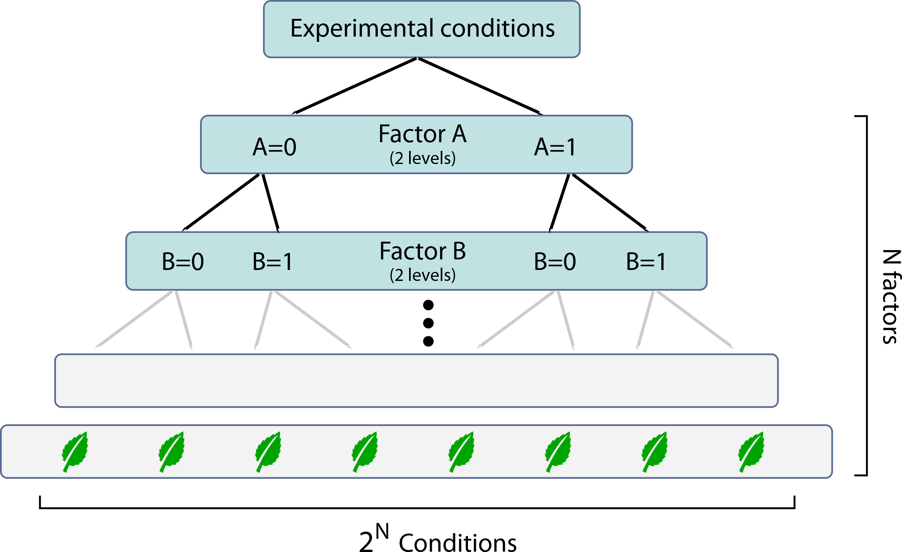

# Chapter 8: Data

What counts as data? In general, data is whatever can change, between different runs of your code. Obviously, anything you have recorded for analysis counts as data. But other things might also count as data. For example, if you run an analysis with different thresholds, the threshold might count as data – it is an input to your script, that might be configurable, and should be stored in a variable.

This chapter will guide you in

-   Choosing appropriate data formats
-   Using structures, arrays and objects

Linked to this chapter are two appendices, 11.1 for some technical background about numbers, and 11.2 for details on how arrays are stored internally.

## 8.1. What is data?

Data is “that which is given” – the stuff that is given to your code. It means many things: facts for analysis, the results of observations or measurements, or in our current context, numeric values in digital form.

One definition separates data from **information**: data is not directly connected with an interpretation; whereas information is meaningful data. So, if you package your data together with a script that interprets the data, or with **metadata** describing how to interpret each part of the data, then your package technically contains information. For example, a word processor ‘doc’ file is data, which becomes informative if you have the word processor to open the file. In fact, a piece of software is itself just made of data, but it becomes a computer program when you have the appropriate CPU to interpret it.

In science, we mean something different by data. We mean measurements, observations, numbers that have a scientific meaning. Data represent something we’re studying outside the computer. Data usually means scientific information.

### Importance of data formats

It is sometimes said that 80% of analysis is organising the data (Wickham 2013) and that clever data structures are better than clever code.

Spend time planning the structure of the data – ideally before collecting data. What counts as a repeated measure? Should data from one experiment be split across multiple files? How will I link data from one source to another?

### How to separate code from data?

A central principle of programming is to keep your data clearly separate from your code. However, the line between data and code is blurred. Code itself is a form of data – it’s data that is used by the interpreter or processor. Furthermore, you can store a reference to a function in a variable. Code itself is “parametric”, to the extent that there are different operations you might perform, and with different options and variables as inputs.

Example: Let’s say I compute energy using a formula $$E = \frac{1}{2} m v^{2}$$, from velocity: energy = 0.5 \* 10 \* velocity\^2. Clearly velocity and energy are variables containing data. But is the mass (10) data? Is the coefficient 0.5 data? Or is it code?

Clearly there is a correct ‘level of abstraction’ to separate code from data, and that might depend on several factors.

Separating your data from your code is not always practical when you are rapidly drafting and prototyping scripts. But keep an eye open for what might be allowed to change – e.g. at a later date. Might you need to run the script with a different number of datapoints? Might coefficients like the mass 10 be different?

How separate should the code and data be? This was covered in \<link Externalisation 6.3\>. You could write the equation as energy = 0.5 \* mass \* velocity\^2. Then you have a number of options:

1.  declare variables just above the point they are used. For example, mass = 10 might appear just above the energy line – making it clear that it is potentially variable.
2.  you could move the declaration mass=10 to the top of the function or script. Someone opening the script for the first time knows exactly how to change this value.
3.  mass could be an input parameter to the function, specified in a higher-level function. Anyone who calls your function needs to provide a mass.
4.  Or to maximise separation, the values like mass could be saved in an external parameter file, and loaded before the analysis.

If you use different data transforms, then even a function could count as data: you might send the transform function as a parameter, stored in a variable:

compute_group_pvalue(data,@**log**);

**function** p = compute_group_pvalue(X,transform)

Xt = transform(X);

[\~,p] = **ttest**(Xt(:,1),Xt(:,2))

**def** compute_group_pvalue(X,trans=**lambda** x:x)

Xt = trans(X)

p = **numpy.stat.ttest**(Xt[:,0],Xt[:,1])

**return** p

compute_group_pvalue(data,**math.log**)

See also lambda functions.

### What are numbers?

Everything in a computer is a number. Letters are numbers coded using a **character set**. Integers, floating point values, complex numbers and arrays are all numbers stored in different ways. For science, it can be helpful to understand how each of these is stored inside the computer. In particular, it is valuable to know how **NaN** (not-a-number), infinity, and **integer** values work.

## 8.2. Natural representations of quantities

There are some ‘hard rules’ for how to code numbers, in the most natural way for computers to understand them.

-   **Proportions not percentages**. Using proportions allows you to perform common calculations (like mixing or scaling) by just multiplying by the proportion. Proportions can be calculated as the mean of an array of **boolean** values due to weak typing (they get converted into 0 and 1). You might want to show percentages when plotting, though.
-   **Radians vs. degrees**: Radians allows you very easy rotation of vectors, geometry, and phase calculations. This is because trigonometric functions and exponentials work directly with radians. However, with degrees it’s easier to spot exact right-angles or round angles in a list. Radians = degrees\*pi/180; degrees = 180\*radians/pi.
-   **Log base e**: in programming languages, log means base e, but some fields use other bases like 10 (acoustics and some engineering applications) or 2 (information theory or entropy). log10(x) = log(x)/log(10).

Choose a natural unit for your variables, and stick to it – consider all the places where data arrives: Check – are they in the same units?

\<case study\> Famously, the Mars Climate Orbiter mission launched in 1998 crashed into the Martian atmosphere the following year, because software from Lockheed Martin sent the total impulse data in Imperial units, but they were interpreted as standard metric SI units. The mission may have cost more than \$300 million USD.

 NASA/JPL/Corby Waste - <http://www.vitalstatistics.info/uploads/mars%20climate%20orbiter.jpg> (see also <http://www.jpl.nasa.gov/pictures/solar/mcoartist.html>)

\</case study\>

Check the discretisation of your inputs: are they quantised with a particular granularity? Plot a histogram of values in a small range to check.

## 8.4. Structures, Fields and Reflection

Structures allow lots of different pieces of information to be accessed using a single variable. This is invaluable when you need to send information to other functions. The way to create structures depends on your language. Matlab uses the syntax

loc.x = 1;

loc.y = 2.

In Python you can use dictionaries loc= {‘x’:1}; loc[‘y’]=2, or you could create a class:

**class** Data:

x=1 \# use this method if you know the fields in advance

loc=Data()

loc.y=2 \# use this or Dictionaries if you don’t

loc \<- **list**(x=1)

loc\$y=2

Generally, you can use the fields as if they were variables. Why is this helpful?

-   You can keep **semantically related** variables together as a group
-   The variables do not **pollute** the workspace – so less chance of name collision and accidental overwriting
-   Code involving many variables can be **easier to read**
-   You can **iterate** over fields – i.e. repeat an operation for multiple fields (see next section)
-   Many variables can be **passed as parameters** to a function in a single breath – making a neat way to send options or configuration (but see also unpacking)

In general, structures serve as namespaces that are separated off from the global workspace. One downside to using structures is that IDEs are not yet intelligent enough to automatically highlight structure fields.

### Dictionaries and dynamic fields

How might you perform the same operation over multiple fields? For example

Data.start_times = [ 1, 2, 3 ]

Data.end_times = [ 10, 11, 12 ]

fn = fieldnames(Data)

for i = 1:length(fn)

Data.(fn{i}) = log( Data.(fn{i}) )

end

data = {

‘start_times’: np.array([ 1, 2, 3]),

‘end_times’ : np.array([10,11,12])

}

for fn in data:

data[fn] = log(data[fn])

If you find you are doing this often, it means that you should have used an array instead of different fields. For example, Data.event_times = [ start_times, end_times ]. Then you can operate on all the values with a single log operation.

### Overusing structures

You can build a semantic structure for your data using nested structures. For example:

Experiment(1).Subject(3).PrelimSession.Trial(20).LeftStimulus.Location.x

Experiment(1).Subject(3).LatestSession.Trial(20).RightStimulus.Location.x

Think carefully about whether this is the best way to store your data. Structures tend to occupy more space than plain arrays. Will you need to access information repeatedly from different parts of the structure? Will the code look long-winded?

An attractive alternative to structures here is n-dimensional arrays, plus a key for names, and maybe complex values, like

Location{ experiment }( subject, session, trial, stimulus ) = x + 1j\*y

session_names = {‘Prelim’,’Latest’}

stimulus_names = {‘Left’,’Right’}

Where there are different numbers of elements, you can

-   use cells/lists, or
-   simply pad data with NaNs, or
-   mix-and-match the structure format and n-dimensional array format (see next section).

### Passing by value

In general structures allow you to **send** many variables to a function, in one go. But can you use structures to **receive** information from a function?

In both Matlab and R, structures are ‘**passed by value**’, meaning that if a structure’s elements are changed within a function call, the changes are discarded. If you want the changes to be kept, you need to return the structure as one of the function’s outputs, and the calling code will need to make an assignment:

Y = include_mean(Y)

**function** X = include_mean(X)

X.mean = **mean**(X.data)

include_mean \<- function(X){

X\$mean = **mean**(X\$data)

}

Y = include_mean(Y)

def include_mean(X):

**\# warning! this changes X**

X['mean'] = X.data.**mean**()

include_mean(Y)

In python the changes to structures and arrays are kept, as objects are **passed by reference**. Returning the structure is not needed. But it means that **referential transparency** is not strictly enforced, and functions can have invisible side effects.

People sometimes worry that passing structures by value (as R and Matlab do) creates copies that waste time or memory. This isn’t the case unless you actually change the structure in your function, as they actually “pass-by-promise” – sending a read-only reference, and copying only if necessary.

### Looping over variables

Sometimes you want to do the same thing to several variables. This is one of the commonest causes of code repetition. One solution is to loop over them. Grouping variables in a namespace helps.

For example, to select valid rows from several variables:

data = **struct**(...)

include = data.times\>0 % select valid samples

data.times = data.times(include)

data.values = data.values(include)

data.isValid = data.isValid(include)

fields = fieldnames(data)

data = { ... }

include = data[‘times’]\>0

data[‘times’] = data[‘times’][include]

data[‘values’] = data[‘values’][include]

data[‘isValid’] = data[‘isValid’][include]

data \<- list(times=... )

include \<- data\$times \> 0

data\$times \<- data.times[ include ]

data\$values \<- data.values[ include ]

data\$isValid \<- data.isValid[ include ]1

could become

**for** i = 1:**length**(fields)

data.(fields{i}) = data.(fields{i})(include)

**end**

data = { key:val[include] **for** key,val **in** data.**items**() }

data \<- lapply( data, function(x)x[include] )

But note instead you could (and perhaps should) use a built-in type that allows row-wise operations:

data = **table**(...)

data = data(include)

data = **pandas.DataFrame**(...)

data = data[include]

data \<- data.slice( df, include )

## 8.5. Should I use Long or Short (wide) Form?

Imagine you have data with three factors: You tested 10 subjects, in an experiment with two conditions, and collected response from 20 trials per condition. The data is 10 × 2 × 20, and can be stored in three **dimensions** of an **array**:

response( subject_id, condition, trial_number )

There is one ‘slot’ for each combination of subject, condition and trial. So you have 400 slots arranged in a 3D grid. This is the short, n-dimensional, or “wide” form.

You can ‘flatten’ this grid into a single column to produce a long table with 400 values. The equivalent long form might look like this:

| subject_id | condition | trial_number | Response |
|------------|-----------|--------------|----------|
| 1          | 1         | 1            | 0.273    |
| 1          | 1         | 2            | 0.411    |
| …          | …         | …            | …        |

If the dataset is complete, the number of rows will be the product of the number of subjects, conditions and trials, prod(size(response)). Typically, a missing row in long form corresponds to a NaN or NA in the short form.

Putting data in short form is useful if you want to

-   remove one subject – simply delete the “slice” corresponding to that subject

response( bad_subject, :, : ) = []

response = np.delete( response, bad_subject, axis=0 )

-   calculate a statistic along one dimension – for example, a mean across trials, for each subject and condition:

mean_response = mean( response, 3 )

mean_response = response.mean( axis=2 )

-   and more complex statistics are equally easy:

sd_across_subjects_by_condition = std( mean( response, 3 ) )

The dimensional, short (“wide”) form is useful when there are the same number of observations in each ‘cell’. If you have variable numbers of observations, you may still benefit from the short form, by padding with NaN.

\<caption\> Fig.8.1: Padding with NaN: white cells show that some rows have fewer datapoints. Marginal means on one dimension preserve the different levels on all other dimensions. \</caption\>

\<exercise\> Why do you use long or short form for your own data? What factors influenced your decisions?

| **Long form**                                                                             | **Short form**                                                                                                                       |
|-------------------------------------------------------------------------------------------|--------------------------------------------------------------------------------------------------------------------------------------|
| May use less RAM with highly variable numbers of observations                             | Uses less RAM when same number of observations per cell                                                                              |
| Rows as observations, so no padding needed                                                | Requires NaN-padding when there are different numbers of observations per condition                                                  |
| Requires specific tools to calculate statistics for particular conditions                 | Permits easy statistics along particular dimensions                                                                                  |
| Requires filters to select appropriate rows                                               | Quick to remove one subject                                                                                                          |
| Easy to view as a table, since it is 2D                                                   | Harder to visualise N-dimensions                                                                                                     |
| Hard to see which observations match with each other, as the row order is arbitrary       | Easy to select and view one condition                                                                                                |
| Columns can be named, using tables or dataframes                                          | Requires metadata explaining what each dimension or factor means                                                                     |
| Columns could take categorical values, such as strings, that are semantically transparent | Requires metadata explaining what the levels within each factor mean                                                                 |
| Need to calculate how many levels there are for each dimension                            | Easy to see the structure of the data, e.g. the number of conditions, sessions or subjects – this simply appears in the shape / size |
| Extracting one condition requires checking and selecting matching rows of the table.      | Faster memory access, indexing and better CPU caching, if speed critical                                                             |

### Structuring long-form data

A standardised way to organise and present tabular data is **data frames**. There are many excellent packages for this such as pandas and tidyverse’s tidyr. Whether this suits you depends on your data and libraries.

### Converting to long form

Long form is incredibly useful as it allows almost anything to be put into a 2-dimensional table, like a CSV file. In R, this is the concept behind **tidy data** (Wickham 2013).

An *n*-dimensional array can be converted to a table with *n* index columns, and a column of values.

\<caption\> Fig.8.2: If you flatten a 3D array with X(:), or flatten(X), you run through rows, then columns, then slices. In contrast, X.flat or X.ravel() run through slices, then columns, then rows. \</caption\>

This puts all the values in one long, flat list. Length of this list is the product of the original dimensions: numel(X) == prod(size(X)), X.size == np.prod(X.shape), length(X) == prod(dim(X)).

In **column-major** languages, the values column is taken from the array by laying out the columns, one below the other, i.e. to run through dimension 1 first, then through dimension 2. Put another way, the first subscript changes the fastest. In row-major languages, the values are laid out by running through the highest dimension first, e.g. the top-left element in each slice is laid out first. Here, the last subscript changes the fastest.

\<caption\> fig.8.3:

Column-major ordering (left: Matlab, R) vs Row-major (right: C, Pascal, Python) arrays. Numpy can rearrange arrays using column-major indices with reshape(m,n,order=’F’), and in Matlab/R this is achieved by transposing or permuting (permute, aperm).

\</caption\>

Then, you need to create an index column for each dimension, each with the same length. To do this, you will need to repeat an index many times. There are many ways to achieve this. For a 3-dimensional array X,

idx = (1:**size**(X,1))' + 0\*X

Y(:,1) = idx(:) % uses singleton expansion

idx = **repmat**(1:size(X,2), **size**(X,1),1,**size**(X,3))

Y(:,2) = idx(:) % uses repetition and flattening

Y(:,3) = **kron**((1:**size**(X,3))', **ones**(**size**(X,1)\***size**(X,2),1))

Or

idx = {[],[],[]};

[ idx{:} ] = **meshgrid**(

1:size(X,1),

1:size(X,2),

1:size(X,3) )

Y = [ idx{1}(:), idx{2}(:), idx{3}(:), X(:) ]

idx = **np**.**arange**( X.**shape**[0] )[:,**None**,**None**] + 0\*X

Y[:,1] = idx.**ravel**()

...

Or

Y[:,1] = **np.kron**( **np.arange**(X.**shape**[0]), **np.ones**( (**np.array**(X.**shape**[1:]).**prod**()) ) )

...

Or

(Y[:,1], Y[:,2], Y[:,3]) = (\~np.isnan(X)).nonzero()

Note how the Kronecker tensor product kron expands matrices by duplicating copies of the second argument for each element in the first array.

Some existing functions could help you do this automatically, such as pandas.melt(), pandas.wide_to_long(), np.where(\~np.isnan(X)), reshape2‘s melt() and tidyr‘s gather().

### Converting to short form

Collapsing a long table into a n-dimensional array is a bit harder. It is sometimes called ‘pivoting’ the table. You may have seen this in Excel. Pre-built functions exist for this kind of transform, such as unstack, pandas pivot and reshape / dcast. A more sophisticated approach is to use accumarray with a lambda function.

**Dimension ordering**: Dimensions of data are often nested. In the ‘column-major’ convention, it is common to put the ‘smallest unit of data’ in the first dimension, and the ‘largest unit of data’ in the last dimension. For example, if your data X comes from 3 experiments with 4 sessions, and 100 datapoints within each session, your data would be X(100, 4, 3). This is because:

-   when flattening the data, the ordering is more sensible
-   when taking averages, functions like mean(X) operate by default on dimension 1.

Exactly the opposite conventions work well in Python – where the **most-significant bits** are in the first dimension – and here it pays to always specify the dimension a function operates on, e.g. X.mean(axis=-1). Note that in Matlab, the first dimensions are the easiest to visualise when displaying an n-d variable, but in Python, the last dimensions are easiest to see.

**Consolidating data**: Depending on the size of your data, it is often better to consolidate data into a single file where possible. This is usually feasible if the combined data file takes up 1/5 of your RAM or less, and if it takes less than 10 seconds to load.

\<example\> You have 10 files, collected on different days, containing tables with the same columns. What should you do?

Assuming you have 32GB RAM, and the tables are smaller than 500MB each, then consider stitching them together. If you opt for Long form, add a column indicating the date of collection. If you opt for Short form, either add a third dimension, concatenating the tables on dimension 3, and padding with NaN. Or else store the tables themselves in an array.

The advantage is that you can quickly calculate statistics across the datasets, compare data quality, obtain summary statistics as needed, and run exclusion criteria or transforms on the whole dataset in one go.

## 8.6. Text as data

In many situations, you may need to obtain data from a text file. This might occur when data is non-tabular, or non-numeric, or came from an unusual source like a web server or custom device. You need to **parse** the text into meaningful units – often extracting numbers. For example, if a string str contains the two digits “12”, you might parse it into a number:

x = str2num(str)

x=float(str)

x\<-as.numeric(str)

In addition to cutting strings using indices, you may need to trim or strip white space eg. strtrim or str.strip(). You may also need to find instances of a particular word, using strfind, str.find, or grep.

But one of the most useful operations is to search or substitute using **regular expressions**. Rather than searching for a exact sequence of characters, you can search with wildcards. Certain characters in the text you are searching for are treated specially, e.g. ., \*, [], () and \\. While you can buy whole books on regular expressions, knowing a few examples can save hours.

-   'ca.\*n' will match can and caravan, because .\* means “any number of any character”
-   '[0-9]+hz' will match 2hz and 20hz, but not just hz, because [0-9] means any character in the range 0 to 9, and + means “at least one of them”
-   '([0-9])+hz' will match 20hz, but the brackets let you extract just the 20 part as a matching-group.

If possible, find code already designed to read the format. E.g. if you are reading **HTML**, **XML**, or **JSON**, never parse these yourself. These formats are hierarchically structured, and **need recursion**. Avoid using regular expressions here, as they cannot do nested searching. Instead, libraries are available for all languages. For XML/HTML you may also avail of command-line tools like XSLT, which allow extremely powerful searches using a language called XPath.

## 8.7. Object-oriented programming

Object-oriented code hides the data from the programmer. It reveals, instead, a set of functions for operating with the data. A discussion of objects and classes is out of the scope of this book (dedicated books include Phillips 2018 and Gamma 1994), but you should be aware of when they could be useful.

Take the example of fitting a linear model to your data. Traditionally, you would call a function, sending it your data:

P=fitlm(x,y)

P=sklearn.linear_model.LinearRegression().fit(x,y)

P=lm(y\~x,data)

Traditionally, this function would return some numbers, e.g. the parameter estimates. But then, if you then wanted to know the $$r^{2}$$, you would need to call another function. You’d need to run the whole regression again – which would be ridiculously inefficient.

Instead, these functions return an **object** representing the model – a bundle of data, packaged up with selected ways of accessing or using that data. These ways of accessing the data include functions called **methods**, and virtual variables called **properties**. For example, there might be a property called coefficients, another called squaredError, and a method called addRegressor, which might change the model. You can think of the methods or properties as being “inside” the object, though in reality they are just ways of accessing the data that’s inside the object.

P.Coefficients

P.Rsquared

P.coefficients

P.score(x,y)

P.coef\_

summary(P)\$r.squared

How can an object hide data from the programmer? The linear model knows things we don’t. Was a sophisticated algorithm used to fit the model? Did the fitting converge exactly? Did the fitting procedure have to try different methods? While some fitting objects might choose to **expose** this information (e.g. via additional properties), they don’t have to. This information could be **private** – strangely, privacy can help the programmer:

-   it makes it easier to find what you need
-   it means you can write the same code to run many different fitting algorithms
-   you can remain agnostic as to which fitting procedure was used.

For example, we don’t know whether the $$r^{2}$$ has been calculated before it is requested. Moreover, we don’t even know if the model has actually been fitted before accessing the coefficients – the object’s code could choose to defer all calculations until needed. These sorts of decision are delegated.

\<key point\> In general, privacy promotes **abstraction**. The less you worry about the implementation detail, the more you can think at a higher level. \</key point\>

\<caption\> Fig.8.4: An illustration of how standard, non-object-oriented programming styles differ from object-oriented programming (OOP). The two examples both count up to 5. Object-oriented languages hide data (like the value of the variable ‘x’) from any functions that aren’t part of the object. In the object-oriented example, code inside the red code box cannot actually obtain the value of x, as it is wrapped inside c. So, to change and check the value of x, it must call the methods ‘increment’ and ‘equals’. \</caption\>

Objects belong to **classes** – classes are fixed templates for objects of a certain type. They specify what data such objects are allowed to have, and what functions can be called on those objects. For more on OOP read (Phillips 2010).

Advantages:

-   The functions that can work with a particular type of data can be kept together.
-   Appropriate functions can be auto-completed.
-   It makes it less likely that you would use the wrong type of function on your data – for example try '1'+1 in Matlab, which invokes numerical addition on a string type.
-   Why would you want to hide information when programming? It makes errors less likely. For example, consider a counter like the figure. There might be parts of the code that rely on the counter never decreasing. But a careless programmer using the counter might try to do x=x-1. This mistake is simply not possible in the object-oriented framework – OOP allows programmers to **constrain and validate** data types.
-   It helps code re-use, since the same methods can be used for many objects, and can even be harnessed on different types of objects. Sub-classes **inherit** behaviour from parent classes.
-   Since classes form templates, they form a neat, self-documenting **API**.
    -   They help to separate interfaces from implementations – i.e. for keeping the contract distinct from the code that fulfils the contract.
    -   They help to separate code from data – i.e. for clearly defining what is allowed to vary from what must be kept fixed.

Disadvantages

-   Objects sometimes take up more memory space than other kinds of data.
-   The syntax for ‘verb-like’ methods might not read as well: increment(counter) vs counter.increment()
-   Syntax for binary operations is ambiguous: should it be dog.eats(bone), or bone.eaten(dog)? The latter is appropriate when the bone gets altered by the dog, but the former when the dog is altered by the bone!

Object-orientated programming is most useful when manipulating high-level data like dates (months, years), accessing database records, and in user interface design. But it can also be a useful general principle for designing a good **API**: i.e. for preparing your code for third party use.

## 8.8. Graphical output

### Plotting

There are a wealth of ways to learn good data presentation.

-   If you are writing a paper, look at high-end journals in your field. Critically analyse how the figures are put together.
-   Look at the growing online resources on visualisation and presentation. It’s crucial to know the variety of kinds of graphs you can plot. There are even books on it.
-   Find libraries you are comfortable with, like matplotlib, ggplot, and write your own functions. Put as much of the figure in code as possible – like legends and subplots. This makes alignment much easier later.
-   Choose colour schemes appropriate to your data – should it look increasing (cool-to-hot) or diverging (positive vs negative)?

### Binning

A common task is to visualise continuous data – such as time series or many graded measurements. Histograms are a great way to check the distribution of values a variable can take. But often people end up “binning” measurements – for example into ranges with fixed edges. This is usually bad practice because

-   Binning discards information
-   The distribution of bin counts are much more complex than continuous data, and so statistical assumptions are often violated
-   The number of bins, and the bin edges, are usually arbitrary – this can impact robustness of results
-   Taking means of another variable in each bin can result in different numbers of observation per bin, so the means may be unevenly weighted.

Instead consider other options:

-   can you use continuous statistics, such as a linear model, instead?
-   Would a sliding window be better, rather than fixed bins?
-   Consider a true histogram (bins with the same numbers of samples in) rather than evenly spaced edges
-   Examining quantiles, and quantile regression
-   Consider a kernel smoothed density or fitting a curve.

### Image files

When saving graphics, many people save out **bitmaps**, rather than **vectors**. Avoid this as much as possible – converting from vector to bitmap is irreversible and destructive.

For example, many people save figures as png, gif, tif or bmp files. Saving as jpeg is terrible practice, because your graphs get compressed according to a photographic algorithm, and any lines will develop artefacts. Anything that is saved from Photoshop, Paint/Paintbrush, Gimp or photo-editing software gets degraded into a bitmap.

\<caption\> Fig.8.5: Avoid bitmaps – use vector formats wherever possible. Saving figures as png will result in aliasing (second row), and JPEG leads to compression artefacts.

However far better than bitmaps, is to save as a **vector format**. Most programs that produce graphs, draw the graphs using lines (vectors), and can save in a vector format. Bitmaps are made of pixels, and have limited resolution when you zoom in – resulting in ‘aliasing’. Vector formats are made of instructions for drawing lines, and so crisp smooth lines will be seen even after zooming. Examples of vector files are svg, pdf, eps, emf and wmf. SVG, scalable vector graphics, is an open format and conforms to XML (extended markup language) – meaning that your image is stored in a similar form to information on a web page. PDF is an Adobe format based on postscript commands, but may be easiest and is supported by Matlab (e.g. using the print command), matplotlib savefig and R (using the pdf() function).

You can post-process your vector images using any vector drawing program, such as Inkscape, Illustrator. This will allow you to change the colours, line thicknesses, text and fonts, as well as put together panels. Investing some time into learning a vector drawing program, rather than powerpoint, can be very worthwhile.

A quick look at a vector file will give you an insight:

pdf / postscript

q

4 0 0 4.00247219 0 0 cm

0 0 m

2979 0 l

2979 1618 l

0 1618 l

0 0 l

png (decompressed)

00 00 00 8A FF FF 4B 00

00 00 00 00 83 FF FF 22

00 00 00 00 00 75 FF FE

Notice that a pdf / postscript image is actually a series of commands for drawing lines “m” = move, “l” = line, whereas bitmaps indicate the colour level of each pixel.

**When to use bitmaps**? For photographs, scans, and for complex images that have been drawn or retouched in photo-editing software. Some filters like bevels and drop shadows will also need to be saved as bitmaps, because the standard pdf language does not include complex instructions.If you plot millions of points on a graph, a bitmap may be smaller and faster.

**If using a bitmap**: Make sure the scale is correct (e.g. 10 cm), choose a sufficiently high resolution (e.g. 300 dots per inch), and use a “lossless” compression format such as png (but remember, it’s not actually lossless if you are saving a drawing).

Further reading: Wilke, fundamentals of visualisation

## 8.9. Hierarchical data and Recursion [advanced topic]

Many kinds of data are tree-like. You might apply a rule to chunks of data, some of which contain sub-chunks where you need to apply the same rule. Common examples are **XML** or **HTML** which have nested tags, expressions (e.g. in a + 2\*(b+c), the addition rule is applied inside a bracket), and language itself (“the dog chased the cat that chased the mouse”). Other tree-like structures include linked lists, semantic models and certain graphs. The trick is to recognise these data, as they are uncommon but difficult to navigate.

Recursion is useful when your data has a nested or tree-like structure. You might start trying to write nested for loops, but then realise you need an unspecified number of nested for loops, one within another. Here you need recursion.

For example, you might want a function that deals with each condition in an experiment – each condition involving a combination of experimental factors. But, there are a variable number of factors. Let’s say each factor has two levels, and in some datasets you have labels

factors.A = 0 or 1, factors.B = 0 or 1

whereas in another dataset you have

factors.A, factors.B and factors.C, each of which can be 0 or 1

and in general there might be N factors.

Fig.8.5: Factorial designs can be considered as a hierarchical data structure.

How might you loop over all levels of the factors?

**for** levA = [0,1] % for each level of factor A

**for** levB = [0,1] % for each level of factor B

processCondition( levA, levB )

This would work for two factors, but you cannot\* have a variable number of nested for loops. The problem is that, if we have N=5 factors, each with 2 levels, then we need to call processCondition() 25=32 times.

[\* footnote – In any language, I believe?]

One alternative is to use a while loop

current_condition = 0

**while** current_condition \< 2\*\*N:

current_condition = current_condition + 1

levels = [ (current_condition // (2\*\*i)) % 2 **for** i **in** **range**(N) ]

processCondition( levels )

But this is clearly a fudge, and doesn’t convey the structure of the algorithm. Instead, you need **recursive functions**. According to many textbooks, the Fibonacci sequence is a typical situation where you might need recursion, but I personally don’t know anyone who has needed a Fibonacci sequence. Recursive functions call themselves, always with different **arguments**, such that once an argument reaches a threshold value, the function stops calling itself and returns. The arguments determine where in the tree you are currently at.

To write recursively, think how you would get from one branch of the tree, to the next set of branches. In the case of factorial designs, imagine we have a value for factor A and B; how do we progress to the possible levels of factor C? We need to

-   start at a particular factor
-   if all the factors have been determined, operate on the leaf and return
-   otherwise step through the levels of the next factor
-   for each new combination, call the same function again

**function** processFromFactor( current_factor, N, levels )

**if** current_factor == N % are we at a leaf?

processCondition( levels )

**else** % we are at a branch

**for** i = 0:1 % for each level of the factor

% go into that branch by calling myself

processFromFactor( current_factor+1, N, [levels i] )

**end**

**end**

**end**

**def** processFromFactor( current_factor, N, levels ):

**if** current_factor == N: \# are we at a leaf?

processCondition( levels )

**else**: \# we are at a branch

**for** i **in** [0,1]: \# for each level of the factor

processFromFactor( current_factor+1, N, **list**(levels) + [i] )

\# note that “list” duplicates the levels.

processFromFactor(0,5,[])

In general the cases where you need recursion are

-   Traversing a hierarchical tree-like data structure
-   Parsing text with nested structures – like an expression with parentheses, or XML/HTML with start & end tags

Recursion can be used in many other ways too, but in many situations a while loop would suffice. In order to have recursion, your code needs to be ‘re-entrant’.

**Re-entrant code** is a block of code which is happy to be called even from within itself. Once you have called the function, it can be re-entered before you leave the function. For the example above with N==2 factors, a stack frame might look like this:

So what is going on here? Confusingly, your code defines a variable current_factor, and there are simultaneously three different copies of it – all in different stack frames – by the time processCondition is eventually called. Your function has been called three times – and each one is still mid-flow of execution. The first two runs are stuck at line 7, denoted by the first and second outermost boxes. These frames correspond to earlier branches. The third run is stuck at line 3, corresponding to reaching a leaf, where it has established a level for both factors, and calls the processCondition function. There are also three copies of N, though they all contain the same value. There are three list instances: the last one is the final product indicating the path to a leaf, but the earlier copies indicate branches, and are used as templates for creating the other conditions at each branch point.

In general, your code can achieve re-entrancy this if you don’t change or rely on anything outside your stack frame. Recursion requires re-entrant code.

**Stack overflow**: Stacks, which contain stack frames, have a limited capacity. Normally a programming language sets a **recursion limit**, because recursion can occur by accident. and if too many frames are on the stack, you get an error. The error looks very long, because it lists all the function calls in the recursion!

\<exercise\> While loops are used when we don’t know in advance how much data we are going to encounter. It turns out that any while loop can be replaced as a recursive function call. Can you re-write this simple while loop using a recursive function?

x=0

while x\<=5

print(x)

x=x+1

solution:

def printRecurse(x):

print(x)

if x\<5:

printRecurse(x+1)

printRecurse(0)

**Note:** it is bad practice to use recursion when a simple while loop will do!

Truly functional languages (E.g. Haskell, F\#) allow **tail-recursive** functions, where a stack frame can be re-used, avoiding this problem.

## Chapter summary

-   Getting your data in the right form is as important as writing good code.
-   Structured data can increase readability, and make data “self-documenting” – but there is a trade-off.

Discussion Questions: People often advise that curating your data should be the first step in analysis. But often it ends up being the last thing we do, before publication. Why do you think that is? Does curating data for your analysis differ from preparing data for publication?

Further reading