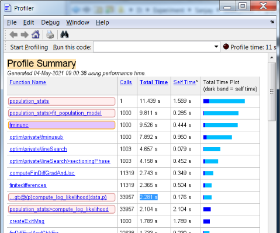
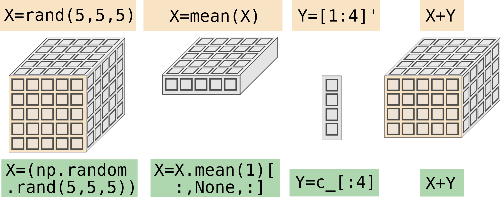

# 9. Efficiency

Efficient code has few lines, and runs faster. Sometimes these two economies trade off against one another, for example if you need to write a fast routine using low-level instructions. Sometimes, they both trade off against readability or reuse, because short fast code often makes more assumptions.

We will cover

-   Approaches to make code run faster and use less memory
-   How to vectorise code, and when to consider parallelisation
-   How humans might interface effectively with code

## 9.1. Making code run faster (and use less memory)

The old advice is, “make it work, make it right, make it fast” – in that order. Don’t optimise too early. Only optimise the parts of your code that are speed critical, so you can prioritise readability for the rest. Often the bottleneck is just one or two lines.

### Run a Profiler

The simplest thing you might do is time your code. you can check the timer before and after your script, or use builtin functions (tic, toc, timeit(), proc.time()). First, you may want to try out several ways of calculating something – for example with different formats of array, or nesting your loops differently. Second, you might want to try timing different chunks of your code, to identify the most costly element.

Profilers are code analysis tools that automatically identify the slowest parts of your code. They show how much time your program spends in each function. You can use them to identify hotspots or bottlenecks where you should focus your efforts in optimising. Matlab has a built in profile tool, Python has the profile module, and Rstudio has the flame graph.

\<case study\>

At the start of a job, a colleague was asked to speed up a section of code, as the operation was taking 9 minutes to run. He spent 2 days rewriting the bit of code he was given. He sped it up by a factor of \>30, by converting python for loops to numpy array operations. The code now ran in 8:59, because the bit he was asked to optimise only took 1 second in the first place. The rest was pre-processing and extracting the data.

\<caption\> Fig.9.1 Example profiler output. Each function call is listed, showing how many times it was called, and the total time spent within that function. Look for functions you wrote (highlighted pink), and the Matlab functions you call (here, the purple line, fminunc). You will see the main function, at the top, population_stats. It calls fit_population_model 1000 times, which takes most of the time. Within this, compute_log_likelihood is called 33,000 times, but itself this only accounts for 20% of the time. The rest is spent in lineSearch – an Matlab internal function, which presumably guesses a better parameter. So in this case, don’t waste time speeding up your likelihood function!

\</caption\>

\<key point\> Sometimes it’s better to have a slower program, if it’s only for single use, than spend time optimising.

Locate the bottleneck in speed before you optimise.

Never sacrifice reliability for efficiency. If you are coding an experiment, save, save, and save the data, as much as speed and space allows.

Avoid sacrificing readability for efficiency. Comment all optimisations carefully.

\</key point\>

\</case study\>

Once you have identified the lines that take the most time, you can think about how to speed them up. Particular operations are disproportionately slow, and rarely you might need to compromise code legibility for speed. One of these techniques might help:

-   Minimise stack allocation (‘**inlining’**): write short functions out in full at the location of the original function call. This disrupts readability, but in some cases can speed up execution. It saves on allocating memory for a new stack frame.
-   Replace high-level data structures with simpler arrays. This can make the data less easy to visualise, but can be quicker to access.
    -   Usually, Matlab plain arrays are faster than cells and tables; numpy.arrays are faster than lists or dataframes. This is because they are **type**-constrained, **memory-mapped** arrays.
    -   Consider replacing strings (e.g. for categories in tables) with numeric categorical variables.
    -   Consider whether you need large numbers of free parameters when fitting models. Searching a space with just a few more free parameters can be disproportionately slower. Can you re-parameterise a model to reduce its complexity? Can you get away with a constrained covariance matrix in your mixed model?
-   Ask someone to re-code the slowest function in C. C gets compiled into static machine code, and can be called on from your script. Sometimes, this can give appreciable speed-ups over interpreted code.

\<exercise\> Which function is likely to be the bottleneck here?

for i = 1:10000

functionA(i)

for j=1:100

functionB(i,j)

for k=1:10

x(i,j,k)=functionC(i,j,k)

end

end

end

Typically, the bottleneck arises in the innermost lines of a set of nested loops. Those lines are executed the largest number of times.

FunctionC is called 107 times – far more than the other functions. Is it allocating any memory inside the function? Is there any input/output, apart from the return values? Does it access the disk, display or other devices? Can it be inlined, or written in C?

-   **Pre-compute** or **memoize** values. You may find that you require the value of a function several times while looping through data, at unpredictable times. It might be slow to calculate that function. For example consider an array X, and you need to calculate specific estimates Y for each value of X. The estimate involves a complicated iterative function:

**for** i=1:**length**(X)

Y(i) = slow_estimate(X(i))

end

**function** y = slow_estimate(x)

delta = **inf**

y = 1 % starting value

**while** delta \> 0.001 **% this may take a while**

est = y + 0.1 \* f(x,y) **% get a step closer**

delta = **abs**(est-y) **% how much did it change?**

y = est

**end**

**end**

-   If X takes discrete values, one solution is to calculate values before you start the loop, and store them in a **lookup** table. It could be a pair of vectors, uniqueX and uniqueY. Then look them up as needed, in your loop. **Precomputing sacrifices memory for speed**.  
    uniqueX = **unique**(X) % possible values of X  
    **for** i=1:**length**(uniqueX)   
     uniqueY(i) = slow_estimate(uniqueX(i)  
    **end**   
    **for** i=1:**length**(X)  
     Y(i) = uniqueY(uniqueX==X(i))  
    **end  
    **or in vectorised form,  
    uniqueY = arrayfun(@slow_estimate, uniqueX)  
    **% order of items in uniqueX corresponding to X:  
    **[indices,\~] = find(uniqueX' == X)   
    Y = uniqueY( indices )
    -   If you don’t know in advance the X-values at which you need to calculate the function, an alternative is to **cache** the results as you compute them. A **hash table** might work well (containers.Map, dict(), list()[[ ]]). Each time before you evaluate the function, check the cache first:  
          
        \<caption\> fig.9.2: Caching or memoizing return values to speed up a function.\</caption\>  
        **function** [est,cache] = find_estimate(x, cache) **% cache = [x,e]**  
         lookup = **find**( cache(:,1) == x )  
         **if** lookup **% old x-value?**  
         est = cache(lookup,2) **% use memoized value**  
         **else** **% new x value?**  
         est = slow_estimate(x) **% run slow calculation**  
         cache(end+1,:) = [ x, est ] **% cache it**  
         **end**  
        **def** find_estimate(x,cache={}): \# cache = {x:e}  
         **try**:  
         **return** cache[x]  
         **except** **KeyError**:   
         val = slow_estimate(x)  
         cache[x] = val  
         **return** (val,cache)  
        memo \<- **list**()  
        find_estimate \<- **function**(x){  
         key \<- **as.character**(x)  
         val \<- memo[[key]]  
         **if**(!**is.null**(val)){  
         **return**(val)  
        }else{  
         val \<- slow_estimate(x)  
         memo[[key]] \<\<- val   
        }   
        Note that the last R example violates transparency and should be enclosed inside another scope; alternatively pass the cache in and out of the function, as per the Matlab example.
-   Use approximations like **interpolation** or table lookups, rather than precise calculation of a function.
    -   What precision do you need? Very often, you will use a stock / library function to calculate something. These functions are designed to be machine precision – i.e. guaranteed to be correct for double-precision values. As mentioned in \<Link\>8.2 numbers \</link\>, this is rarely needed in science, if you have chosen appropriate units and zero-points. Can you come up with a simpler algorithm to calculate the function? A short **Taylor expansion** might be more than enough.
    -   If your function has a continuous domain, consider precomputing a table of values at key points. Then as you iterate, interpolate between the values in the table (interp1, np.interp, approx).

### Check for duplication

Your code will be more efficient if a set of similar lines is placed in a for loop. See conceptualisation.

### Remove any graphical or text output

You may be sending logging, debugging or progress messages. Consider having a flag to switch them off:

VERBOSE = false;

**if** VERBOSE

fprintf(‘subject %g’,i)

end

if VERBOSE:

print(‘subject %g’ % i)

If a Matlab calculation doesn’t terminate with a semicolon, it will be displayed (which is slow). You can find these by looking for a yellow warning flag in the margin (configure this in the code analyser).

All graphical output is very slow, so do not update graphs during a long loop. Again consider a flag to switch graphics off.

Additionally, printing messages violates referential transparency, and pollutes the console. Think of the console like the global workspace: it can get “polluted”, and might be needed for something else. Consider logging the messages to a file instead.

### Discard intermediates

Sometimes new variables get created that are not directly outputs of a function:

Y = **function** count_states(P, c)

**\# P=probability vector, c=counts**

logp = **log**(P);

plogp = P.\*logp;

Y = **exp**(c’\*plogp);

This code creates two intermediate variables, each as big as P. If P is large, this could be slow, as memory would need to be allocated within the function, and de-allocated at the end of the function. Some intelligent compilers will avoid creating so many intermediates, and transform your code into the following:

Y = **exp**( c’\*P\***log**(P) );

For long computations, omitting the intermediates can make code hard to understand. But it is worth trying to see if it speeds up your code, or equally

Y=**log**(P);

Y=P\*Y;

Y=**exp**(Y);

Makes just one new variable, and reflects what is actually going on inside the computer after optimisation -- but is arguably much harder to understand since there are no semantic labels. It is fine to do this if you comment well, though.

You can also sacrifice legibility for less memory use, if you use the input variable itself as the intermediate variable. In this case, no new variables are created:

**function** X = count_states(X,c)

X = X .\* **log**(X);

X = **exp**(c’\*X);

### Preallocate memory for arrays

Most code is faster if you know in advance how much space you need for an array.

X=**np.array**([])

**for** i **in** **range**(4):

X=**np.insert**(X, i, **np.**log(i+1))

Becomes

X=**np.zeros**(4) **\# preallocate**

**for** i **in** **range**(4):

X[i] = **np.**log(i+1)

X=[];

**for** i=1:4

X(i) = **log**(i);

**end**

becomes

X=**zeros**(4,1)

...

X\<-**c**();

**for**(i **in** 1:4){

X[i]\<-**log**(i)

}

Becomes

x \<- vector('list', 10)

...

### Vectorisation

Each of the above can be written as a vector operation:

X = **log**(1:4)

X = **np**.**log**(**np.arange**(4)+1) \# or **np.log**(**np.c\_**[:4])

X\<-**sapply**(1:4,log)

See Vectorisation next.

### Harness built-ins

There are a lot of things you can write manually, which there’s already code for. Notably:

-   Statistics functions including standard distributions, various types of regression, mixed models.
-   Functions that plot particular kinds of graphs
-   Commonly used domain-specific code, such as signal processing and filtering,
-   Several matrix operations including inversion, covariance and correlation, eigenvectors and eigenvalues (see Vectorisation next)

However, certain common operations often still require manual or custom coding, such as permutation tests, data normalisation, time-series epoching. Although these algorithms are conceptually domain-general, the details of what is needed are often dependent on context and on your data format.

Most floating point functions are actually done on the CPU, so all algorithms should be equally fast (like sin, sqrt etc). However they way they are optimised depends a lot on the context: in some versions of Python numpy.sqrt is far slower than math.sqrt when applied to a scalar whereas numpy.random.normal is far faster than random.gauss. Although they do roughly the same thing, they involve different error checks, type **cast**s and **indirection** (layers of additional function calls). Furthermore, some implementations are hidden but hand-optimised in C or even **assembly language**, whereas others are readable in your language but rely on automatic compilation, which is less efficient.

\<key point\> In speed-critical code, try out alternative syntax or functions. \</key point\>

### Boolean indexing

How might you add up the numbers in a list that are bigger than 2?

To select the numbers matching your condition, you need to perform an operation known as filtering, or masking. You might think of running through your list with a for loop, using an if statement:

total = 0

**for** i=1:**length**(data)

**if** data(i) \> 2

total=total+data(i)

**end**

**end**

To do this quickly, you can use boolean or logical indexing:

data = [2,1,5,4,1,3]

mask = data\>2

\# so mask == [False, False, True, True, False, True]

subset = data(mask)

**sum**(subset)

data = **np.array**([2,1,5,4,1,3])

mask = data\>2

subset = data[mask]

**sum**(subset)

data \<- **c**(2,1,5,4,1,3)

mask \<- data\>2

subset \<- data[mask]

**sum**(subset)

### Parallelise for loops

Modern computers have multiple **cores**. A core is a self-contained processor, with its own arithmetic, registers and thread of execution. Each core can execute different code. Some operations automatically take advantage of multiple processors (see Vectorisation, next).

for loops by default are serial, but can be converted, with a little work, to run in parallel. you will need the appropriate packages: the Parallel Processing toolbox in Matlab which allows replacing for with parfor, the multiprocessing/handythread module in Python, and library(parallel) or rpud in R which parallelise foreach. Depending on the computations, array sizes, language and library, you may need to specifically rewrite your code to take advantage of parallel processing:

parfor i=1:10 % each iteration runs in parallel

**% i must be the first index in arrays**

result(i) = run_long_operation( data(i) )

**% operation must be independent across iterations**

end

pool = multiprocessing.Pool()

results = pool.map( run_long_operation, data_as_list )

registerDoParallel()

result \<- foreach(i=1:10, .combine=cbind) %dopar% {

run_long_operation( data[[ i ]] )

}

Note that copies of data are sent to each processor, so there are language-specific tricks you should look up to make this more efficient.

If there are several nested loops, usually, the best thing to do is to parallelise the outermost loop. This is because there is a large time cost when you start and stop a parallel loop. The CPU has to set up multiple cores with their own allocated memory, start an instance of the interpreter in each core, and deliver those cores with their own copy of your data and code. This can take many seconds, so should not be inside a loop.

\<key point\> Parallel processing can make some programs several times faster, has significant overheads.

Parallel coding is more difficult. You’ll need to identify which calculations can be done independently of each other – i.e. don’t need to occur in sequence.

\</key point\>

If you find yourself needing to parallelise an inner loop, you should probably consider more sophisticated ways to parallelise, such as spmd (single program multiple data) or MPI (message-passing interfaces). These methods allow controlled communication of certain signals between different parallel units.

**Gustafson’s law** states that if a proportion $$p$$ of your program’s run time is parallelisable, then with $$N$$ processors you get a speedup factor of $$1 + p ( N - 1 )$$. In other words, if all your code is parallelisable, your code is N times faster, whereas if none of it is, there is no speedup.

### Harness a GPU (Graphics processing unit)

See Vectorisation below

### Consider sparse arrays

If your data is largely constant values, e.g. mostly zeros with a few numbers, you may benefit from “sparse arrays”. Typically matrices or arrays are stored with one memory slot per array slot. For example, a 10 x 10 array occupies 100 memory slots. However, if you know that most slots will be unoccupied, you can store the array in a much smaller space. Moreover, in some situations you can get away with many fewer maths operations.

\<caption\> Fig.9.3: How are sparse matrices stored? Left: memory spaces used by a full matrix; Right: the same matrix represented in sparse form; notice it uses fewer memory spaces. \</caption\>

As a rule of thumb, sparse arrays become efficient when \>50% of the elements are “background”.

Typical examples of a sparse matrix include

-   an image stored as an array, where part of the image is a plain background, or transparency.
-   exclusion masks, where you put a ‘1’ just where you want to remove data
-   time series where infrequent events occur (assuming the background reading is truly constant)

Ensuring your data is saved in a **compressed format** can be especially useful in these cases. Do not store full-form of sparsely-populated data in CSV files, or ASCII text. Instead use save, np.save, and save, which will by default compress files appropriately.

### Operate on small data chunks

When you have very large data, you may need to use **out-of-memory data**. This simply means that most of the data is kept on disk, but gets ‘paged’ in and out of RAM as needed.

-   One common strategy is memory-mapped arrays memmap(), np.memmap(), and the package mmap.
-   You could set up a database – an external program that curates data tables. This requires some overheads, but makes it much easier to find data in a large store. Rather than accessing your values simply by row and column indices, databases offer a query interface to filter efficiently by values too. Matlab offers tall() arrays where a table can be backed by a database until needed; or you can manually connect to databases (e.g. sqlite2 and odbc) and extract subsets into memory as needed.
-   Operating systems can also manage paging, using **virtual memory** or “swap files”. In this case, data can be addressed as though it is in RAM, but is actually being stored on disk. The advantage is you can use large arrays straight off; the disadvantage is that you have no control over when things gets written and read from the disk, and this is not always intelligent.

The inverse setup can also be useful: **RAM disks**. In this situation, you save a file to a folder which is not on disk, but instead is in RAM – using a virtual file system. RAM can be accessed many times faster than data on disk. So RAM disks can be useful when you want to use the same code for small data and large data: your code can deal with files, and sometimes those files are on a true disk, and other times they are on a virtual RAM disk.

For huge datasets, you should think about an analysis method that **avoids the problem** altogether.

-   Calculate per-chunk summary statistics, e.g. means and variances for each trial or session? Can you parameterise distributions early on in the analysis pipeline?
-   Can you use subsampling, e.g. pick smaller subsets randomly, then run the analysis many times?
-   Can you apply dimensionality reduction at an early stage? Consider how much true redundancy is in the data. What is the “underlying dimensionality” of the physical or biological process your data is tracking?
-   Could you down-sample your data to a lower sampling rate? Or apply a spectral transform or decomposition that shifts your analysis from the time domain to another domain?

***

### Back to the drawing board

If you are struggling to make code to run in a sensible timeframe, then sometimes you need to take a step back. Are there any mathematical shortcuts? Can you make some assumptions? Perhaps the algorithm is not suited to your problem.

***

Algorithms take longer when they operate on more data. For example, adding two arrays together will take 10 times longer if you make the arrays 10 times bigger. But sorting the array may take over 20 times longer. The scaling law can be represented by **big O notation**: adding arrays is $$O ( n )$$, whereas sorting them is $$O ( n \log {n )}$$. If O is bigger than $$n$$, you may be able to split your data into smaller chunks. But does your algorithm have the right scaling properties, in the first place?

***

-   This is sometimes the hardest part of good coding: to abandon the method you have invested in programming, scrapping your code, and drafting a new approach to a problem.

## 9.2. Vectorisation

In many situations, you will want to perform the same maths on each element in an array, in parallel. Most numerical operations can “distribute” over a matrix. For example, addition, scalar multiplication, and trigonometry will automatically apply to each array element. This is true in Matlab, Python numpy, and in R – but interestingly, not in most other computer languages! In C, C++, Java, Javascript, Basic, and even in plain python, maths does not automatically distribute over arrays.

Vector operations generally run faster than loops.

-   In some cases the calculations can be run on the Graphics Processing Unit, or **GPU**. Many desktop computers have a dedicated graphics card that has its own powerful processor. mainly for running 3D games. Running a 3D game at high resolution may require a million pixels to be calculated every 17 milliseconds. The only way to do this is to be able to add whole arrays together in one step – something that is done by having **millions of parallel arithmetic channels** in the GPU. The GPU is therefore optimised for operating on very large arrays. The GPU might receive a single instruction that operates on millions of numbers at a time. The GPU also has its own memory – usually used for storing textures and image maps. This incredible power can now be harnessed by most modern languages.
-   In some cases, the computer can take advantage of **multiple CPUs** (central processing units) or multi-**core** CPUs for such distributed operations. Modern desktop computers have between 2 and 16 independent ‘cores’. If the operations are independent for each element of the array, then the maths libraries may be able to split large arrays so that each CPU handles a portion of the array.

This is called parallelisation, or **vectorisation**. However it is often not beneficial to do this, because of there are overheads for delegation, like initialisation, and splitting and re-joining the array.

Not all code is amenable to parallelisation. How can you tell if yours is suitable? Useful rules of thumb are:

-   Ask yourself whether you could delegate different parts of your data to different people, who can’t talk to each other, giving them all the same instructions.
-   If the order of the iterations doesn’t matter, then the algorithm is in principle parallelisable, so think about vectorisation.
-   If the individual iterations of the loop are sequentially interdependent on each other, vectorisation may not be possible.

**To use the GPU**, in Matlab create a gpuArray to hold your data, and many built-in functions will run in parallel. Several GPU Python libraries are available (eg numba). Additionally, most neural network implementations (such as TensorFlow, Keras and PyTorch) take advantage of the GPU, since they require mainly parallel additions and multiplications.

Consider using the GPU:

-   If you can represent your algorithm in terms of large multidimensional arrays and tensor products. The GPU is better than the CPU if you are operating on millions of values in parallel – for example, adding images together, linear algebra with large matrices, and optimisation using genetic algorithms, simulated annealing and particle filters.
-   If you can do most work on the GPU, without needing to transfer data back and forth. As with multi-core parallelism (above), there is an overhead to transferring data to and from a GPU. The GPU’s memory is also smaller than your main motherboard RAM.

**Simulations** are ripe for parallel processing. Each random sample can be computed independently of the others, and so can be computed on GPU.

Specific non-parallel computations are specially optimised for parallel processing: matrix multiplication, matrix inversion and singular value decomposition (SVD) are key examples. If you can express your problem in terms of these operations, you will gain a lot of speed.

**To take advantage of multiple CPUs**, there are techniques for parallelising loops. Advanced techniques include manually creating processes, synchronising them, and transferring data between them. See (Czarnul 2018)

### Matrix multiplication

There are many situations where you need to multiply elements by some coefficients, and add them up. These operations can be conveniently summarised as matrix multiplications. The basic concept is that you have some structured data, and you want to combine parts of that data by mixing, weighting the components in some way. Matrix operations are known as **linear algebra**, because you can accomplish any linear transformation using matrices.

\<key point\> Temporal filtering, rotations, linear regression, some dynamical systems and neural network layers can all be written as matrix multiplication. \</key point\>

Useful matrices to know

eye(5) a matrix with ones on the diagonal, and zeros everywhere (identity)

diag(X) turns a vector into the diagonals of a matrix (and the reverse)

toeplitz([1,2,0,0]) a matrix with diagonal and off-diagonal stripes

cov(X) covariance of a (NxP) matrix, giving a PxP matrix

eig(X) the matrix of eigenvectors (principal axes) and the eigenvalues (stretch factors)

svd(X) singular value decomposition, split a matrix into rotate \* scale \* rotate

triu(X) the upper triangle part - set everything else to zero. (cf. tril)

You will find amazing uses for matrices. Knowing some linear algebra will speed up your coding, and allow you to express some clumsy-looking algorithms more succinctly.

Examples:

1.  You have four items. What are the possible pairs of objects? (hint: there are 6 pairs)

[i,j] = **find**( **triu**(1-**eye**(4)) ); [i j]

np.c_[ **np.where**( **np.triu**(1-**np.eye**(4)) ) ]

  
\<caption\>Fig.9.4: creating useful matrices for common tasks. \</caption\>

2.  You record a time series from 5 sensors, and know the measurement error for each one. You want the mean of the 5 readings, but weighted by their precision.

X = data(time, sensor); P = precision(1,sensor)

Y = data \* P' / sum(P) ;

 \<caption\>Fig.9.5: Almost everything is a matrix multiplication \</caption\>

Can you express your problem in terms of matrix inversion? Matrix pseudoinverses (Moore-Penrose inverse) are computed very efficiently, and can be used to obtain b in a model y \~ Xb + ϵ, from a dataset y, by y\\X (Matlab’s matrix left-divide operator), or np.linalg.pinv(X)\*y.

Linear algebra operations are **highly optimised** in terms of run-time. The BLAS library (basic linear algebra subprograms) is tailored to your hardware. You could check which version of BLAS is being used (eg. with version('-blas'), np.show_config(), sessionInfo()). Having the right version of BLAS can speed up matrix operations 10-fold.

### Boolean masking

Boolean masks are useful when you vectorise a loop that contains an if.

Let’s say we have two data vectors, X( time ) and Y( time ). Let’s say we want the average of the X values just when Y\>0. We can do the following:

mean( X( Y\>0 ) )

np.mean( X[ Y\>0 ] )

But what if X and Y are matrices? Let’s say we have X( time, trial ) and Y( time, trial ). Here, selecting the values as above will not work, as it doesn’t preserve the trial structure. X(Y\>0) will give a single column vector, but really, we want a mean for each column. One solution is to use a for loop over them:

**for** i = 1:**size**(Y,2) **% for each column**

meanX(i) = **mean**( X( Y(:,i)\>0, i ) );

**end**

meanX = [ **np.mean**( X[ Y[:,i]\>0, i ] ) **for** i **in** **range**(Y.**shape**[1]) ]

[**np.mean**(x[y\>0]) **for** (x,y) **in zip**(X.T,Y.T)]

But can we do it without looping? We can use ‘nan’ in conjunction with nanmean: the nan values are ignored when calculating the mean.

maskedX = X;

maskedX(Y\<0) = nan;

nanmean( maskedX )

| Pros                                                                 | Cons                                                         |
|----------------------------------------------------------------------|--------------------------------------------------------------|
| Shorter code for same effect                                         | Requires commenting                                          |
| More “semantic”                                                      | Less explicit                                                |
| Can be reused for multidimensional arrays, without changing the code | Unclear how many dimensions it’s operating on, from the code |
| Can be automatically parallelised – so often faster                  | Not all operations will work with nans                       |

\<tip\> Note that the mean of a Boolean array gives probabilities or proportions. \</tip\>

### Singleton Expansion (‘Broadcasting’)

Python and Matlab support expanding singleton dimensions as required. What is a singleton dimension? Consider the mean of a 3-D array

X = **rand**(5,5,5) X = **np.random.random_sample**(5,5,5)

X = **mean**(X,1) X = X.**mean**(**axis**=1)[:,**None**,:]

The size of X is 1x5x5, where the first dimension is a ‘singleton’. What would happen if we add a column vector to this?

Y = [ 1 ; 2 ; 3 ; 4 ] **% column vector**  Y=c_[:4]

X=X+Y

The size of X is now 4 x 5 x 5. It is as though we had duplicated X 4 times along its first dimension, and duplicated the column vector 25 times, before performing the addition. This can be very useful.

\<caption\>Fig.9.5: Harness the power of collapsing and expanding along dimensions. These three operations use broadcasting or singleton expansion. \</caption\>

Example:

You have a vector of numbers. How many are greater than 10, and how many are greater than 20, 30, 40 etc.? This is the cumulative frequency or density. Here is a naïve way of calculating it:

X = 100 \* **rand**(100,1);

cutoffs = [0,10,20,30,40];

for i=1:**length**(cutoffs); Y(i)=**sum**(X\>cutoffs(i)); end

X = **np.random.uniform**(0,100,(100,1))

cutoffs = **np.array**([0,10,20,30,40])

Y = **np.zeros**(cutoffs.shape)

**for** i **in** **range**(**len**(cutoffs)):

Y[i] = **np.sum**( X\>cutoffs[i] )

or perhaps better

Y = np.array([ np.sum( X\>c ) for c in cutoffs ])

The singleton expansion method is simply:

sum( X \> (0:4)\*10 )

( X \> 10\*np.r_[:5] ).sum( axis=1 )

Versions of Matlab prior to 2016 do not automatically expand singleton dimensions, except for scalars (i.e. normal 0-dimensional numbers). There, expansion needs to be done explicitly using bsxfun:

bsxfun( @gt, X, [10,20,30,40] )

note that the \> operator must be replaced by its function equivalent, in this case, gt (greater than). In R, there is no neat solution, but pracma::bsxfun() or sweep() can be used. Alternatively you can duplicate the rows of the second vector to create a 7x3 matrix, and take advantage of R’s **array recycling**,

| Pros                                 | Cons                                                                       |
|--------------------------------------|----------------------------------------------------------------------------|
| Parallelisable                       | Increased memory cost                                                      |
| Usually faster, but depends on RAM   |                                                                            |
| Simpler to read compared to for loop | Not as explicit Risk of silent bugs when two dimensions have the same size |

\<tip\> Caution – check carefully which dimension is being broadcast. \</tip\>

### Applying functions to arrays: Mappings

Often we define a function that applies to scalar inputs, but we want to apply that function to each element in an array.

cellfun, arrayfun, structfun, map, np.apply_over_axes() (apply functions over n-dimensional arrays) and np.vectorize()which allows multi-argument functions that work on scalars to operate in parallel on arrays, and apply.

If you want to solve an equation that depends on a parameter, and you want to solve it for several values of the parameter. You could write

**function** solution = solver(param)

...

allSolutions = **arrayfun**( @solver, [1,2,3,4] )

**def** solver(param):

...

all_solutions = **map**(solver, **np.c\_**[:4])

or

all_solutions = **np.vectorize**(solver)(**np.c\_**[:4])

solver \<- **function**(param){

...

}

all.solutions \<- **apply**( **matrix**(c(1:4)), 1, solver)

If you want to apply a binary function – a function with two inputs – to a single input array, you might be looking for a **fold** operation, where the function is successively applied to its own result and the next item in the array. For example, sum is the fold of plus.

\<caption\> Fig.9.6: Folding lets you apply a function several times, cumulatively. The operation c=f(a,b) can be applied to an array X, by initially applying it to the first two elements of the array, then taking the result, and applying f to this again together with the third element, and so on. \</caption\>

If you want to apply a binary function to two arrays that are incompatible sizes, you might be looking for a **convolution**, where the smaller array is ‘slid over’ the larger one, and the function applied on every possible pair of sub-arrays (convn, np.convolve, and the functional form sweep). Smoothing is a common example.

Although you can sometimes rely on the underlying implementations to optimise these vector operations, you might want to try explicit optimisation with parfor, Multiprocessing.map, parLapply, as well as the GPU options mentioned earlier.

With enough thought, almost every for loop can be eliminated!

But this is often not a good thing, as we have seen. Consider carefully: Will it make the code easier to read and understand? Will it be easier to maintain in the future?

## 9.3. Lambda functions

Consider a situation where you need to limit the range of values in a vector:

X = **min**(200,**max**(800, X ))

Y = **min**(200,**max**(800, Y ))

In this case, we are limiting the values to lie between 200 and 800. If I need to change the criteria, I would need to change the number in two places. This is bad, and here are three solutions you have already seen:

-   Make constants like MIN_VAL=200, MAX_VAL=800, and use those instead. This makes the code longer, and has the disadvantage that people have to look up or down to find the definitions of the constants. The advantages are that you can change them easily, or pass the constants in to the function from outside, save the constants with the data etc.
-   Keeping the X and Y as separate variables is “missing the hidden structure” in your data. If X and Y are the same length, perhaps they should be stored in a single two-column matrix, or as a complex number, so you need just one of the lines of code. Or if they are different lengths, perhaps they should be stored in a cell or list.
-   Create a function to limit the range, like   
    function y= limitRange(x)  
    y=max(200,min(800,x))  
    def limitRange(x):   
     return max(200,min(800,x))  
    limitRange \<- function(x){  
     return max(200,min(800,x))  
    }

Maybe what we want is to create a temporary function. These can be created quickly using this syntax:

limitRange = @(x) min(200,max(800,x));

X = limitRange(X)

Y = limitRange(Y)

limitRange = **lambda** x: min(200,max(800,x))

limitRange \<- **function**(x) max(200,min(800,x))

Now the constants are used once, they can be kept near the relevant code, and you can give the function a meaningful name. The fact that you are doing the operation twice is kept explicit, by requiring two lines.

If you are working in a script in Matlab, creating a function may mean creating a new file. In Python, this is less useful, since you can define functions wherever you like with def. The main benefit of a quick anonymous lambda function is that you can create functions in the middle of an expression – e.g. when calling map. For example to count nans in each of a list of vectors,

**cellfun**(@(x)**sum**(**isnan**(x)), {v1,v2,v3})

**map**(**lambda** x:**np.isnan**(x).**sum**(), [v1,v2,v3])

In R, all functions are anyway created as anonymous objects, which are stored in variables. For quick one-off use, e.g. when using apply to distribute the function over a matrix, you can provide the function anonymously, i.e. without assigning it to a variable first: apply(X,1,function(x) min(200,max(800,x)) )

\<exercise\> What are the disadvantages of lambda functions in Python/Matlab?

They cannot have attached documentation, so the inputs and outputs are often unclear. They can only contain one expression, so they often appear condensed and less legible.

## 9.6. User interfaces

In some situations, it may be useful to create a user interface (UI) to your scripts. This might be:

-   console-based, where you offer options and the user presses a key
-   a graphical user interface (GUI), with on-screen buttons that can be clicked.

Would a UI be useful in science? Perhaps your student or assistant is performing a repetitive task. You might make life easier for them if they could just click a couple of buttons. Or perhaps you want to easily browse through data, without having to manually load and type in commands. In general, a UI can improve automation when human input is required – this might be sanity-checking / eyeballing data, or classifying images, or simply configuring options and setting up a pipeline.

### How to build a UI

Text-based UIs are the easiest. At the simplest level, you might ask the user some questions at the start of your script. Just print text to the screen, and read input from the keyboard. You might

-   confirm some options
-   ask for an input file
-   ask where an output file should be stored;
-   pause for a keypress after a figure is drawn.

Sometimes this is enough to achieve the goal.

To build a graphical interface, you need to use new commands. Unfortunately, each operating system (Windows Mac and Linux) each have very different ways of drawing buttons and icons on the screen. To resolve this, several platform-independent “toolkits” (i.e. APIs that interface with multiple operating systems) have been developed. Each language has its own way of talking to these toolkits. Matlab gives you some interactive figure elements, or you can tap into Java’s javax.swing tools. Python links with tcl/tk via tkinter, Qt via PyQt, or Gtk; R links with all of these with gWidget. A newer way of creating interfaces is through a web server: this approach allows a user to view and interact with your data through a web browser. One advantage of this is that you can work across platforms, locally or remotely, and publish your work in a more accessible format. But note that using your local computer as a server comes with all the attendant security risks.

Dialog boxes are the simplest graphical interface. You could, for example, show a standard file dialog, using just one or two lines of code. More complex tasks can require much more code, and may need an event-driven architecture.

User interface design – and providing the best user experience (UX) – is an enormous topic. The best UIs are “transparent” – you don’t notice them, because they let you access exactly what you need with great ease. You need to be aware of so many things to design a good interface, and most of them are not obvious. This is beyond the scope of the book, so I will just highlight a couple of considerations:

-   Consistency – are things where people would expect to find them? Do the elements behave the way people expect when they interact? Re-use design elements wherever possible. Is there easy navigation?
-   Ergonomics – is it easy for people to move between elements, and select things? Is information easy to scan, and can you minimise eye movements? Does it feel convenient? Allow people different ways to do the same thing, for example typing a number or moving a slider.
-   Aesthetics – are the colours balanced, contrast sufficient, fonts appropriate and the right size of type? Are elements arranged neatly, sorted sensibly? Is there appropriate space between elements?
-   Control – inform people what is going to happen, and don’t force choices on the user. Anticipate their needs but allow for rarer use cases. Is the wording simple, without jargon?
-   Safety – Protect against user error. Protect the delete button, ask for confirmation, and display any critical information clearly. Allow actions to be undone or cancelled.
-   Simplicity – one screen of an interface should deal with just one task. Organise elements hierarchically.

Plenty of courses and books are available on UI/UX design principles – including graphic design, web layout, and data visualisation.

### Is a UI really needed?

A UI is not always be the right thing:

-   Is there a risk of people using your software without fully understanding it? GUIs usually oversimplify the nature of a task. Partial knowledge can be a dangerous thing.
-   UIs are most useful when the code needs to be used by a non-scientist. It must therefore be foolproof – you need to check the inputs carefully. For example:
    -   Provide information at the prompt about what kinds of inputs are allowed, and what are not. Must it be numerical? An integer?
    -   check input values are in range – and parse them correctly. In the rare case you want to use eval, make sure that users cannot inadvertently damage something by entering an odd value here.
    -   if you are going to save a file, it is good practice to check whether that file already exists (using exists, path.exists, file.exists). Then check with the user whether to overwrite ( “Abort/Overwrite?”), and perhaps keep a backup of the old file by renaming or moving it before writing your output file.
-   Be aware that while automating statistical tests can be useful, it does open up **multiple comparison problems**, and permits **p-hacking** by tweaking parameters. While adjusting model parameters is an important part of understanding pilot data, detecting artefacts, and formulating hypotheses, it has no role in statistical tests. Multiple statistical tests are fine when running simulations or doing power calculations.
-   As soon as you add an interface, you actually reduce the ability to automate the analysis. You can’t easily automate mouse clicks! It is often much better to provide an **API** through which another script can control your code.

### Making a long operation more friendly

If you are writing a loop that goes round and round, operating on many items, it is courtesy to provide some feedback to the user. Perhaps you want to spit out:

Processing item 1 of 256…

Processing item 2 of 256…

It is good practice to always include an option to switch off this message.

A marker of progress also helps you decide whether it is worth waiting for it to complete, or to cancel and refactor before re-running.

### Event-driven programming

Event-driven code has no ‘main’ function. An event-handler is present in the background, that waits for something interesting to happen. When an event occurs, it **dispatches a message** to deal with the event. The handler can then call all the functions that have registered an interest in the event, called event **listeners** or **hooks**.

Event-driven programming is used in three main situations:

1.  for graphical user interfaces (**GUI**s), where you need to respond to a click or keypress
2.  hardware interfaces, where you need to respond to a signal from a sensor or a message from a device
3.  servers, where you need to respond to requests from clients – such as a web server, which sends web pages on demand.

You can create event-driven code in standard languages with a while loop that just goes round and round, checking for events. This ‘polling loop’ can then call other functions when a particular signal is received.

One useful pattern in event-driven code is the **callback**. Callbacks are a kind of **asynchronous** interface, which lets two different pieces of code run at their own pace, yet remain in communication. Most commonly, it is used for GUIs: you might write a function that should be called when a button is pressed. You add your “handler” function to the interface, so it can receive messages. The point in the message chain where your callback is added is called a **hook**. How could this pattern be useful for us?

\<caption\> Fig.9.6: example of event-driven pattern. You register your interest in an event by sending a function handle (your mouse_handler) to the operating system, so that it can call on you when needed. It keeps track of your request. Your code carries on or waits. The operating system is running in the background all the time, and when a mouse movement is detected, it calls your code back. \</caption\>

Suppose a user is calling your function from their own code. If your algorithm takes a long time to complete, it may be useful to interact with the user’s code while your algorithm runs. Essentially, your algorithm’s main function can ask the user to provide their own function -- in the form of a **handle** or callable function object – essentially, a link to their own code. Your algorithm can then call them back, to let them know about how it’s going. For example, the user might want to draw a progress bar, or to collect interim results from you. You can even get signals back from the user, from the function’s return values. Maybe the user can tell your algorithm when to stop, or it could even feed you more data.

In short, callbacks allow your application to continue an interactive dialogue with the user’s code, without exiting your function.

## 9.7. Your hardware

Hardware is cheap compared to development time. Optimising is hit-and-miss, and your performance gains will depend sensitively on your dataset, **library** versions, interpreter implementation, and **operating system**. and even good code runs slowly on some tasks. You can consider using the most up-to-date hardware, including

-   Increasing your system RAM
-   Solid-state drives or NVMe (solid-state disks that attach directly to the motherboard)
-   Faster **CPU** – or rather, multicore CPUs. We no longer enjoy the benefits of increasing clock speeds; rather, new technology runs more things in parallel. Critical code should be parallelisable.

Failing these, you can invest in **high-performance computing** (HPC), available at most Universities or purchasable online. You will need to learn some shell scripting and batch creation to operate these, but the benefits can be massive if your operations are correctly parallelised.

## Chapter summary

You can make code faster by a number of tricks: simple re-writing, parallel processing, or GPU calculation. Vectorising computations allows for more expressive code, with large complex operations being expressed in a single operation. Avoid saving images as bitmaps.

Discussion Questions: We often think that execution is slow because we perform complex algorithms on large datasets. Have you come across exceptions to this? Speed trades of against many things, can you list them?