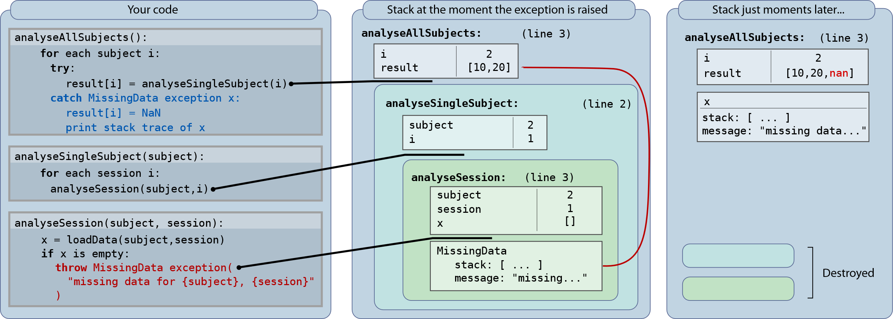

# Chapter 10: Errors

Errors can be upsetting, but every time you get an error message, be thankful! They are there to protect you. When an error occurs, one of the oldest tricks is to temporarily insert a print statement that reports on critical variables, just before the point of the error. In this chapter we will explore some other ways to find code problems.

After reading this chapter, you should know how to

-   use errors, warnings and assertions
-   pare down code to find errors
-   spot common errors
-   write code that will stop if you try something bad
-   test code

You will also realise that code cannot really be proven to be correct or incorrect: code itself defines an algorithm.

## 10.1. When Errors are a Good Thing!

Errors are blessings in disguise. Errors are due to problems in your code, or problems in the way someone used your code.

It is much better to halt with an error, than give the wrong result!

\<Exercise\>

Let’s say you write a function to statistically compare two lists of numbers.

**function** stat = compare_groups(g1,g2)

[\~,stat] = **ttest2**(g1,g2)

**def** compare_groups(g1,g2):

**return** **scipy.stats.ttest_ind**(g1,g2)

compare_groups \<- **function**(g1,g2){

t.test(g1,g2)

}

It is possible that you send the function some strange or inappropriate inputs. For example, you might give it an empty list for g1. What is the best thing to do in this situation? Cover up the right column of the table below. Consider your options (left column) and see if you can work out what’s good or bad about each (right column)

| One reasonable behaviour is for the function to return a strange or inappropriate result. For example, here, the comparison might return zero 0.                                        | Unfortunately zero could also result from a completely valid input, so the user has no way of knowing that something invalid has happened. Always use something distinguishable.                                                                                                                                                          |
|-----------------------------------------------------------------------------------------------------------------------------------------------------------------------------------------|-------------------------------------------------------------------------------------------------------------------------------------------------------------------------------------------------------------------------------------------------------------------------------------------------------------------------------------------|
| You might decide that returning an empty array [], or ‘not available’ NA, rather than a number, is more appropriate.                                                                    | Empty arrays can cause mysterious errors when tested. For example if you used the function, put the result in x, then checked if x\>2, would you get unexpected behaviour?                                                                                                                                                                |
| A standard “error code” number in this situation might be to return **not a number**, or NaN, in place of the result, indicating that the computation completed, albeit unsuccessfully. | This has the benefit of continuing the flow of execution, but mostly arresting later calculations using that value. The user might call your comparison function, store the result, then at a later stage use it. The problem **only becomes apparent later** when the result is used, and so the problem is hard to track down.          |
| Return a special text value instead of the number, and document clearly that the function might return some text in case of unexpected input. return ‘bad input’                        | The output of the function needs to be checked each time the function is called. It cannot be stored straight into a numeric array. Although it gives flexibility in what you return, this kind of “polymorphic” output makes life hard for the caller!                                                                                   |
| Print something on the screen indicating the input didn’t make sense. print(‘bad input to comparison’)                                                                                  | It’s hard to control arbitrary printed output from a function. The function might be called thousands of times, or from a GUI, where this would be inappropriate.                                                                                                                                                                         |
| Issue a warning that the value was unexpected, and return the spurious result                                                                                                           | While an alert programmer will spot the warning, it may not necessarily be seen.                                                                                                                                                                                                                                                          |
| Throw an exception, stopping execution: error(‘bad input’) raise ValueError(‘bad input’) stop(‘bad input’)                                                                              | This forces the user to stop and think whether they really meant to pass the strange inputs to your function. They will either need to check the values and avoid calling your function when it is inappropriate, or **catch** the error. It adds to checking code, but may force the user to “do the right thing” when data is invalid.  |
| **Assert** that the input is valid (see 10.2 Assertion)                                                                                                                                 | When assertion fails, it usually signifies a fatal problem. What if the user wants to carry on, despite the problem?                                                                                                                                                                                                                      |

If you choose to throw an error, you would insert code at the start of your function to check for the error condition, and generate an appropriate message like this:

**function** stat = compare_groups(g1,g2)

**if** std(g1)==0 \|\| std(g2)==0

**error**(‘stats:novar’,‘ groups have no variance!’)

**end**

**def** compare_groups(g1,g2):

**if** np.std(g1)==0 **or** np.std(g2)==0:

**raise** **ValueError**('groups have no variance!')

compare_groups \<- **function**(g1,g2){

**if**(sd(g1)==0 \| sd(g2)==0)

**stop**('groups have no variance!')

}

Try to test for the broadest range of conditions that will cause problems.

\<end exercise\>

\<key point\>You might curse every time you see an error. But really, they are saving you hours of time. Imagine how much worse things would be, if your code just ran incorrectly, giving spurious results. \</keypoint\>

## 10.2. Anatomy of an Error

There are two types of error: syntax errors, and semantic errors.

-   **Syntax errors** will show up as errors, in annoying red text. The computer can recognise them, because they violate the rules of the language.
-   **Semantic errors** often run without a hiccup, and so are much more dangerous. They may go unnoticed, and the cause may be hard to pinpoint.

Example

**for** i = 1:**length**[X] % syntax error – won’t run

**for** i = **length**(Y) % two semantic errors, one warning

test(X(i),Y(j)); % warning

**end**

**end**

In the first line, the wrong kind of brackets are used, and the computer can see instantly that it doesn’t make sense.

In the second line, the variable i is re-used. The computer can run this code, but in some versions of Matlab, it notices something is odd here: “loop index is changed inside a for loop”. Some Python IDEs may also notice this. But don’t count on it!

Also, in the second line, the iteration should presumably extend over items of Y, but the start of the range is missed out. The computer will happily run this code, assuming you just wanted to use the last element of Y.

In the third line, if you haven’t created a variable j in your script, you might be lucky and get another warning that j has not been created. But this might not be noticed until run time.

Learn to read the error messages carefully to pinpoint the error. Errors come with a stack trace, telling you which functions were called in the lead-up to the error.

### Understanding error messages

If an error tells you that:

| index exceeds matrix dimensions  index is out of bounds index is out of range                                            | Either an array is not big enough, or the index (i.e. the number in the brackets) is wrong. Print both out and see. |
|--------------------------------------------------------------------------------------------------------------------------|---------------------------------------------------------------------------------------------------------------------|
| subscript indices must be real positive integers only integers, slices (\`:\`)… are valid indices invalid subscript type | The number in brackets is wrong. Print it out and see.                                                              |
| in an assignment, the number of elements…;  could not broadcast input array…                                             | the left-hand side of an equals sign has brackets, and the number of items doesn’t match the right-hand-side        |
| nans cannot be converted to logicals                                                                                     | You have nan in an if statement, or are trying to assign nan to an element of a logical array.                      |

These should be enough to see that the error message isn’t user-friendly, but does give you a lot of information if you understand what it really means. Note that in R, you can use indices that lie outside an array, or even nan and inf, and won’t give an error! It gives you NaN. An error might only arise when you try and use this result. This can result in difficult-to-debug behaviour, because the error message occurs far downstream of the incorrect line.

\<key point\> Try and throw errors as soon as something *could* go wrong, e.g. by using **assertion**. \</key point\>

### The Stack trace

The stack trace is a vital microscope for debugging. Ignore nothing in the output. Here is an example:

Traceback (most recent call last):

File "\<stdin\> ", line 1, in \<module\>

File "test.py", line 2, in a

File "test.py", line 8, in b

File "test2.py", line 2, in c

NameError: global name 'd' is not defined

Why is the stack trace so complicated? When an instruction results in an error, the error is ‘raised’, and ‘**thrown**’ up the call stack. The error terminates the function in which it occurred, which then terminates the function that called that function, and so on. Finally, the command or script you executed terminates, and the error is **dumped** on the screen. As the error propagates up the stack, each function tags some information onto the error, to give you the context in which the error occurred, resulting in the stack trace. Crucially, information from different levels in the trace could be relevant in different situations. Your job is to investigate the crime scene by following the leads from the low to the high levels.

**The first line to look at** **is the last one**. This gives the actual kind of error that occurred. Every detail of this line is important.

Above this is the ‘lowest level’ line of code on which the error can be pinned down. Often, you did not write that code. Often, it is in a function from a library, or a built-in function. Here, the code is in the function c() defined in test2.py. So why is an error happening there? The answer is that you fed this function some bad data. If a function receives data it was not expecting, the graceful thing to do is to raise an error. This helps you work out what you did wrong – even though it looks like the error isn’t yours. The actual mistake is probably higher up in the stack. So ignore this line for now.

**The next line to look at is the lowest line that is in your code**. If test2.py is not yours, but you did write test.py, then go to line 8 in test.py, and look at your call to c(). Most likely, you have sent an invalid parameter to c. This gives you clues for solving the problem with the debugger (see 7.5 debugging with a stack). A sensible next step would be to place a breakpoint at line 8 of test.py, inside the definition of function b(), just before you call c().

You might find that the function b() is blameless, but some of the values it received are amiss. In that case, a() is reprehensible, and you can climb up the debug stack into a() (with dbup, u).

### What if no error is thrown?

There are several difficult-to-debug situations where you think an error should be thrown, but it is not:

-   Using arrays or other numerical values for an if statement: all kinds of things can be interpreted as true or false, without errors.
-   Indexing with logicals that are smaller dimensions than the matrix: if the boolean index is smaller than the parent array, this is usually a coding mistake; but a subset gets silently used.
-   Indices become negative: could arise from bad arithmetic, but instead of warning, Python counts backwards, and R drops an element, without warning.
-   NaN indexes in R silently return a NaN
-   Automatic broadcasting
-   Find doesn’t find anything: in some cases negative values or empty arrays denote no result – always check for and handle this case.

### Assertion

One way to ensure that results are correct, is to throw an error when certain expected conditions are not met. Whenever you make an assumption about the value of a variable, check the value first. This is known as assertion.

**if** **any**(**isnan**(x)), **error**(‘encountered nan in x’); **end**

**assert**(\~**any**(**isnan**(x)),’encountered nan in x’)

**if** **np.any**(**np.isnan**(x)): **raise** **OverflowError**(‘encountered nan in x’)

**assert not np.any**(**np.isnan**(x)), ‘encountered nan in x’

**stopifnot**( **sum**( **is.na**(x) )==0 )

Assertions are useful right at the start of a function, to check the inputs, and after calling a library function where the outputs are not always as expected. This leads to a style called **defensive coding**, where you make no assumptions about even your own code. Here, you assume that you might have sent an invalid input to each function, and check thoroughly.

Unfortunately, many libraries return arbitrary **magic codes** when something goes wrong, when it is often more helpful to get an error. A common example is if you are searching for text in a string, eg using Python string.find(), the function might return -1 when a string does not match. A better system is to throw an error, or return error codes in structures.

\<caption\> Fig.10.1: example of a moderately useful error message, with a message explaining what you probably did wrong, a stack trace, and providing options for how to continue. How could this message be improved? \<caption\>

### Generate warnings

If you find yourself dealing with corner cases in your data, consider displaying warnings.

Example:

You write a function that requires a two-dimensional input. But let’s say that it is obvious what your code should do if the input is only 1-dimensional, but this makes some assumptions, and you don’t want to do this except in special cases. You could issue a warning: “warning: one dimensional input will be treated as two-dimensional”.

This goes hand-in-hand with paying attention to warnings issued when you run your code.

## 10.3. Error handlers

Error handlers are segments of code that are executed as soon as an error occurs. Some error handlers are global. The debugger is itself a global error handler. More usually, you want a local error handler, that is only triggered in a specific block of code.

### Throwing and catching

Python makes an important distinction between errors and exceptions. Errors are generally fatal, triggering the end of your program, whereas **exceptions** are often “caught”. Catching an exception means that you are aware that it might happen, and define what should happen in that situation – you **handle** the exception.

\<key point\>Try-catch is a design pattern allowing for control to change hands with minimum fuss, when an ongoing course of action needs to be cancelled. \</key point\>

Throwing an error or exception means that you give the user the option of dealing with the problem. When you throw the error, your function immediately ends. The stack frame is deleted, and the caller’s code is examined. If the calling line is not enclosed within a try block, then the caller’s function also immediately ends, and their stack frame is also deleted. The error thus propagates up through each calling function, until the base stack frame is reached. Nobody caught the error, so it is displayed for the user, in the console. You get a big red stack trace!

\<caption\> Fig.10.2:

Catching an exception. When something goes wrong, you might know what to do. For example, if some data isn’t found, you might decide to use NaN or NA. In this code (left panel), the result is calculated in a subfunction analyseSingleSubject, and data is loaded in a deeper subfunction, analyseSession. One sensible way to avoid an error would be to check the data exists, before trying to analyse it. But this would either require sending messages up to the analysis functions e.g. from analyseSession to analyseSingleSubject, or the analysis functions must check to see if the data is OK before proceeding with analysis. Throwing and catching is a quick way to send a message straight up to the top function, while cancelling any calculations that might be scheduled to happen in between. Here, the missing data causes an runtime exception to be thrown (red code). At that moment in time, there are three open stack frames (middle panel). Because the catch occurs in the outermost function (blue code), the inner stack frames are collapsed, and control is returned to the outermost function. The catch code also receives the error data in a variable (here, x) containing the stack trace and message.

\</caption\>

If any of the callers have enclosed the call in a try block, something different happens. The control of execution jumps to the corresponding catch / except block. This allows the caller to deal with the problem, then continue its work, in the knowledge that the exception occurred. No error message is printed.

Errors can have different types. This is useful:

**try**:

Y = 1/x[i]

**except** **ZeroDivisonError**:

...

**except** **IndexError**:

...

Matlab has limited support for error types.

Consider displaying the problem inputs when creating an error. Here is an example in javascript:

fileName =(

“./experiments/expt1/”

\+"subj" + i +

\+"/session" + j + “.csv”

)

Can you spot the error?

**Bad Error**: cannot find file.

**Useful Error**: cannot find file “./experiments/expt1/subj1NaN/session2.csv”

Some languages will silently skip over errors like “+ +”, which is an example of what happens if you don’t give sensible errors.

\<case\>

### Case study

The first launch of the Ariane 5 rocket in 1996 resulted in a colossal explosion 30 seconds after launch. The programmers had left in some legacy code from the previous rocket design, Ariane 4. This code was not required for the launch, but was left running in the background, checking sensor values. The code raised an overflow error because the rocket was going much faster than it had been designed to allow. Because no error handler had been written for this condition, the error propagated and stopped the control of the rocket. Control was transferred to a backup computer, but this was running the same code and threw the same error, and terminated too. So, both control computers crashed, leading to a “rapid unscheduled disassembly”.

Credit: ESA/CNES/Arianespace – Photo Optique Video du CSG – S. Martin

Learning points:

-   Remove code that is no longer needed. You can always get it back if needed, using version control.
-   Check what errors each line of code could lead to. Languages like Java require compulsory exception-checking, where all exceptions of certain kinds must either be declared or caught. For example, in Java you cannot write “openFile(‘test.txt’)”. Instead, you are obliged to write “try{ openFile(“text.txt”); } catch (FileNotFoundException e){ … }”. This forces programmers to think about what should happen in every eventuality. In less strict languages like Matlab, Python and R, you should still mentally think about what happens in each possible case.
-   One way to know if code is working, is to try a second way of solving the same problem, to see if you get the same result. You might write the same statistical analysis in two ways, to check the implementation is correct. Although building in redundancy in your checks is great, if an error occurs in an aspect that is shared between your implementations – eg. the data format, or the algorithm itself – then the duplication doesn’t help.

\<end case\>

## 10.4. The short, self-contained code example (SSCCE)

If you are stuck during debugging, the quickest way to find the problem is to **simplify the code**. Try and find the shortest, simplest piece of code that can reproduce the problem you are having. Ideally it should be under 15 lines long. This is also called a reproducible example, or reprex.

Let’s say you have a script that plots a graph, and it plots a blank. Where is the problem? Try and find a **single explicit case** where the code fails

-   Remove any optional parameters
-   Feed in fixed known data values – the simplest values you can think of
-   Delete lines which are not being run in this particular case
-   Remove any function calls which are not strictly needed to get a result out

These **paring** steps will identify whether there are specific conditions that make the code fail, or if not, narrow down the lines on which the problem could be. You can also work in the opposite direction, **building**:

-   Start by showing that a basic plot command, on its own, works fine.
-   Add in the data to this command, showing that it works when it is given the right numbers.
-   Gradually build the function around this, line-by-line, adding one feature at a time, until it stops working.

Once you have the minimal code to reproduce the problem, you could post it on an online forum (e.g. Stack Exchange) to see if anyone can spot why the code is failing. It has been said that the kind of answer you get depends on the way you ask the question: Choose the right forum, provide a specific meaningful title, do post code examples, write in clear grammatical English, be precise, informative and objective, and describe your overall goal not just the steps. Post a follow up if you find a solution.

\<caption\> Fig.10.3: A quick guide to debugging. \</caption\>

## 10.5. Spotting some obvious errors

Here is a checklist of the commonest hard-to-spot errors:

-   Is the **right version** of your function being called? Use which; start python with python -v; check filenames in sys.frames(). Have you got two versions of your script – an older version, or maybe a backup? A common cause of this is working from a portable hard disk. Also try setting a breakpoint in the file you are editing, and see if it stops when called: If it does not, perhaps it is running a different file.   
      
    The problem is cured by using good version control.
-   Are the right **versions of libraries** present? Different versions of your language may have different features (e.g. Matlab 2016 and broadcasting; Python 3 and integer division), and different libraries and toolboxes have idiosyncrasies.
-   **Using the wrong data**: Often we change, overwrite, edit data files – for example adding or removing runs of an experiment, filtering trials, preprocessing in various ways. If you load a data file, are you sure it contains what you expect? Data files should be kept apart from analysis scripts, at least conceptually, to keep your code re-usable with different datasets. But this naturally permits situations where you read in an incorrect version of the data.   
      
    Keep a log of what has been done to each file, and when – using version control, or keeping notes, adding meta-data, or commenting the scripts that made the changes.
-   Re-use of a loop index that gets overwritten (for example, i).
-   **Modifying assigned arrays** in Python: Consider this code:  
    x = **np.array**([1])  
    y = **np.array**([2])  
    z = x+y **\# version 1: now x=1, y=2, z=3  
    **z = x; z+=y **\# version 2: now x=3, y=2, z=3**  
    Someone unfamiliar with Python may be utterly confused by the last line, where z is inadvertently linked to x. The z=x line may be intended to create a copy, like z=x.copy() or z=np.copy(x). This does not happen in Matlab or R, which both assign numbers by value, not by reference.
-   **Modifying arrays passed by value** in Python: If an array is passed to a function, and is modified inside the function, it will affect variables outside the function. Consider this function call:  
    **def** transform(val):  
     val[0] = np**.log**(val[0])   
     **return** val  
    x = **np**.**array**([1])  
    y = transform(x) **\# x is also modified**  
    val contains a reference to the original array, and storing values into it change the original. The transform function violates referential transparency: a pure function would return a modified copy as an output parameter. This cannot occur in Matlab, where function calls **pass by value**, not **pass by reference**.. Note that this doesn’t happen if the local variable val itself is re-assigned to a different array within the function:  
    **def** transform(val): **\# val refers to the original array**  
     val = **np**.**log**(val) **\# val now refers to a new array**  
     **return** val  
    x = **np**.**array**([1])  
    y = transform(x) **\# x itself remains unharmed**  
    The decision to use pass-by-reference for python arrays makes it more memory-economical, because you are less likely to copy arrays unnecessarily.   
    In R, passing is usually by value like Matlab, but can be overridden because R actually passes by **promise**, and the caller’s environment can be accessed using ≪-, or   
    transform \<- **function**(val){  
     **assign**(**deparse**(**substitute**(val)), val+1, **parent.frame**())  
    }
-   **Masking** of a library function on the path (Matlab). There might be two functions of the same name, in different libraries. You can check for path collisions using which plot -all.
-   **Uncleared variables** in a script – maybe your first analysis creates an array with 8 items, but the second analysis only writes 6 items. The result will contain the last two items from the first analysis. This is cured by using functions or namespaces.
-   Using = instead of == (though this is becoming less common with smarter syntax checking)
-   Using \^ instead of \*\* in Python. Unless you are used to working in binary, you might be surprised that 3\^4 == 7. This is a painful hangover from C, where exponentiation (raising something to a power) needed a helper function, and \^ was helpfully designated as bitwise exclusive-or.
-   If you have moved from Matlab to Python, check you haven’t used \~ instead of not. You will be startled to learn that \~True == -2, which bizarrely means True if used as a **boolean**.
-   Loading data from a saved workspace, that accidentally overwrites current variables. Cured by never loading directly into the workspace.
-   Using **zeros for missing data**. This results in silent, catastrophic errors that are usually caught too late. For example, mean(X) will systematically underestimate the mean. Always code an experimental abnormality, error or failure as NaN.
-   **Excluding datapoints** unevenly: If data is missing or removed from one condition, in paired or matched data, there is danger of losing the alignment between rows. For example if removing rows using X(:,bad_index)=[], np.delete( X. [bad_index]), X\<-X[-bad_index,]remember to remove the same rows from any other matched variables. Note that array concatenation ignores empty arrays (in fact [[]] reduces to [], np.concatenate(np.empty(0), np.empty(0)) is [], c(c(),c()) is NULL) so this can give silent errors.
-   **Zero-based indexing.** For example, you may label datasets as “1,2,3” in a spreadsheet, but need “0,1,2” in Python. Similarly, when “slicing” arrays to get a subarray, check whether you want the end index to be included (Matlab) or not (Python).
-   **Indices out-of-sync**. It is common to remove outlier datasets from an analysis, but ensure this doesn’t mess up your indexing. Often it is better to remove datasets right at the end of a analysis – while plotting and calculating statistics. Alternatively, remove them right at the start – e.g. before pre-processing. Another case is when an array is edited in a loop: This code  
    for i in range(len(X)):   
     if X[i]==0: del X[i]  
    leads to an index error as X gets shorter, and what’s worse,  
    i=0  
    while i\<len(X):  
     if X[i]==0: del X[i]  
     i+=1  
    silently fails to delete repeated zeros.
-   Mixing up visually similar characters
    -   Full stops vs commas ,/.
    -   Apostrophes and back-ticks ‘/\` and single vs double quotes ‘/” when delimiting strings
    -   Forward / and backward slashes \\ especially in paths in Windows vs Mac/Linux
    -   Parentheses vs braces in array indexing {/(

        Use a good font (section 3.2), increase the point size, good colour contrast, and a large screen.

-   **Bad refactorisation** – when you re-arrange code, changing the names of variables, simplifying long lines, removing repetitions, does the new code do exactly what the old code did? Test out both versions with some critical cases (see 10.10 testing).
-   **Inadvertent broadcasting**: Numpy and recent Matlabs automatically expand singleton dimensions. Great! But consider the following: a=[1;2;3]; b(:)=a; a+b; a=np.array([1,2,3])[:,None]; a[:,0:1]+a[:,0]. Here you create a column vector, and add it to what looks like a copy. But the two vectors inadvertently run in different dimensions, accidentally resulting in a 3x3 matrix.
-   **Inadvertent recycling**: A related (but worse) phenomenon occurs in R, where an operation on two vectors succeeds even if they are not the same length. R will ‘recycle’ elements of the shorter array: c(1,2,3,4) + c(0,10) gives c(1 12 3 14), with no errors. Check the dimensions of each array are as expected.
-   **Line endings**: Do you move code between Mac, PC and Linux? Some languages are sensitive to the type of **character** used for ‘line endings’. These are unfortunately denoted by different **ASCII** codes on Windows. Python scripts may generate strange errors with the wrong line-ending characters. You can check this using an editor that allows you to change the line ending type, or using a hexadecimal dump tool.
-   **Unhandled if conditions**: If you use if, make sure that you have dealt with the else side too. For example, when looping through an array, you might want to create some output when a condition is met.   
    for i=1:length(inputs)  
     if inputs(i)\>0  
     outputs(i) = log(inputs/2)  
     end  
    end  
    But, what do you want to output if the condition is not met? Matlab and R allow you to automatically extend an array to a specified index: x(10)=1, x[10]=1. Matlab will fill unassigned values with 0, and R will fill with NA. This code leaves zeros in the output, and if this is desired behaviour, it should be made explicit:  
     else  
     outputs(i) = 0

## 10.6. Code review

A key part of commercial software is that code gets reviewed by other programmers. This is a rare luxury in science. Can you:

-   Get peers or a student to read the code? It’s beneficial for them to understand how the code works
-   Send it to a collaborator – even if it’s just for them to re-run the analysis
-   Post it to an open science repository: the very act of preparing a code for publication can jolt you into spotting a new error.
-   Get a peers or a student to reproduce an analysis from a methods write-up: This has a double benefit: it ensures that every last detail is included in your Methods section – as well as ensuring that the result is robust to different implementations of the same analysis. This could be a good opportunity for junior students to make a solid contribution to a scientific paper.
-   Code in pairs – it can be a great learning experience for both people.

Many professional programmers do **Pair Programming** – where two people write code together. One person drives, while the other looks over their shoulder, approving or disapproving. If each person has a 10% chance of making an error, then the chance of both people making the error could be just 1%. \<ref Hannay et al. 2009\>

This is a great way of learning too: start with the teacher driving, then switch to the student driving. This is **scaffolding** (van de Pol, Volman and Beishuizen 2010), a teaching method where teachers first act as a model, then fade to the back, giving the student responsibility, but under direct supervision.

## 10.7. Heed the developer tools

### Heed the Warnings!

A warning is a message generated that indicates an expected condition was not met. When a warning occurs at run-time, the problem is not sufficiently bad that the program has to stop. The program continues to run despite the warning. You might have allowed this by design.

But unless you understand fully what you are doing, **try and eliminate all warnings**. In general they are a sign of a problem, and even if the code runs, you may not be guaranteed a correct answer.

There are some situations where you might want to disable warnings.

-   One common example is when you use legacy code, because an older piece of code can’t be changed easily.
-   The code that generates a warning might be buried in a loop, and warnings could slow down calculation
-   A lot of warnings might prevent important messages from being seen. Although printing things to the console can be a sign of bad code.

But if you do this:

-   Disable them only temporarily. When you set the **flag** to override warnings, cancel this when you are done.
-   Disable only the selected warnings that you are trying to remove.
-   Try and **preserve the state** of the warning flags – did someone already disable warnings? You can check this in your code and store that information before you change it. Try and respect their decision by checking if warnings are already disabled, and restore the state.

### Heed the Lint!

**Lint** is a tool built into your **IDE** that checks the quality of your code. It can check formatting, syntax, and spot some bad practices. IDEs will show lint warnings as symbols in the margin, wiggly underlines, or in a separate window.

\<caption\>Fig.10.4: example of lint output from Matlab’s code analyser

[Pic matlab warnings; pylint]

These warnings are determined from an initial parse of your code, and can flag up many common problems.

-   Unpaired brackets or sometimes wrong types of brackets, unpaired quotes.
-   Commas replaced by full stops, or vice versa. It is unfortunate that they look very similar, and are also neighbours on the keyboard.
-   Missing line-continuations (... or \\)
-   Assignment = instead of comparison == (sometimes)
-   Some structural problems can be picked up when variables are not created, or not used – this should immediately raise suspicion.

\<box\> Unless you fully understand what you are doing, **do fix all the lint warnings**. Although some warnings are just cosmetic, some of them reflect errors. Some of those errors will show up when you try to run the code, but some of them may not! The code might run just fine, but give the wrong answer.\</box\>

Paying attention to lint messages often spotlights semantic errors. A common example is using a variable before it is initialised. You will be able to run the code, if the variable had already been created in the workspace any time before. But the value may not be what you expect!

## 10.8. Strong and Weak Typing

Strong typing means that variables of one type cannot be automatically converted to variables of a different type. For example, numbers cannot be used as text, unless you specify how to format them. You cannot do print(‘loading dataset ’+i). Instead you must use a function like num2str, printf, str, format, or paste.

Python has quite strong typing. Consider this for loop:

Y = [1,2,3,4]

for i in range(Y):

print(Y[i])

Here, you probably intended to loop over elements in Y. The code as presented will not generate a syntax error: the range function needs to know the length of Y, but instead it is given Y. Python knows immediately that you cannot use range on an array. It raises “TypeError: range() integer end argument expected, got list.“

Matlab, on the other hand, does not notice the problem, since in terms of **type**, a number is the same as a vector of size 1x1:

Y = [1,2,3,4]

for i = 1:Y

disp(Y(i))

This runs fine, but gives just one result because the colon operator only looks at the first element. So the expression 1:[1,2,3,4] is treated (perhaps bizarrely) as 1:1.

The weak typing could possibly allow some interesting tricks, for example 1:[] yields []. But it makes debugging hard!

### Numerical casting

Some languages are weakly typed, and allow this kind of automatic type conversion (**type casting**). This can lead to difficult-to-spot errors. For example, integers sometimes stay as integers:

0.5+int8(1) = 2

Though in Python 2.x, integers are converted but only when a floating point value is present

5/3 = 1 5/3. = 1.667

Beware of your language versions. “Brodacasting”, or singleton expansion, is a more subtle example of weak typing. In older Matlab, you cannot add a 1x5 to a 5x1 array.

conditions = [1; 2; 3]

for i=1:length(conditions) % iterate through the column vector

m(conditions(i)) = mean( data{i} ) % this makes m a row vector!

end

u = m(conditions\>1) % indexing a row vector using a column – OK

v = conditions(m\>0) % indexing a column by a row – also OK

m = m + 15 \* (conditions\>1) % increase m for certain conditions\*

m = m \* (conditions\>1) % zero out condition 1\*

The last two lines do not work, because m has unfortunately turned out as a row vector. In older Matlab the addition happily generates an error. However, later Matlab and Python allow **broadcasting**, which silently creates a large matrix. You might never detect this error, for example if you just select values from m using m(condition==1) etc. The last line always fails silently in Matlab because matrix multiplication is overloaded on the \* operator, and so a scalar is produced; in this situation Python still broadcasts, using element-wise multiplication (matrix products would require an explicit call to np.matmul).

### Boolean casting

Sometimes Booleans stay Booleans when they should not:

flag = (0==1) = 0

flag(1) = 5 = 1

x=np.array([0==1]) = False

x[0]=5 = True

x=c(FALSE) = FALSE

x[1]=5 = 5 [the expected answer]

Basically, these ‘nonsense’ conversions happen without warning, leading to very confusing behaviour. This is because in these languages, variable **types** are not “strong enough”: numbers can get down-**cast** to Booleans – a **narrowing** conversion. It was a design decision, however, since there are situations where weak typing makes life considerably easier, for example with adding logical values to obtain a count, averaging logical values to obtain a proportion, or indexing a 2-item array with logical values converted to integers.

Similarly watch out for conversions in comparison:

x=5

if(x) print(‘yes’) yes

if(x==TRUE) print(‘yes’) (does not print yes)

This is the case in all three languages: although nonzero numbers are “true”, when used in an if statement, it is **not** true that they are (equal to) true. Again, this is because if coerces numbers into booleans, whereas equality testing (==) coerces the other way round, **promoting** booleans into numerical 1 or 0. This is just a rule you have to get used to!

## 10.10. Testing

Always test your analysis. Software designers advocate **test-driven development**, and write tests for their code in parallel with their code. Tests are themselves pieces of code, that call your code and reveal whether it does what it is supposed to. Often the test code is as long as the actual code! This is not always suitable for scientific code, as your specification is rarely known in advance.

When you write an analysis script, make sure you test it on synthetic data. You will need to write a separate script to create the **synthetic data**, in the exact format of what you expect the real data to look like.

-   Create test data that contains the effect you are testing for.
-   Create test data with additional effects that you are not testing for, to make sure that does not invalidate the analysis
-   Permute (shuffle) the test data so that the effect should come out as null.
-   Create noisy data, or data without signal.

Then run your analysis on these three types of test data. This demonstrates that your code does not produce spurious significance, can detect significant results of a given size, and is not distorted by additional effects.

\<Exercise\>

Can you create a simulation to test the compare groups function in 10.1?

**function** p = compare_groups( g1,g2 )

[\~,p] = **ttest2**(g1,g2)

**function** [g1,g2] = generate_sim_data(N,effect_size)

g1=**randn**(N,1);

g2=**randn**(N,1)+effect_size;

**function** test_compare_groups

[g1,g2]=generate_sim_data(100,1)

compare_groups(g1,g2)

Any statistics you do should, ideally, be tested with your original data shuffled, so that it would in theory not produce a significant result.

### Creating test data – How to run a simulation

Try and think about the process that generates your data. Can you write this as an algorithm? This is sometimes called a ‘forwards model’ or **generative model**. Defining your forwards model is crucial for hypothesis testing, so you should have one even if you are not creating test data.

\<caption\> Fig.10.5: Scientists often use a model to interpret their data. The most common process is to fit parameters to data (right-to-left here), and examine those parameters. But all models tacitly describe the process that generates data, and so are capable of sampling (left-to-right). This can be done from assumed parameters, fitted parameters, or even randomly sampled parameters based on a posterior estimate. \</caption\>

Consider a linear model, y \~ Xb + ϵ. Here y is a data vector, b is the parameters of the model that generate the data, and X is the design matrix – the set of conditions for each datapoint. ϵ is an error term. How would you generate test data? First consider what is the range of x that your predictors (independent variables) can take. Maybe you have two conditions, tested in two populations. Then you need 4 levels of X.

You will need to include randomisation. You might generate X as follows:

condition = random boolean vector

(e.g. randi(2,1000,1)-1, random.randint(2,size=1000))

population = another random boolean vector

intercept = vector of ones e.g. ones(1000,1)

Then combine the columns to obtain a design matrix

X = [ intercept, condition , population ]

Then you will need to set some plausible values for your parameters. Perhaps b will be [3; 2; 1]. This would signify that y is expected to have a mean of 3, that y will increase by 2 for condition==1 compared to condition==0, and that y is increased by 1 for population==1 compared to population==0. Finally, you need to decide on the noise, e.g. ϵ = 0.5. Now you can generate simulated data, by calculating y_sim = X\*b + ϵ \*randn(1000,1).

Then, run your analysis on the simulated data. Fit the data to your model. Can you extract the original parameters b?

Your forwards model might be much more complicated than this simple linear example. You may need for loops or use mathematical functions. For example, you might include interaction terms, random effects and error covariance. But essentially, you need a route to get from the conditions to some expected data.

-   First, simulate first with a very large number of data points, e.g. 5000, to check the model can be fitted at all. Some models simply cannot be fitted. If the parameters have high covariance, this means that the same data can be explained by two parameters. You can estimate the covariance by simulating multiple times, and correlating the parameters.
-   Then, simulate with the same number of data points in your dataset. This determines whether you have enough data. Are you getting sensible parameters? You can perform your statistics on the simulation to obtain a simulated p-value – are you getting an effect, with the estimated effect size?
-   You can do your own power calculation. Estimate your power to recover effects by varying the sample size and running multiple simulations. How often do you recover a significant effect?
-   You can check whether your statistical test adequately corrects for multiple comparisons. You can measure the **family-wise error** (FWE, overall chance of a type 1 error) and **false-discovery rate** (FDR, chance of a positive result being a type 1 error): set the effect size to zero (e.g. b(2)=0 in our example) and run the same simulations.

\<bigger picture\> Do you have a forward model?

Forward generative models are a crucial part of understanding your data, because they capture the assumptions you make.

-   If you are recording a time-series of data points, think about Gaussian processes or Markov processes.
-   If you are recording the times of events, for example response times, think about drift-diffusion models or race models.
-   If you have a timecourse of response to an event, consider convolution with a temporal finite impulse response function, which can be empirical or theoretical.
-   If you are measuring whether a condition is met, or which category something falls under, consider logistic or multinomial Bernoulli processes.

Each of these let you generate stochastic, simulated data from some assumptions.

\<caption\> Fig 10.6: Some examples of models that support a forwards, generative process, together with a representative equation. Regression models map one set of values onto another. Markov models and Gaussian processes map one state to a subsequent state, generating a time-dependent “walk”. Impulse responses and dynamic systems generate a timecourse from initial conditions. \</caption\>

\</bigger picture\>

### Simulating after fitting

Once you have fitted a model, consider re-creating surrogate data from it. Then you can run this surrogate data through your analysis pipeline, to confirm your fitting works correctly.

**Posterior predictive sampling:** One useful way to do this is to include the uncertainty in the estimated parameters (b in the example above)\<ref Wilson\>. To do this, you need a correlation, scale, or covariance matrix of the estimate b. This gives you the posterior distribution of b, from which you can draw samples, e.g

b_samples = b + chol(cov_b) \* randn(N,length(b))

b_samples = np.random.multivariate_normal(b, cov_b, N )

b_samples \<- mvrnorm( N, b, cov_b )

Here, the Cholesky decomposition acts a bit like a square-root. Finally, simulate with these new values, and re-plot. Does it look like your data? Posterior predictive checks tell you whether your pattern of results is truly captured by a model.

\<caption\> Fig.10.7: Parameter recovery helps you test if your fits are valid. Left: the fitted value is plotted against simulation value. Values on the diagonal are recovered well. Middle: Bias from the true value is reduced when simulating large datasets, but some fitting methods still carry asymptotic bias with infinite data. Right: the mean absolute error is one measure of variability of recovered values, across different runs of the simulation. It declines to zero when each run simulates many samples. \</caption\>

**Parameter recovery**: Are the parameters of interest actually distinguishable from your data? To check this, simulate with a range of parameters, fit the simulated data, and compare the true and recovered values. This tells you the bias and spread of recovery.

\<ref\> Wilson R & Collins AGE, eLife 2019 [10.7554/eLife.49547](https://doi.org/10.7554/eLife.49547) \</ref\>

### Unit Tests

A unit test is a piece of test code that accompanies a function you have written. It specifies what your code is supposed to do, using examples. Here’s an example of how you might write a unit test. Consider a function that calculates the average of an array:

function a = average(X)

a = nansum(X)

a = a/sum(\~isnan(X))

The corresponding unit test might be:

function averageTest()

assert(average(1)==1) % test a basic scalar

assert(average(ones(10,1))==1) % test basic vector

assert(average([1;nan])==1) % check it ignores nan

assert(isnan(average([]))) % test empty array

assert(average(1+1j)==1+1j) % check it works for complex numbers

assert(average(ones(3))==[1,1,1]) % test average of matrix

A collection of tests like this is called a **test suite**. The idea is that you run this suite whenever you make modifications to the average function. It might seem ridiculous testing out all these little possibilities, especially for such a simple example function. Perhaps it hardly seems worth it…

However, you may notice that the last test will fail, picking up the missing elementwise division in the function: a = a ./ sum(\~isnan(X)). This could be quite a hard error to detect in some situations!

The more of your code is validated against tests, the better. You can use **code coverage** tools to check if your test suite is missing something. You may think of new scenarios to test as you write other parts of the program.

\<Key point\>

Keep building the test suite while you write the program.

When a bug is found, add it to your test suite. \</key point\>

## 10.9. Provability

Computers are logical, and so everything they do is clearly defined, precisely determined, and known in advance. Right? Well, not quite. The idea of a program being “correct” is not straightforward. A standard definition of correctness \<ref\> is that for *every* possible set of conditions the program runs in, it will produce a specified result. Such a program is provably correct, or **verifiable**.

\<ref\> David Gries, The Science of Programming”, 1981\</ref\>

It is hard to prove a program is correct. It requires a huge amount of specification. You can view proof as an extreme extension of **unit tests** (see previous section). Unit tests specify a few key cases where a known output should be produced. But this is not enough for proof: the expectations for every condition must be set out. For the proof to be useful, the conditions must be set out in a more abstract form than the program itself, e.g. as a formula against which the code can be verified. The formulae may be specified in formal logical propositions, whereas the code is specified as a series of instructions – the **implementation**.

Separate computer languages exist for writing specifications for proofs, and tools are available in some languages for automatically proving code matches such specifications. However, there are some problems with provability:

-   The code is only as good as the conditions that are laid out. Just because a program is provably correct, doesn’t mean it will do the right thing.
-   Writing the specification is itself laborious and error-prone.
-   Most useful applications use constructs that are inherently not provable – you may have heard of Turing’s **halting problem**: you cannot write a program that can decide whether any other program will finish executing (and this can be proved!).
-   Usually, each function is proved separately. But it is all too common for individual functions to operate perfectly, but for bugs to crop up when functions are pieced together. Do functions work in the same units or coordinates? Do they interfere with each other? The whole is greater than the sum of the parts, and so requires additional proof.

Consequently proof is not available in most scientific languages. Unless life-critical decisions depend on the software, most developers do not validate their code with proofs. It’s simply too time-consuming. You may get on well with simpler alternatives, like **assertion** and unit tests.

## Chapter Summary

Be hyper-vigilant for variables overwriting each other, overwriting built-in or library functions (especially in R and Matlab), unexpected data, or invalid inputs. Sadly, there are many situations where code fails silently. This is a worst-case scenario, and is made worse by certain language features like weak typing and idiosyncrasies of indexing. Make errors occur gratuitously – always check and assert. To minimise bugs use team coding and review, respect all warnings or ‘underlines’, and when necessary, handle errors with caution. Use simulated or shuffled data to make sure your code and statistics work as expected. Build unit tests to double check code works in every possible scenario.

Discussion Questions: Why do you think error messages are hard to interpret? Why might it be harder to spot your own errors than your colleague’s? Why is it that after 40 years, computers still crash?