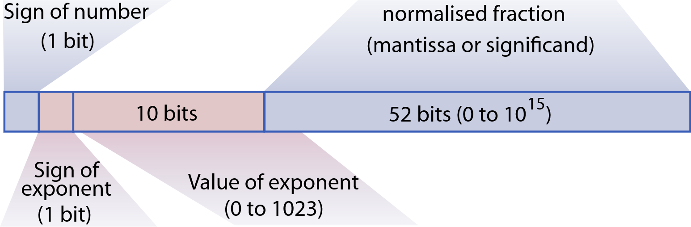
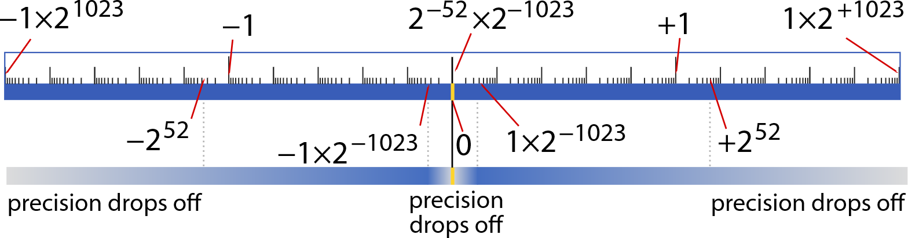
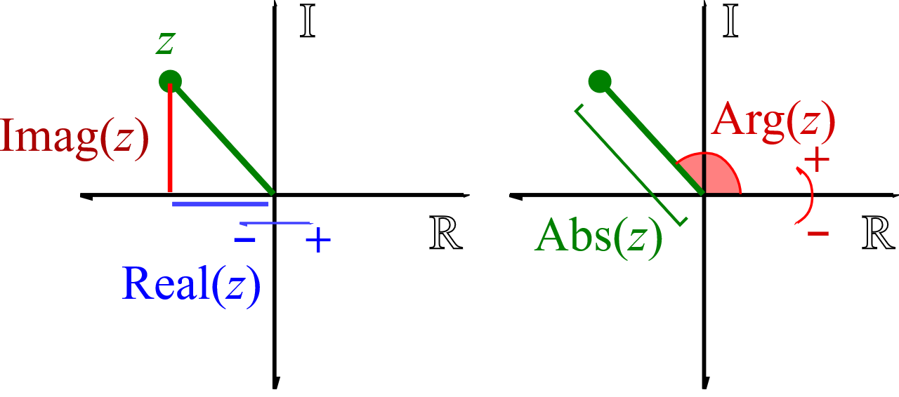
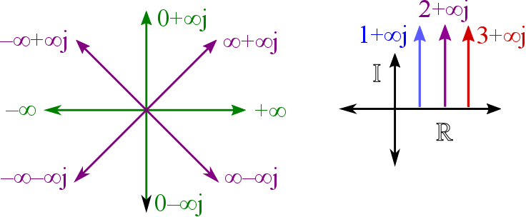
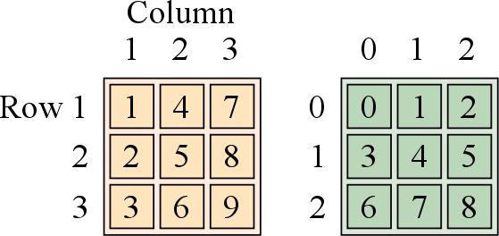
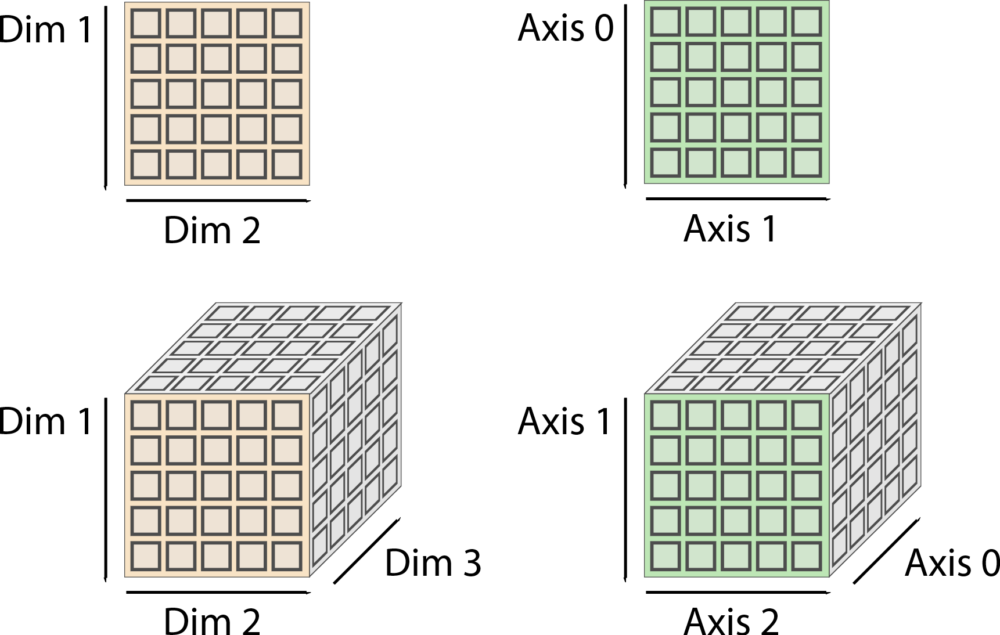

# Appendices

## 11.1. How do computers see numbers?

You may have heard that numbers are stored as 1’s and 0s, a sequence of binary digits (bits). But how do the numbers you use in your analysis relate to these bits?

Historically, many computers used 8 binary digits to store individual numbers. Eight ‘0’s means 0, and eight 1’s would mean 255 in binary. To store a number bigger than 255, you would need two **byte**s – so for example 258 would be stored as ‘0000 0001 - 0000 0010’. The two bytes are held in neighbouring slots in the computer’s memory, and together represent a larger value. This leads to some major questions: What happens if you add together numbers, and the result is bigger than will fit? How might a negative number be stored? What if you want to store decimals?

To solve these problems, **floating point** numbers were created. In these numbers, some bits represent the number, and other bits represent the order of magnitude (a binary version of ‘powers of ten’). The number component is termed the mantissa (or significand or fraction) and the order of magnitude is called the exponent. There is a specific **bit** that indicates whether the number is positive or negative, another bit indicating whether the exponent is positive or negative. Furthermore, the Institute of Electrical and Electronics Engineers (IEEE) specifications for floating point numbers – which are widely used now – also reserve special bits to indicate things like ±infinity, and Not A Number (NaN). Depending on how many bytes are used, a floating-point number (sometimes just called a **float** for short) can be single-precision (4 bytes), or most commonly double precision (8 bytes, sometimes just called ‘doubles’). [ref: Goldberg]

Why is this important?

Numbers close to zero (either positive or negative) can be represented incredibly precisely – since a large negative exponent allows the mantissa to “zoom in” there.

The great news is that nowadays, these number formats are integrated into the lowest level components of your computer – the CPU itself knows the rules. So, these floating point numbers behave consistently across most languages.

### Integers

Integers have a fixed range. This means they have limited precision: half of 1 is zero, because there are not fractional digits. Integers need to be appropriately scaled in terms of their measurement units. This has benefits as well as disadvantages.

Beware of integers. There are many situations where you need integers, but many new types of error can occur, if you’re not used to integers:

-   There are many formats, and conversions can be tricky. There are 8-bit bytes, 16-bit words (short integers), and 32- to 64-bit “long” integers. There are signed and unsigned integer representations. There are ‘little-endian’ formats in which the least-significant byte (the one representing the smallest powers of 2) comes first, and ‘big-endian’ with reversed byte order.
-   Division is confusing, as remainders are discarded.
-   Languages differ in when integer representations are used. When you calculate 1/2, Matlab, R and Python 3 treat this as a double-precision calculation, whereas Python 2.7 defaults to an integer, yielding 0.
-   **Overflow** is common – where a calculation goes above or below the maximum representable value. You might need to check each calculation to avoid silent errors. For example, 32767+1 is not representable as a 16-bit signed integer.

You can ignore integers unless you

-   deal with hardware. Embedded firmware and custom analog-to-digital conversion often return data as integer formats.
-   use older file formats, for compatibility with older data or machines
-   need significant data compression. If high precision is not meaningful for your data, for example due to a noise floor, you may be better off converting to a fixed-point (integer) format.

The latter point is pertinent. Most of our data doesn’t need 64 bits. You can probably compress data enormously, simply by converting to an integer format.

For an average pressure sensor, it is not worth storing readings to more than 12 bit precision. This means that each sample can take a value from 0 to 212=4096, which might be an ample number of gradations as long as the baseline is accounted for. If it is not enough, then store the logarithm, so that you can expand the precision of small values, while allowing coarser representation of larger values. Or equivalently use a floating-point representation. A 12-bit format would occupy less than 1/5 the disk space. Notice that zipping the data (lossless data compression) would not help.

Some images are best represented using a single byte per pixel, occupying ¼ of the space.

The extreme example is for data made up of 1’s and 0’s, such as ‘yes/no’ responses, or masks (an array used to select from another array). If space is an issue, check that you are using an 8-bit integer format. And better still, you might be able to use a 1-bit format, where 8 datapoints are collapsed into a single byte – sometimes called a bit array.

### Double precision formats

These days, most numerical operations are done to “**double** precision”: usually a 64-bit format with 52 bits of mantissa, 11-bit exponent, and a sign bit. The exponent thus allows scales from 10-1023 to 10+1024.

\<Caption\> Fig.11.1: Double-precision floating-point values are stored in 64-bits (i.e. they occupy 8 bytes). They include an exponent ranging from -1023 to +1023. The missing value of exponent (effectively +1024) is used to indicate +/- infinity (when the mantissa is 0) and NaN otherwise.\</caption\>

This is great for manipulating data: the number format is IEEE standardised, the results of operations too are standardised, all modern CPUs are fully optimised for these kinds of number, so if you encounter rounding errors, the problem is in your algorithm.

In the rare situations, you might need bigger numbers. Some platforms support long double (numpy.longdouble) or extended precision floating point numbers, with usually 10-byte (80-bit) numbers, or even larger 128-bit floats. These allow a larger range, but not always greater precision. There are also packages which support arbitrary precision – for example symbolic toolboxes.

I have not encountered a situation that needs more than a double: the real solution is usually to change the scale of the variables.

\<caption\> \</caption\>

\<box\> Did you know there are two zeros? Doubles can hold positive zero or negative zero, even though these are defined to be equal. You can recover these in the binary representations e.g. compare

**num2hex**(-1/**inf**) vs **num2hex**(0)

which in Python can be done with

**hex**(**struct.unpack**(“\<Q”,**struct.pack**(“\<d”,-1/**np.inf**))[0]).

\</box\>

### Infinity and beyond

Infinity is generated when a number goes out of bounds. They behave like you might expect:

1/inf == 0

inf + inf == inf

\-1e1024 == -inf

-   Negative and positive infinity are distinct.
-   There are also various species of complex infinity.

Integers do not support infinity, and they will **overflow**. Different languages adopt different strategies to deal with this. Matlab will **saturate**:

int8(126) + 2 127

int8(-127) - 2 -128

uint8(0) - 1 0

Numpy instead wraps around, which is perhaps the most confusing!

np.int8(126) + np.int8(2) -128

This bizarre behaviour occurs because the ‘sign bit’ (which determines whether a number is positive or negative) is the most significant bit, and the value -1 is actually represented in binary as 11111111.

On the other hand, plain Python integers get automatically **promoted** to a higher number of bits when needed, with implicit conversions. This allows Python to have **arbitrary precision** arithmetic:

np.int8(127) + 2 129

type(np.int8(127) + 2) \<type 'numpy.int64'\>

But as you will see, these type conversions can easily lead to dangerous, silent errors in your code! My advice is, wherever possible, to stick to double precision floating point numbers.

\<tip\> Stick to using doubles, if you can! \</tip\>

### NaN and her family

NaN, meaning **not a number**, is a special value that can result from an indeterminate or invalid calculation. It is designed to stop erroneous values appearing when you try to do something silly. Historically, all computations that could result in bad results needed to be manually checked; now, NaN behaves like an **overflow** flag to indicate something bad has happened:

inf – inf NaN

0/0 NaN Python Error: divide by zero

inf \* 0 NaN

NaN propagates whenever it is involved in calculation:

1 + NaN NaN

But is confined to its position in an array:

[0,1,2,3] + [NaN,1,2,3] [NaN, 2,4,6]

sum( [0,1,2,3, NaN] ) NaN

Importantly, NaN never meets the criteria for numerical comparison:

NaN \> 0 == false

NaN \< 0 == false

This means that NaN can be “un-propagated” (removed from the calculation) using comparators.

\<tip\> Caution: Boolean operations can conceal a problem with earlier calculations. \</tip\>

Another way this can happen in R/Python is by raising it to the zeroth power, giving 1:

NaN\^0 NaN

np.nan \*\* 0 1

NaN\^0 → 1

Crucially remember that NaN is not equal to NaN. Really! Try it out:

NaN == NaN false

np.NaN == np.NaN False

NaN == NaN NA

To find out whether a variable is nan, use isnan(x) np.isnan(x) is.nan(x)

Given the last peculiarity, you might notice that you could also use x==x to check if a value is not NaN.

But notice that converting NaN to a truth value depends on the language. Matlab and R won’t let you, while python thinks NaN is true.

if nan, print ‘true’; end NaN’s cannot be converted into logicals

if float(‘nan’): print(‘true’) True!

If(NaN){ print(‘true’); } argument is not interpretable as logical.

In R, you have the option of specifying a missing value NA (not available). This value indicates “unknown *yet existing* data” – something that does have a value but which is not known. This is an important distinction in statistics. It behaves as follows:

NA \> 0 NA

NA+1 NA

NA==NA NA

if(NA){print(‘true');} missing value where TRUE/FALSE needed

\<box\> Did you know that there are actually many different NaNs? They can be divided into “quiet” and “signalling” NaNs. Most NaNs are quiet: they are propagated through calculations, so that you can catch the error at the end of a sequence of operations. Signalling NaNs have a different binary representation, and actually generate an error when used. They aren’t generated but normal calculations but you can create one with decimal.Decimal('snan')\</box\>

\<Case study\> Don’t let missing data have the last word

In a Nature paper in 2019, a study of world religions in \>400

(Whitehouse et al. 2021)

\</case study\>

### Empty, Null and Void (Advanced Topic)

It is worth noting that although NaN is universally an “error value”, all languages have a separate way of denoting ‘nothing’, or where something is missing. This can be very confusing, since it is variously called “null”, “void”, “empty” or “none”. In some situations, this can be conceived as an array with no size, or a box which has been “squashed until it is flat” in one or more directions. Contrast this with NaN and NA, which occupy space. In other situations, you are better of as thinking of such variables as completely different – with unique properties.

\<from here in three columns?\>

In Matlab, empty arrays [] serve this function, and behave even more peculiarly than NaN:

[] + 1 []

[] \< 1 false

[] == [] false

If [], print ’true’ (it’s not true.)

Curiously, empty arrays still retain a knowledge of their size.

ones(0,0) == [] []

ones(1,0) == [] Error using ==: Matrix dimensions must agree

ones(1,0) == ones(2,0) Error using ==: Matrix dimensions must agree

And this depends on the version of Matlab because singleton expansion can kick in!

ones(0,0,0)==ones(0,0) 0x0x0 empty logical array

In Numpy, empty arrays are distinct from None.

np.ones((0,2)) == np.ones((0,0)) False

np.array([]).shape (0,)

np.array([[]]).shape (1,0)

np.array([[[]]]).shape (1,1,0)

np.array([])==np.array([[]]) [] 1x0 boolean array!

And dimensions with size 1 are special, as they can be **singleton expanded** (“**broadcasted**”):

np.ones((0,0)) == np.ones((1,0)) [] 0x0 (RHS broadcasted down: shrinks)

np.ones((0,0)) == np.ones((2,0)) False (no singleton dimension to broadcast)

np.ones((1,0)) == np.ones((2,0)) [] 2x0 (LHS broadcasted up)

np.ones((1,0)) == np.ones((0,1)) [] 0x0 (both singletons broadcasted down)

np.ones((1,0)) == np.ones((0,2)) False (non-singleton dimension mismatch)

The situation with R arrays is different: R has various classes of data. A numeric variable can contain a list of values,

x\<-c(1,2,3)

but this can be converted to an array with array(x), or a 3x1 matrix with matrix(x). They are all different. You also have NULL, which functions like the empty array in Matlab and Python, but is not the same as an empty array or matrix:

c() NULL

array(dim=c(0)) numeric(0)

array(dim=c(0,0)) \<0x0 matrix\>

array(dim=c(1,0)) \<1x0 matrix\>

array(dim=c(2,0)) \<2x0 matrix\>

But

array(dim=c(1,0)) == array(dim=c(2,0)) logical(0)

array(dim=c(1,0)) + array(dim=c(2,0)) Error: non-conformable arrays

So unlike Matlab, R doesn’t mind testing equality with different size empty arrays, but will not do maths on them.

\<end columns\>

These are common sources of errors in Matlab. Can you spot the error here?

**global** sample_count

**while** **true**

do_something()

sample_count = sample_count + 1

**if** sample_count \> 100, **break**; **end**

**end**

What would happen if you run this?

This code runs an endless loop! When you create a global variable in Matlab, but don’t initialise it, it will start as []. The error []+1 is not picked up, since Matlab treats size 0 x 0 as compatible with other sizes. Note that empty arrays still have a size. [] is a 0x0 array, but this is not the same as ones(1,0).

In contrast to empty numpy arrays, None is used in Python to denote non-numeric empty values. While it is not a numeric class, it happens to be smaller than any number:

None + 1 unsupported operand type(s) for +: 'NoneType' and 'int'

None \< 0 True \| (fail in Python 3)

None \> 0 False \|

None==None True, but avoid this and use is instead of ==

True if None else False False

### How precise are my numbers?

When you add an exponent, you lose precision in the mantissa. For example, 1 is greater than 0. 1001 is greater than 1000. 1 + 10\^10 is bigger than 10\^10. But if you add very large numbers, the 1/0 bit becomes so insignificant that it vanishes (sometimes called **underflow**). The scale at which this occurs is given by “epsilon”:

1 + eps \> 1 : true

1 + eps/2 \> 1 : false

eps = sys.float_info.epsilon

eps \<- .Machine\$double.eps

You can also find the largest possible number (in float_info; realmax; Machine\$double.xmax).

\<caption\> Fig.11.2: Double precision numbers have a colossal range. Due to the separate exponent, they are good to about 15 significant digits, but you can shift those digits up or down by about 308 decimal places. For numbers around 10\^15, the value is correct only to the nearest integer. The precision falls off as numbers get larger. For tiny numbers, when the exponent gets down to its lowest, around 10\^-308, the precision again falls off as fewer significant digits can be represented. \</caption\>

It is rare to truly need anywhere near these limits in science. If I had to measure the length of a ruler to the nearest atom, but coded its start and end positions relative to the north pole, I might *just* exceed the precision limit. If you are genuinely having issues with reaching the maximum values or minimum precision, then your algorithm may need revising.

Rounding errors arise when you don’t have enough digits available in your mantissa, so that the least-significant bits get truncated. For example did you know that:

0.3 + 0.3 + 0.3 + 0.1 == 1 False

0.1 + 0.3 + 0.3 + 0.3 == 1 True

The values of these sums is also displayed differently in Python, Matlab and R.

**Dealing with rounding errors**

1.  **Normalise** the values that need to be precise, so that they lie near zero, and store the bias (i.e. the constant large component) in a separate variable. Instead of storing your timestamps as femtoseconds since 1st January 1970, store them relative to the start of your experiment. You can store the start time separately. Storing just the offsets frees up the whole of the mantissa. You rarely need to represent things more than a few orders of magnitude difference, and if you ensure your values all have the same relative scales, you are unlikely to run into rounding errors.
2.  **Remove ‘hard comparisons’** from your code. Statements like if x\>0, or if x==y are discontinuous, because a tiny change in x can have a large effect. This genuinely doesn’t happen in the real world! If you are using these kinds of comparison, think again about your model. You probably want a soft comparison. For example instead of   
    z = 0 if x == 0 else 1, consider something more physically plausible like   
    z=1/(1+exp(x)) also known as a **softmax** or logistic function, and instead of   
    z = 0 if y==x else 1, consider something like z=(x-y)\^2 – i.e. rather than asking if they are identical, use the quantitative difference. This makes functions differentiable, so their outputs don’t vary suddenly with their inputs.
3.  **Use log scales** when numbers get small. A very common situation is for likelihoods in statistics. If you are fitting a model of a large dataset, the probability of obtaining that exact dataset by chance is ridiculously minuscule. But it is by no means negligible: to fit a model, you need to compare it with other probabilities on the same scale. For this reason, we use log likelihood. Similarly, if you are computing a softmax probability exp(v(1))/sum(exp(v)), and the values v are moderately large, you should subtract the maximum value from them v=v-max(v) – because only the relative values are important here.
4.  **Look for small denominators** or highly nonlinear functions in your code. If you divide by a number that is decaying towards zero, you will have problems, presumably because there isn’t a physical interpretation for what you are trying to do.
5.  **For ratios of factorials**, try and cancel terms in your equation, rather than computing them.
6.  **For differential equations**, switch from Euler methods (fixed timestep) to an adaptive method like Runge-Kutta. Nonlinear equations might need very fine timesteps for some regions of the solution. These methods are more complex, and so come at a cost.
7.  **Is your system chaotic**? If so, you may need new approaches. All the precision in the world will not save you here, so consider embracing the variability. Introduce small amounts of noise into your values, and run your analyses many times with different perturbations. It will be important to ascertain how sensitive your measures are to microscopic fluctuations.

\<Key point\> If you encounter problems from rounding errors, it’s not because you need more precision. It’s because you need to adjust your algorithm.

8.  **Last resort**: you can use a high-precision library e.g. Gnu Multiple Precision Floating-point Reliable library (MFPR). It is unlikely to be as tightly optimised as native floating point maths.

### Complex numbers [Advanced topic]

A complex number consists of two real floating point values, termed ‘real’ and ‘imaginary’ components. For a scientist, these can be incredibly useful for representing 2D coordinates, since there are built-in ways of calculating angles and lengths.

-   Rather than manipulating two columns for X and Y coordinates, or two separate variables for X and Y, you can use a single variable with real and imaginary components.

Z = X + 1j \* Y; % create a complex array

ampl = **abs**(Z) % the lengths of all the vectors

Z_rot45 = Z \* **exp**( 1**j**\***pi**/4 ) % rotate them all by 45 deg

This scales up to n-dimensional arrays without changing the code. Benefits:

-   You can sometimes halve the amount of code required for 2D operations
-   The code is usually easier to understand, since the semantics of adding and scaling work just like vectors.

    

\<caption\> Fig.11.3: Complex numbers are a great trick for 2D coordinates. \</caption\>

In Matlab and R, you can simply plot(Z) directly to show real values on the x-axis, and imaginary values on the y-axis (termed an Argand diagram).

Note that mathematically, there are two types of infinity for complex numbers: the single-point ‘complex infinity’, and Directed infinities which have a direction. This is not true in most languages, e.g.:

-   **inf** \* (1+1j), or **inf** \* (1+2j). Although these go off in mathematically different directions, in Matlab, R and numpy, these produce identical results. The angle (argument) of the complex number resulting from these expressions is π/4.
-   Most languages only cope with 8 directions of infinity (the real and imaginary terms can each be +inf, -inf or zero), each having different arguments. For example  
    **angle**(**inf**\*(1-1j)) -π/4  
    **cmath.phase**(**np.complex**(-**np.inf**,1)) π   
    **Arg**(**complex**(**re**=0,**im**=-**Inf**)) -π/2  
      
    \<caption\>Fig.11.4: The many directions of complex infinity \</caption\>
-   However, one of the values can be finite, giving a whole range of infinities. Mathematically these are actually identical, but they are stored and treated differently by all languages except for Mathematica.   
    (0+**inf**\*1**j**) == (1+**inf**\*1**j**) false  
    **complex**(0,**float**('inf')) == complex(1,**float**('inf')) False  
    **complex**(**re**=0,**im**=**Inf**) == **complex**(**re**=1,**im**=**Inf**) FALSE
-   In R and numpy, complex infinities don’t behave as you might expect:  
    Inf\*(1+0i) Inf+NaNi  
    Inf\*(0+1i) NaN+Infi  
    This strange behaviour is because Inf\*0 is not defined, i.e. NaN, in all languages. This is why the previous example used complex instead of Inf\*1i. So, you can get strange results like   
    **np.mean**(**np.inf**+0**j**) inf+NaNj   
    Here, it looks like you should just get a real-valued result, but in fact an imaginary NaN appears! Note that this doesn’t occur in R or Matlab, which produce the expected Inf+0j.

Effectively, the real and complex components are treated like a pair of separate floating point numbers, expressed in cartesian coordinates, an old convention originating in Fortran. In the same vein, you can also have three types of **complex NaN**, with just real, just imaginary, or both parts being NaN. As you can imagine, these are common sources of bugs if you use complex arithmetic.

Comparison between complex numbers is avoided in Python and R, with errors

0\>1j TypeError: no ordering relation is defined for complex numbers

0\>1i invalid comparison with complex values

whereas Matlab just uses the real component:

0\>1j true

## 11.2. How do computers see arrays?

So far, we have mentioned lists and arrays interchangeably. Terminology varies between languages, but an important distinction is whether the elements have to be numbers, or can each be a more complicated data structure:

| All elements of identical type | Matrix / Array      | Numpy array  | Vector / Matrix / Array |
|--------------------------------|---------------------|--------------|-------------------------|
| Elements of different types    | Cell / Struct array | List         | List                    |

Uniform arrays are usually stored as a contiguous block of **RAM**, and are part of the recipe for efficient programming. A single command can work on each element, without a loop, making code shorter. The computer can also operate simultaneously on many elements, allowing parallel processing.

### Column-major vs Row-major arrays

A strong reason for choosing Matlab, Python (with numpy) or R for scientific coding, is that they have easy access to powerful numeric array processing. Arrays can be huge, occupying gigabytes of **RAM**, and high-dimensional (up to 32 dimensions in Python, and essentially unlimited in Matlab or R).

Matlab and R, following the convention of the old language Fortran, store 2-dimensional arrays by running down the rows of the first columns, then going up to first row of the second column, and so on. This is termed **column-major** indexing. Python scientific computing (through the numpy library), along with C, runs across the columns of the first row, then down to the first column of the second row, and so on.

This ordering is only important if you need to store or iterate over the arrays in a ‘flat’ form – i.e. if you need to index into the array without using subscripts for each dimension. This is discussed more thoroughly in chapter 8.

### Zero vs one-based indexing

Unfortunately, switching between 0-based and 1-based indexing causes a lot of chaos, and is the source of many code errors.

Python, like C and Java, uses a zero-based array indices. The first element of an array X is X[0]. This might seem a strange choice, as it conflicts with normal mathematical matrix indexing, which usually start at 1. For example, the first element of a matrix is often written $$X_{11}$$. Also, many people find starting at 1 more natural, because the indices then correspond to the ordinals 1st, 2nd etc.

Zero-based indices makes sense when you think of the index as being relative to the start of an array. The first element is start+0, and the next element is start+1, etc. Moreover, it becomes more convenient if you need to convert between 1-dimensional to n-dimensional arrays, or iterate over elements in a matrix. The zero-based indices allow you to multiply or divide subscripts more easily, and use modular arithmetic.

\<figure\>

If X is 3x3, then the 4th item in the array is the second item in the second column (because the top left is the zeroth item!). How to get the linear index, from the row and column subscripts?

\<caption\>Fig.11.5: 1-based indexing and 0-based indexing in a 3x3 matrix. How to access the middle row, middle column of a grid of 3x3 items stored in a flat 9-element list?

| With 1-based indexing (Matlab/R): you need X(5). i=2 % second row  j=2 % second column % there are 3 rows per column X( (j-1)\*3 + i ) % =X(5)  | With 0-based indexing (Python): you need X[4] i=1 \# second column j=1 \# second row \# there are 3 columns per row X[ 3\*i + j ] \# =X[4]  |
|-------------------------------------------------------------------------------------------------------------------------------------------------|---------------------------------------------------------------------------------------------------------------------------------------------|

\</caption\>

What about going the other way, finding the row and column from the index? For Matlab-style 1-based indexing, the middle item is number 5. To work out the row and column, you need to take row **mod**(5,3) which is 2, and column 1+**floor**((5-1)/3), which is 2 using integer division. So, you would take item X(2,2). (in R, row 5%%3 and column (1+(5-1))%/%3)

To get the middle item using Python’s zero-based indexing (number 4), knowing that there are 3 rows in each column, you use row 4//3, which is 1 (as an integer) indicating the second row, and row 4 % 3, which is 1, indicating the second column (or use **divmod**). So you take item X[1,1].

Zero-based indexing is far simpler in this situation. However, it

Matlab and R use 1-based indexing. While this is intuitive for some, it makes multidimensional indices complicated. If X is 3x3, then to find the index of item i, you need column (i-1)/3+1, and row ((i-1)%3)+1 so that i=4 gives column 2 row 2.

\<caption\>Fig.11.6: Matlab and Python order the dimensions differently when displaying arrays \</caption\>

## 11.3 Interoperability (Advanced topic)

Many scientists switch between languages depending on the need case. For example your workflow might look something like this:

-   Run your experiment in Python, controlling your hardware with external C libraries.
-   Load the datafiles into Matlab for preprocessing and extracting useful parameters.
-   Then transfer those parameters to R for statistical analysis.

The obstacles are numerous: you need to learn several languages, remember the idiosyncrasies of each language, and transfer the data without loss or misinterpretation. Moreover, you may adopt different coding **idioms** – styles of coding that mesh with available syntax – e.g.

| Matlab cell expansion out=**cell**(4,1) [out{:}]=**ttest**(y)  | Python list comprehensions [2\*x **for** x **in** **range**(5)] | R formula manipulation  (y\~x)[[2]] |
|----------------------------------------------------------------|-----------------------------------------------------------------|-------------------------------------|

These language-specific tricks add to the confusion.

Luckily there are libraries that allow loading of CSV, Excel and HDF5 (eg Matlab) data, and all languages allow **ASCII** text export/import.

There are also ways of **calling** one language directly from another. You can place data in a file, and execute a script in another language. For example, you could call R from Matlab:

**csvwrite**( 'data_from_matlab.csv', table_data )

**% Rscript needs to be available on your path**

**system**( [ 'Rscript analyse.R' ])

**% This waits for the R script to finish**

**% (i.e. it’s a "synchronous" or "blocking" call)**

**\# R script file 'analyse.R'**

table_data \<- **read.csv**('data_from_matlab.csv', **header**=FALSE)

**\# fit a model to the data and output the coefficients**

output \<- **data.frame**(**coefficients**(**lm**(tabledata)))

**write.csv**(output, 'data_from_R.csv')

**% R script has now finished; now read coefficients**

stats = **csvread**('data_from_R.csv')

Here, the yellow text all sits in one Matlab script, and the blue text is in an R script.

When coding in multiple languages, it is even more important to document how the data flows, and what the user needs to have installed to run the programs. Typically, this goes in a “Readme” file, or better, in a **manifest**.
